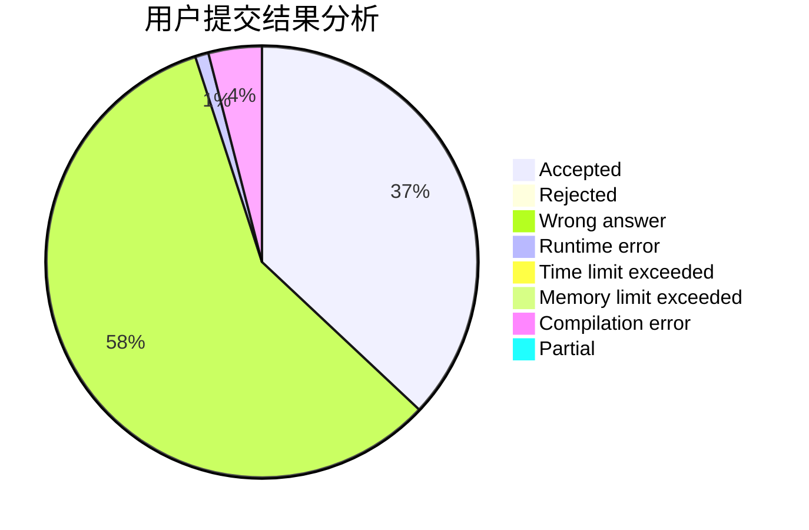
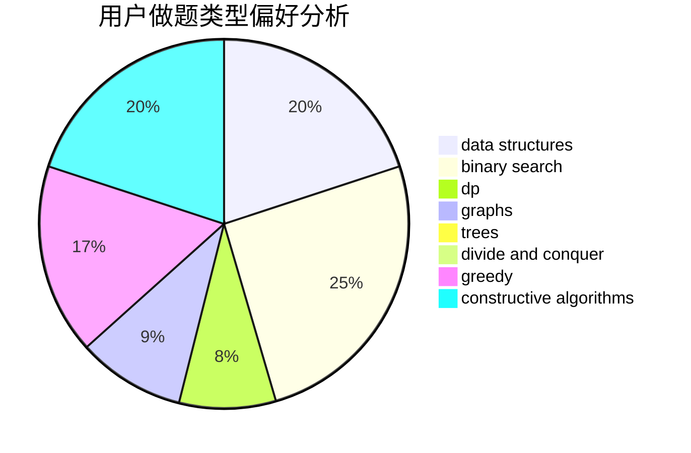

# -2x9_21-
<!-- tabs:start -->
#### **用户提交结果分析**

#### **用户做题类型偏好分析**

#### **用户错题知识点分析**

<!-- tabs:end -->
# 推荐题目
[Tanya and Stairways](http://codeforces.com/problemset/problem/1005/A)		implementation		  
[Coins and Queries](http://codeforces.com/problemset/problem/1003/D)		greedy		  
[Sonya and Matrix](http://codeforces.com/problemset/problem/1004/D)		brute force,
                        constructive algorithms,
                        implementation		  
[Summarize to the Power of Two](http://codeforces.com/problemset/problem/1005/C)		brute force,
                        greedy,
                        implementation		  
[Tree Constructing](http://codeforces.com/problemset/problem/1003/E)		constructive algorithms,
                        graphs		  
[Abbreviation](http://codeforces.com/problemset/problem/1003/F)		dp,
                        hashing,
                        strings		  
[Two Strings Swaps](http://codeforces.com/problemset/problem/1006/D)		implementation		  
[Binary String Constructing](http://codeforces.com/problemset/problem/1003/B)		constructive algorithms		  
[Distinguish four 2-qubit states - 2](http://codeforces.com/problemset/problem/1002/B4)		nan		  
[Delete from the Left](http://codeforces.com/problemset/problem/1005/B)		brute force,
                        implementation,
                        strings		  
<!-- tabs:start -->
#### **data structures**
[Tanya and Stairways](http://codeforces.com/problemset/problem/1000/G)		data structures,
                        dp,
                        trees		  
[Coins and Queries](http://codeforces.com/problemset/problem/1007/A)		combinatorics,
                        data structures,
                        math,
                        sortings,
                        two pointers		  
[Sonya and Matrix](http://codeforces.com/problemset/problem/1004/F)		bitmasks,
                        data structures,
                        divide and conquer		  
[Summarize to the Power of Two](http://codeforces.com/problemset/problem/1006/C)		binary search,
                        data structures,
                        two pointers		  
[Tree Constructing](http://codeforces.com/problemset/problem/1007/D)		2-sat,
                        data structures,
                        trees		  
[Abbreviation](http://codeforces.com/problemset/problem/1000/C)		data structures,
                        implementation,
                        sortings		  
[Two Strings Swaps](http://codeforces.com/problemset/problem/1000/F)		data structures,
                        divide and conquer		  
[Binary String Constructing](http://codeforces.com/problemset/problem/1004/E)		binary search,
                        data structures,
                        dp,
                        greedy,
                        shortest paths,
                        trees		  
[Distinguish four 2-qubit states - 2](http://codeforces.com/problemset/problem/1492/C)		binary search,
                        data structures,
                        dp,
                        greedy,
                        two pointers		  
[Delete from the Left](http://codeforces.com/problemset/problem/1490/G)		binary search,
                        data structures,
                        math		  
#### **binary search**
[Tanya and Stairways](http://codeforces.com/problemset/problem/1007/C)		binary search,
                        interactive		  
[Coins and Queries](http://codeforces.com/problemset/problem/1006/C)		binary search,
                        data structures,
                        two pointers		  
[Sonya and Matrix](http://codeforces.com/problemset/problem/1004/E)		binary search,
                        data structures,
                        dp,
                        greedy,
                        shortest paths,
                        trees		  
[Summarize to the Power of Two](http://codeforces.com/problemset/problem/1492/C)		binary search,
                        data structures,
                        dp,
                        greedy,
                        two pointers		  
[Tree Constructing](http://codeforces.com/problemset/problem/1463/D)		binary search,
                        constructive algorithms,
                        greedy,
                        two pointers		  
[Abbreviation](http://codeforces.com/problemset/problem/1490/G)		binary search,
                        data structures,
                        math		  
[Two Strings Swaps](http://codeforces.com/problemset/problem/1479/D)		binary search,
                        bitmasks,
                        brute force,
                        data structures,
                        probabilities,
                        trees		  
[Binary String Constructing](http://codeforces.com/problemset/problem/1436/E)		binary search,
                        data structures,
                        two pointers		  
[Distinguish four 2-qubit states - 2](http://codeforces.com/problemset/problem/1461/D)		binary search,
                        brute force,
                        data structures,
                        divide and conquer,
                        implementation,
                        sortings		  
[Delete from the Left](http://codeforces.com/problemset/problem/1493/C)		binary search,
                        brute force,
                        constructive algorithms,
                        greedy,
                        strings		  
#### **dp**
[Tanya and Stairways](http://codeforces.com/problemset/problem/1003/F)		dp,
                        hashing,
                        strings		  
[Coins and Queries](http://codeforces.com/problemset/problem/1000/G)		data structures,
                        dp,
                        trees		  
[Sonya and Matrix](http://codeforces.com/problemset/problem/1000/D)		combinatorics,
                        dp		  
[Summarize to the Power of Two](http://codeforces.com/problemset/problem/1005/D)		dp,
                        greedy,
                        number theory		  
[Tree Constructing](http://codeforces.com/problemset/problem/1006/F)		bitmasks,
                        brute force,
                        dp,
                        meet-in-the-middle		  
[Abbreviation](http://codeforces.com/problemset/problem/1004/E)		binary search,
                        data structures,
                        dp,
                        greedy,
                        shortest paths,
                        trees		  
[Two Strings Swaps](http://codeforces.com/problemset/problem/1492/C)		binary search,
                        data structures,
                        dp,
                        greedy,
                        two pointers		  
[Binary String Constructing](https://codeforces.com/contest/1457/problem/C)		brute force,
                        dp,
                        implementation		  
[Distinguish four 2-qubit states - 2](http://codeforces.com/problemset/problem/1491/C)		brute force,
                        data structures,
                        dp,
                        greedy,
                        implementation		  
[Delete from the Left](http://codeforces.com/problemset/problem/1437/C)		dp,
                        flows,
                        graph matchings,
                        greedy,
                        math,
                        sortings		  
#### **graph**
[Tanya and Stairways](http://codeforces.com/problemset/problem/1003/E)		constructive algorithms,
                        graphs		  
[Coins and Queries](http://codeforces.com/problemset/problem/1000/E)		dfs and similar,
                        graphs,
                        trees		  
[Sonya and Matrix](http://codeforces.com/problemset/problem/1006/E)		dfs and similar,
                        graphs,
                        trees		  
[Summarize to the Power of Two](http://codeforces.com/problemset/problem/1005/F)		brute force,
                        dfs and similar,
                        graphs,
                        shortest paths		  
[Tree Constructing](http://codeforces.com/problemset/problem/1487/C)		brute force,
                        constructive algorithms,
                        dfs and similar,
                        graphs,
                        greedy,
                        implementation,
                        math		  
[Abbreviation](http://codeforces.com/problemset/problem/1437/C)		dp,
                        flows,
                        graph matchings,
                        greedy,
                        math,
                        sortings		  
[Two Strings Swaps](http://codeforces.com/problemset/problem/1470/D)		constructive algorithms,
                        dfs and similar,
                        graph matchings,
                        graphs,
                        greedy		  
[Binary String Constructing](http://codeforces.com/problemset/problem/1476/C)		dp,
                        graphs,
                        greedy		  
[Distinguish four 2-qubit states - 2](http://codeforces.com/problemset/problem/1304/D)		constructive algorithms,
                        graphs,
                        greedy,
                        two pointers		  
[Delete from the Left](http://codeforces.com/problemset/problem/1475/C)		combinatorics,
                        graphs,
                        math		  
#### **trees**
[Tanya and Stairways](http://codeforces.com/problemset/problem/1000/G)		data structures,
                        dp,
                        trees		  
[Coins and Queries](http://codeforces.com/problemset/problem/1000/E)		dfs and similar,
                        graphs,
                        trees		  
[Sonya and Matrix](http://codeforces.com/problemset/problem/1007/D)		2-sat,
                        data structures,
                        trees		  
[Summarize to the Power of Two](http://codeforces.com/problemset/problem/1006/E)		dfs and similar,
                        graphs,
                        trees		  
[Tree Constructing](http://codeforces.com/problemset/problem/1004/E)		binary search,
                        data structures,
                        dp,
                        greedy,
                        shortest paths,
                        trees		  
[Abbreviation](http://codeforces.com/problemset/problem/1479/D)		binary search,
                        bitmasks,
                        brute force,
                        data structures,
                        probabilities,
                        trees		  
[Two Strings Swaps](http://codeforces.com/problemset/problem/1511/C)		brute force,
                        data structures,
                        implementation,
                        trees		  
[Binary String Constructing](http://codeforces.com/problemset/problem/1499/F)		combinatorics,
                        dfs and similar,
                        dp,
                        trees		  
[Distinguish four 2-qubit states - 2](http://codeforces.com/problemset/problem/1491/E)		brute force,
                        dfs and similar,
                        divide and conquer,
                        number theory,
                        trees		  
[Delete from the Left](http://codeforces.com/problemset/problem/1466/D)		data structures,
                        greedy,
                        sortings,
                        trees		  
#### **divide and conquer**
[Tanya and Stairways](http://codeforces.com/problemset/problem/1004/F)		bitmasks,
                        data structures,
                        divide and conquer		  
[Coins and Queries](http://codeforces.com/problemset/problem/1000/F)		data structures,
                        divide and conquer		  
[Sonya and Matrix](http://codeforces.com/problemset/problem/1461/D)		binary search,
                        brute force,
                        data structures,
                        divide and conquer,
                        implementation,
                        sortings		  
[Summarize to the Power of Two](http://codeforces.com/problemset/problem/1466/G)		combinatorics,
                        divide and conquer,
                        hashing,
                        math,
                        string suffix structures,
                        strings		  
[Tree Constructing](http://codeforces.com/problemset/problem/1490/D)		dfs and similar,
                        divide and conquer,
                        implementation		  
[Abbreviation](https://codeforces.com/contest/1483/problem/C)		data structures,
                        divide and conquer,
                        dp		  
[Two Strings Swaps](http://codeforces.com/problemset/problem/1491/E)		brute force,
                        dfs and similar,
                        divide and conquer,
                        number theory,
                        trees		  
[Binary String Constructing](http://codeforces.com/problemset/problem/1303/G)		data structures,
                        divide and conquer,
                        geometry,
                        trees		  
[Distinguish four 2-qubit states - 2](http://codeforces.com/problemset/problem/1494/D)		constructive algorithms,
                        data structures,
                        dfs and similar,
                        divide and conquer,
                        dsu,
                        greedy,
                        sortings,
                        trees		  
[Delete from the Left](http://codeforces.com/problemset/problem/1482/E)		data structures,
                        divide and conquer,
                        dp		  
#### **greedy**
[Tanya and Stairways](http://codeforces.com/problemset/problem/1003/D)		greedy		  
[Coins and Queries](http://codeforces.com/problemset/problem/1005/C)		brute force,
                        greedy,
                        implementation		  
[Sonya and Matrix](http://codeforces.com/problemset/problem/1006/B)		greedy,
                        implementation,
                        sortings		  
[Summarize to the Power of Two](http://codeforces.com/problemset/problem/1000/B)		greedy		  
[Tree Constructing](http://codeforces.com/problemset/problem/1005/D)		dp,
                        greedy,
                        number theory		  
[Abbreviation](http://codeforces.com/problemset/problem/1000/A)		greedy,
                        implementation		  
[Two Strings Swaps](http://codeforces.com/problemset/problem/1004/E)		binary search,
                        data structures,
                        dp,
                        greedy,
                        shortest paths,
                        trees		  
[Binary String Constructing](http://codeforces.com/problemset/problem/1004/B)		constructive algorithms,
                        greedy,
                        implementation,
                        math		  
[Distinguish four 2-qubit states - 2](http://codeforces.com/problemset/problem/1492/C)		binary search,
                        data structures,
                        dp,
                        greedy,
                        two pointers		  
[Delete from the Left](https://codeforces.com/contest/1496/problem/C)		geometry,
                        greedy,
                        math,
                        sortings		  
#### **constructive algorithms**
[Tanya and Stairways](http://codeforces.com/problemset/problem/1004/D)		brute force,
                        constructive algorithms,
                        implementation		  
[Coins and Queries](http://codeforces.com/problemset/problem/1003/E)		constructive algorithms,
                        graphs		  
[Sonya and Matrix](http://codeforces.com/problemset/problem/1003/B)		constructive algorithms		  
[Summarize to the Power of Two](http://codeforces.com/problemset/problem/1004/C)		constructive algorithms,
                        implementation		  
[Tree Constructing](http://codeforces.com/problemset/problem/1004/B)		constructive algorithms,
                        greedy,
                        implementation,
                        math		  
[Abbreviation](http://codeforces.com/problemset/problem/1493/A)		constructive algorithms,
                        greedy		  
[Two Strings Swaps](http://codeforces.com/problemset/problem/1463/D)		binary search,
                        constructive algorithms,
                        greedy,
                        two pointers		  
[Binary String Constructing](https://codeforces.com/contest/1456/problem/B)		bitmasks,
                        brute force,
                        constructive algorithms		  
[Distinguish four 2-qubit states - 2](http://codeforces.com/problemset/problem/1492/D)		bitmasks,
                        constructive algorithms,
                        greedy,
                        math		  
[Delete from the Left](https://codeforces.com/contest/1504/problem/D)		constructive algorithms,
                        games,
                        interactive		  
#### **sortings**
[Tanya and Stairways](http://codeforces.com/problemset/problem/1007/A)		combinatorics,
                        data structures,
                        math,
                        sortings,
                        two pointers		  
[Coins and Queries](http://codeforces.com/problemset/problem/1005/E1)		sortings		  
[Sonya and Matrix](http://codeforces.com/problemset/problem/1006/B)		greedy,
                        implementation,
                        sortings		  
[Summarize to the Power of Two](http://codeforces.com/problemset/problem/1000/C)		data structures,
                        implementation,
                        sortings		  
[Tree Constructing](http://codeforces.com/problemset/problem/1005/E2)		sortings		  
[Abbreviation](https://codeforces.com/contest/1496/problem/C)		geometry,
                        greedy,
                        math,
                        sortings		  
[Two Strings Swaps](http://codeforces.com/problemset/problem/1495/A)		geometry,
                        greedy,
                        math,
                        sortings		  
[Binary String Constructing](http://codeforces.com/problemset/problem/1497/A)		brute force,
                        data structures,
                        greedy,
                        sortings		  
[Distinguish four 2-qubit states - 2](http://codeforces.com/problemset/problem/1427/A)		math,
                        sortings		  
[Delete from the Left](http://codeforces.com/problemset/problem/1461/D)		binary search,
                        brute force,
                        data structures,
                        divide and conquer,
                        implementation,
                        sortings		  
<!-- tabs:end -->
