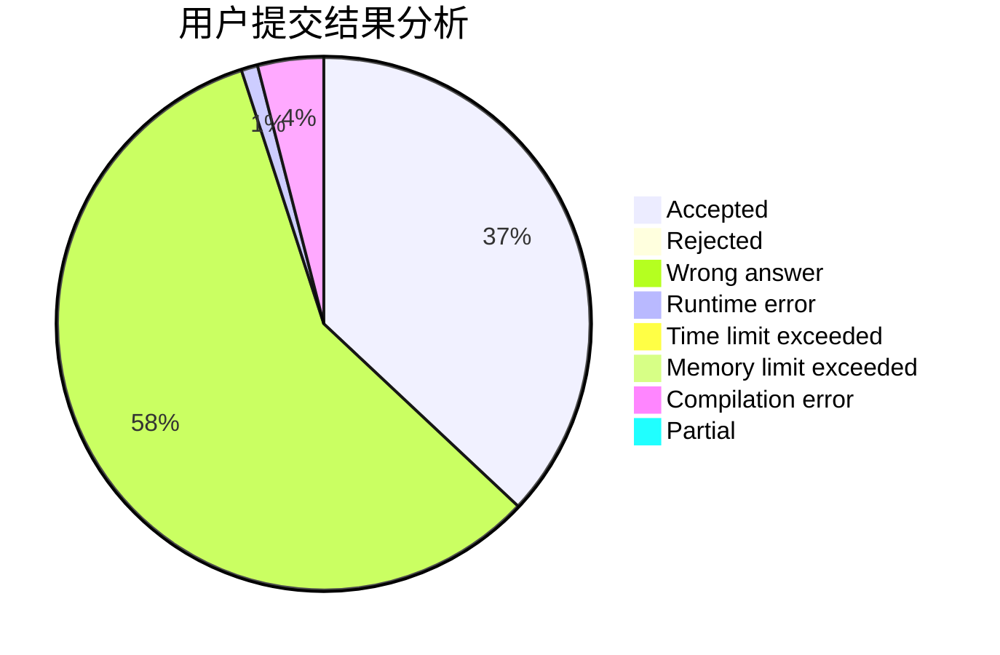
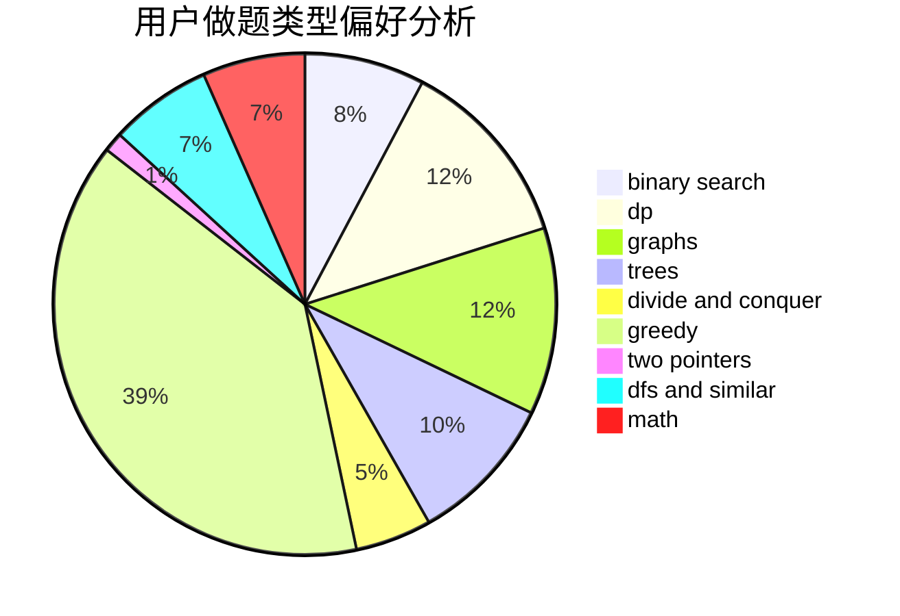

# -2x9_21-

<!-- tabs:start -->

#### **用户提交结果分析**

#### **用户做题类型偏好分析**

<!-- tabs:end -->
# 推荐题目
[1004C](https://codeforces.com/contest/1004/problem/C)
[1003E](https://codeforces.com/contest/1003/problem/E)
[1007A](https://codeforces.com/contest/1007/problem/A)
[1005D](https://codeforces.com/contest/1005/problem/D)
[1004B](https://codeforces.com/contest/1004/problem/B)
[1000G](https://codeforces.com/contest/1000/problem/G)
[1007E](https://codeforces.com/contest/1007/problem/E)
[1000F](https://codeforces.com/contest/1000/problem/F)
[10023](https://codeforces.com/contest/1002/problem/3)
[1005A](https://codeforces.com/contest/1005/problem/A)
