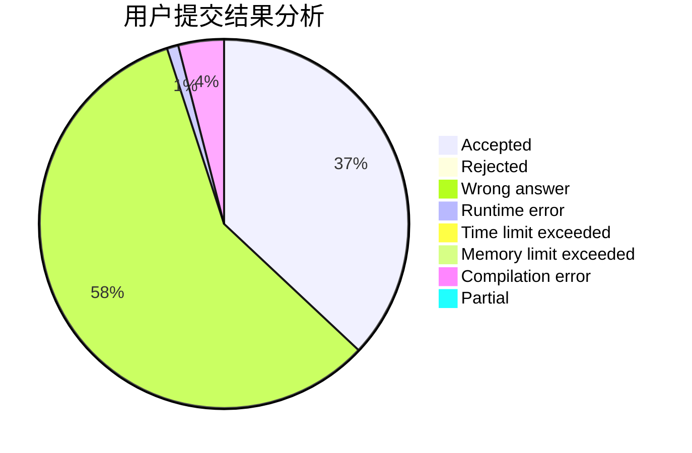
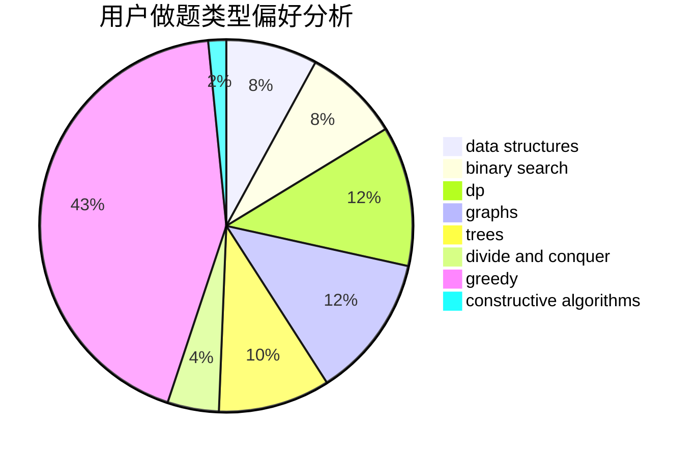

# -2x9_21-

<!-- tabs:start -->

#### **用户提交结果分析**

#### **用户做题类型偏好分析**

#### **用户错题知识点分析**

<!-- tabs:end -->
# 推荐题目
[1004C](https://codeforces.com/contest/1004/problem/C)		constructive algorithms,
                        implementation		  
[1003E](https://codeforces.com/contest/1003/problem/E)		constructive algorithms,
                        graphs		  
[1007A](https://codeforces.com/contest/1007/problem/A)		combinatorics,
                        data structures,
                        math,
                        sortings,
                        two pointers		  
[1005D](https://codeforces.com/contest/1005/problem/D)		dp,
                        greedy,
                        number theory		  
[1004B](https://codeforces.com/contest/1004/problem/B)		constructive algorithms,
                        greedy,
                        implementation,
                        math		  
[1000G](https://codeforces.com/contest/1000/problem/G)		data structures,
                        dp,
                        trees		  
[1007E](https://codeforces.com/contest/1007/problem/E)		dp		  
[1000F](https://codeforces.com/contest/1000/problem/F)		data structures,
                        divide and conquer		  
[10023](https://codeforces.com/contest/1002/problem/3)		dsu,graphs,sortings,trees		  
[1005A](https://codeforces.com/contest/1005/problem/A)		implementation		  
