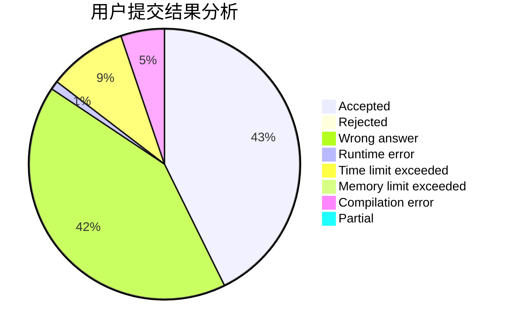
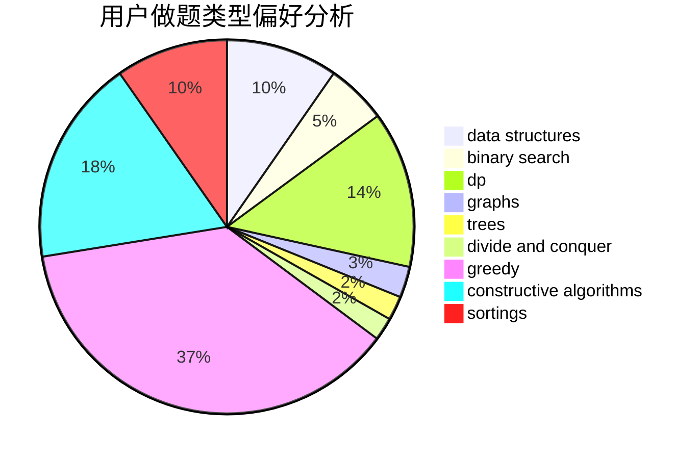
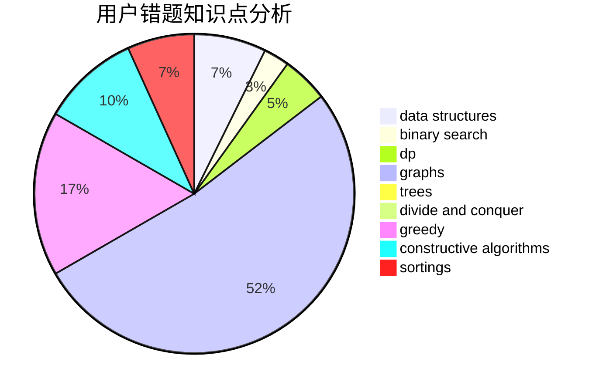

# -Faker
<!-- tabs:start -->
#### **用户提交结果分析**

#### **用户做题类型偏好分析**

#### **用户错题知识点分析**

<!-- tabs:end -->
# 推荐题目
[1016B](http://codeforces.com/problemset/problem/1016/B)		brute force,
                        implementation		  
[1010F](http://codeforces.com/problemset/problem/1010/F)		fft,
                        graphs,
                        trees		  
[1016A](http://codeforces.com/problemset/problem/1016/A)		greedy,
                        implementation,
                        math		  
[1016D](http://codeforces.com/problemset/problem/1016/D)		constructive algorithms,
                        flows,
                        math		  
[1015E2](http://codeforces.com/problemset/problem/1015/E2)		binary search,
                        dp,
                        greedy		  
[1012C](http://codeforces.com/problemset/problem/1012/C)		dp		  
[1011A](http://codeforces.com/problemset/problem/1011/A)		greedy,
                        implementation,
                        sortings		  
[1015A](http://codeforces.com/problemset/problem/1015/A)		implementation		  
[1010D](http://codeforces.com/problemset/problem/1010/D)		dfs and similar,
                        graphs,
                        implementation,
                        trees		  
[1015C](http://codeforces.com/problemset/problem/1015/C)		sortings		  
<!-- tabs:start -->
#### **data structures**
[1010E](http://codeforces.com/problemset/problem/1010/E)		data structures		  
[1008C](https://codeforces.com/contest/1008/problem/C)		combinatorics,
                        data structures,
                        math,
                        sortings,
                        two pointers		  
[1017D](http://codeforces.com/problemset/problem/1017/D)		bitmasks,
                        brute force,
                        data structures		  
[1009F](http://codeforces.com/problemset/problem/1009/F)		data structures,
                        dsu,
                        trees		  
[1492C](http://codeforces.com/problemset/problem/1492/C)		binary search,
                        data structures,
                        dp,
                        greedy,
                        two pointers		  
[1490G](http://codeforces.com/problemset/problem/1490/G)		binary search,
                        data structures,
                        math		  
[1479D](http://codeforces.com/problemset/problem/1479/D)		binary search,
                        bitmasks,
                        brute force,
                        data structures,
                        probabilities,
                        trees		  
[1497A](http://codeforces.com/problemset/problem/1497/A)		brute force,
                        data structures,
                        greedy,
                        sortings		  
[1491C](http://codeforces.com/problemset/problem/1491/C)		brute force,
                        data structures,
                        dp,
                        greedy,
                        implementation		  
[1492B](http://codeforces.com/problemset/problem/1492/B)		data structures,
                        greedy,
                        math		  
#### **binary search**
[1015E2](http://codeforces.com/problemset/problem/1015/E2)		binary search,
                        dp,
                        greedy		  
[1008E](https://codeforces.com/contest/1008/problem/E)		binary search,
                        interactive		  
[1010B](http://codeforces.com/problemset/problem/1010/B)		binary search,
                        interactive		  
[1016E](http://codeforces.com/problemset/problem/1016/E)		binary search,
                        geometry		  
[1011C](https://codeforces.com/contest/1011/problem/C)		binary search,
                        math		  
[1011B](http://codeforces.com/problemset/problem/1011/B)		binary search,
                        brute force,
                        implementation		  
[1010A](http://codeforces.com/problemset/problem/1010/A)		binary search,
                        math		  
[1011D](https://codeforces.com/contest/1011/problem/D)		binary search,
                        interactive		  
[1492C](http://codeforces.com/problemset/problem/1492/C)		binary search,
                        data structures,
                        dp,
                        greedy,
                        two pointers		  
[1463D](http://codeforces.com/problemset/problem/1463/D)		binary search,
                        constructive algorithms,
                        greedy,
                        two pointers		  
#### **dp**
[1015E2](http://codeforces.com/problemset/problem/1015/E2)		binary search,
                        dp,
                        greedy		  
[1012C](http://codeforces.com/problemset/problem/1012/C)		dp		  
[1016F](http://codeforces.com/problemset/problem/1016/F)		dfs and similar,
                        dp,
                        trees		  
[1012F](http://codeforces.com/problemset/problem/1012/F)		dp,
                        implementation		  
[1005D](http://codeforces.com/problemset/problem/1005/D)		dp,
                        greedy,
                        number theory		  
[1015E1](http://codeforces.com/problemset/problem/1015/E1)		brute force,
                        dp,
                        greedy		  
[1013E](https://codeforces.com/contest/1013/problem/E)		dp		  
[1015F](http://codeforces.com/problemset/problem/1015/F)		dp,
                        strings		  
[1016C](http://codeforces.com/problemset/problem/1016/C)		dp,
                        implementation		  
[1007E](http://codeforces.com/problemset/problem/1007/E)		dp		  
#### **graph**
[1010F](http://codeforces.com/problemset/problem/1010/F)		fft,
                        graphs,
                        trees		  
[1010D](http://codeforces.com/problemset/problem/1010/D)		dfs and similar,
                        graphs,
                        implementation,
                        trees		  
[1009D](http://codeforces.com/problemset/problem/1009/D)		brute force,
                        constructive algorithms,
                        graphs,
                        greedy,
                        math		  
[1009G](http://codeforces.com/problemset/problem/1009/G)		bitmasks,
                        flows,
                        graph matchings,
                        graphs,
                        greedy		  
[1011F](https://codeforces.com/contest/1011/problem/F)		dfs and similar,
                        graphs,
                        implementation,
                        trees		  
[1012B](http://codeforces.com/problemset/problem/1012/B)		constructive algorithms,
                        dfs and similar,
                        dsu,
                        graphs,
                        matrices		  
[1013D](https://codeforces.com/contest/1013/problem/D)		constructive algorithms,
                        dfs and similar,
                        dsu,
                        graphs,
                        matrices		  
[1487C](http://codeforces.com/problemset/problem/1487/C)		brute force,
                        constructive algorithms,
                        dfs and similar,
                        graphs,
                        greedy,
                        implementation,
                        math		  
[1437C](http://codeforces.com/problemset/problem/1437/C)		dp,
                        flows,
                        graph matchings,
                        greedy,
                        math,
                        sortings		  
[1470D](http://codeforces.com/problemset/problem/1470/D)		constructive algorithms,
                        dfs and similar,
                        graph matchings,
                        graphs,
                        greedy		  
#### **trees**
[1010F](http://codeforces.com/problemset/problem/1010/F)		fft,
                        graphs,
                        trees		  
[1010D](http://codeforces.com/problemset/problem/1010/D)		dfs and similar,
                        graphs,
                        implementation,
                        trees		  
[1016F](http://codeforces.com/problemset/problem/1016/F)		dfs and similar,
                        dp,
                        trees		  
[1011F](https://codeforces.com/contest/1011/problem/F)		dfs and similar,
                        graphs,
                        implementation,
                        trees		  
[1009F](http://codeforces.com/problemset/problem/1009/F)		data structures,
                        dsu,
                        trees		  
[1479D](http://codeforces.com/problemset/problem/1479/D)		binary search,
                        bitmasks,
                        brute force,
                        data structures,
                        probabilities,
                        trees		  
[1511C](http://codeforces.com/problemset/problem/1511/C)		brute force,
                        data structures,
                        implementation,
                        trees		  
[1499F](http://codeforces.com/problemset/problem/1499/F)		combinatorics,
                        dfs and similar,
                        dp,
                        trees		  
[1491E](http://codeforces.com/problemset/problem/1491/E)		brute force,
                        dfs and similar,
                        divide and conquer,
                        number theory,
                        trees		  
[1466D](http://codeforces.com/problemset/problem/1466/D)		data structures,
                        greedy,
                        sortings,
                        trees		  
#### **divide and conquer**
[1461D](http://codeforces.com/problemset/problem/1461/D)		binary search,
                        brute force,
                        data structures,
                        divide and conquer,
                        implementation,
                        sortings		  
[1466G](http://codeforces.com/problemset/problem/1466/G)		combinatorics,
                        divide and conquer,
                        hashing,
                        math,
                        string suffix structures,
                        strings		  
[1490D](http://codeforces.com/problemset/problem/1490/D)		dfs and similar,
                        divide and conquer,
                        implementation		  
[1483C](https://codeforces.com/contest/1483/problem/C)		data structures,
                        divide and conquer,
                        dp		  
[1491E](http://codeforces.com/problemset/problem/1491/E)		brute force,
                        dfs and similar,
                        divide and conquer,
                        number theory,
                        trees		  
[1303G](http://codeforces.com/problemset/problem/1303/G)		data structures,
                        divide and conquer,
                        geometry,
                        trees		  
[1494D](http://codeforces.com/problemset/problem/1494/D)		constructive algorithms,
                        data structures,
                        dfs and similar,
                        divide and conquer,
                        dsu,
                        greedy,
                        sortings,
                        trees		  
[1482E](http://codeforces.com/problemset/problem/1482/E)		data structures,
                        divide and conquer,
                        dp		  
[566C](http://codeforces.com/problemset/problem/566/C)		dfs and similar,
                        divide and conquer,
                        trees		  
[1428F](http://codeforces.com/problemset/problem/1428/F)		binary search,
                        data structures,
                        divide and conquer,
                        dp,
                        two pointers		  
#### **greedy**
[1016A](http://codeforces.com/problemset/problem/1016/A)		greedy,
                        implementation,
                        math		  
[1015E2](http://codeforces.com/problemset/problem/1015/E2)		binary search,
                        dp,
                        greedy		  
[1011A](http://codeforces.com/problemset/problem/1011/A)		greedy,
                        implementation,
                        sortings		  
[1009B](http://codeforces.com/problemset/problem/1009/B)		greedy,
                        implementation		  
[1013B](http://codeforces.com/problemset/problem/1013/B)		greedy		  
[1017C](http://codeforces.com/problemset/problem/1017/C)		constructive algorithms,
                        greedy		  
[1008B](http://codeforces.com/problemset/problem/1008/B)		greedy,
                        sortings		  
[1005D](http://codeforces.com/problemset/problem/1005/D)		dp,
                        greedy,
                        number theory		  
[1009D](http://codeforces.com/problemset/problem/1009/D)		brute force,
                        constructive algorithms,
                        graphs,
                        greedy,
                        math		  
[1009C](http://codeforces.com/problemset/problem/1009/C)		greedy,
                        math		  
#### **constructive algorithms**
[1016D](http://codeforces.com/problemset/problem/1016/D)		constructive algorithms,
                        flows,
                        math		  
[1012D](http://codeforces.com/problemset/problem/1012/D)		constructive algorithms,
                        strings		  
[1017C](http://codeforces.com/problemset/problem/1017/C)		constructive algorithms,
                        greedy		  
[1009D](http://codeforces.com/problemset/problem/1009/D)		brute force,
                        constructive algorithms,
                        graphs,
                        greedy,
                        math		  
[1015D](http://codeforces.com/problemset/problem/1015/D)		constructive algorithms,
                        greedy		  
[1012B](http://codeforces.com/problemset/problem/1012/B)		constructive algorithms,
                        dfs and similar,
                        dsu,
                        graphs,
                        matrices		  
[1013D](https://codeforces.com/contest/1013/problem/D)		constructive algorithms,
                        dfs and similar,
                        dsu,
                        graphs,
                        matrices		  
[1493A](http://codeforces.com/problemset/problem/1493/A)		constructive algorithms,
                        greedy		  
[1463D](http://codeforces.com/problemset/problem/1463/D)		binary search,
                        constructive algorithms,
                        greedy,
                        two pointers		  
[1456B](https://codeforces.com/contest/1456/problem/B)		bitmasks,
                        brute force,
                        constructive algorithms		  
#### **sortings**
[1011A](http://codeforces.com/problemset/problem/1011/A)		greedy,
                        implementation,
                        sortings		  
[1015C](http://codeforces.com/problemset/problem/1015/C)		sortings		  
[1008B](http://codeforces.com/problemset/problem/1008/B)		greedy,
                        sortings		  
[1012A](http://codeforces.com/problemset/problem/1012/A)		brute force,
                        implementation,
                        math,
                        sortings		  
[1013C](https://codeforces.com/contest/1013/problem/C)		brute force,
                        implementation,
                        math,
                        sortings		  
[1008C](https://codeforces.com/contest/1008/problem/C)		combinatorics,
                        data structures,
                        math,
                        sortings,
                        two pointers		  
[1496C](https://codeforces.com/contest/1496/problem/C)		geometry,
                        greedy,
                        math,
                        sortings		  
[1495A](http://codeforces.com/problemset/problem/1495/A)		geometry,
                        greedy,
                        math,
                        sortings		  
[1497A](http://codeforces.com/problemset/problem/1497/A)		brute force,
                        data structures,
                        greedy,
                        sortings		  
[1427A](http://codeforces.com/problemset/problem/1427/A)		math,
                        sortings		  
<!-- tabs:end -->
