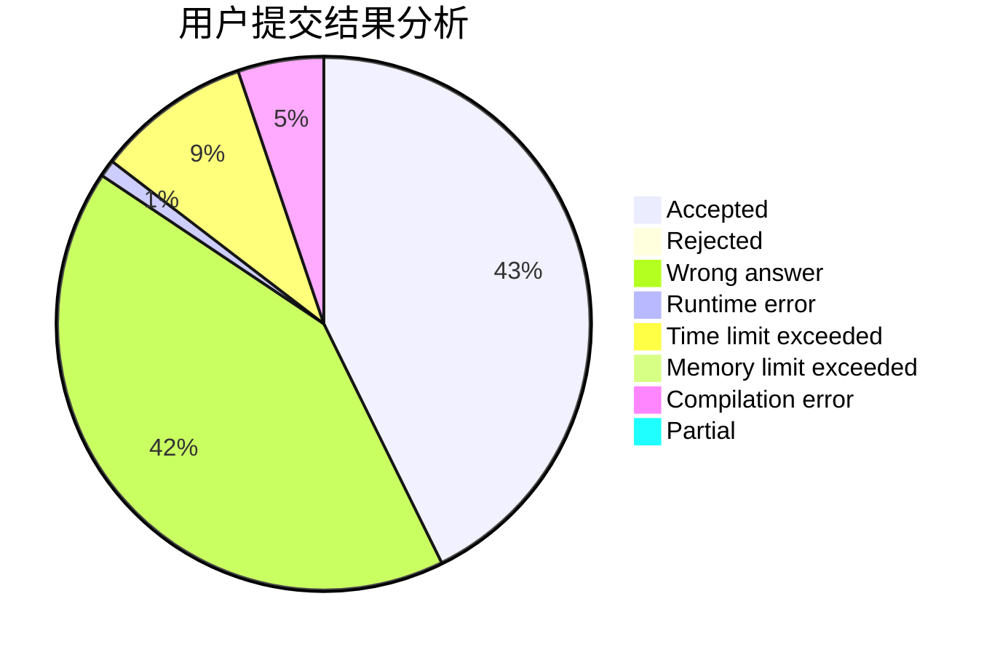
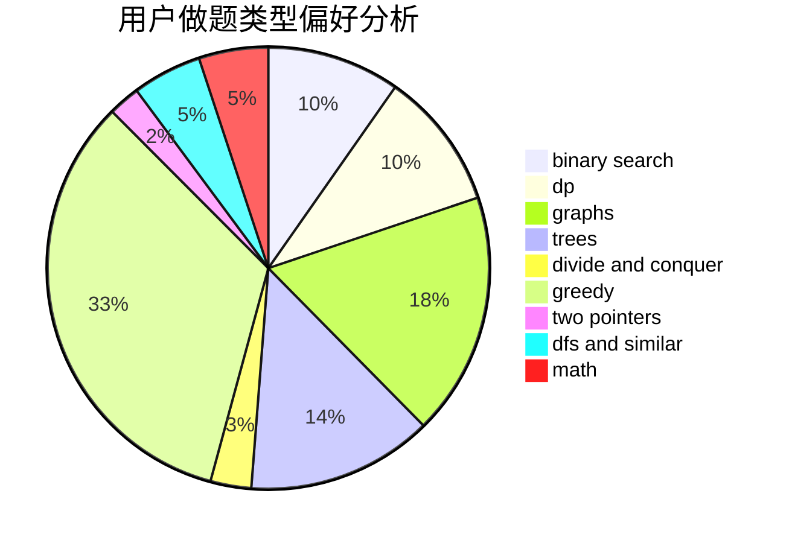

# -Faker

<!-- tabs:start -->

#### **用户提交结果分析**

#### **用户做题类型偏好分析**

<!-- tabs:end -->
# 推荐题目
[1010B](https://codeforces.com/contest/1010/problem/B)
[1011C](https://codeforces.com/contest/1011/problem/C)
[1016B](https://codeforces.com/contest/1016/problem/B)
[1015D](https://codeforces.com/contest/1015/problem/D)
[1013A](https://codeforces.com/contest/1013/problem/A)
[1016D](https://codeforces.com/contest/1016/problem/D)
[1015F](https://codeforces.com/contest/1015/problem/F)
[1013E](https://codeforces.com/contest/1013/problem/E)
[10151](https://codeforces.com/contest/1015/problem/1)
[1011D](https://codeforces.com/contest/1011/problem/D)
