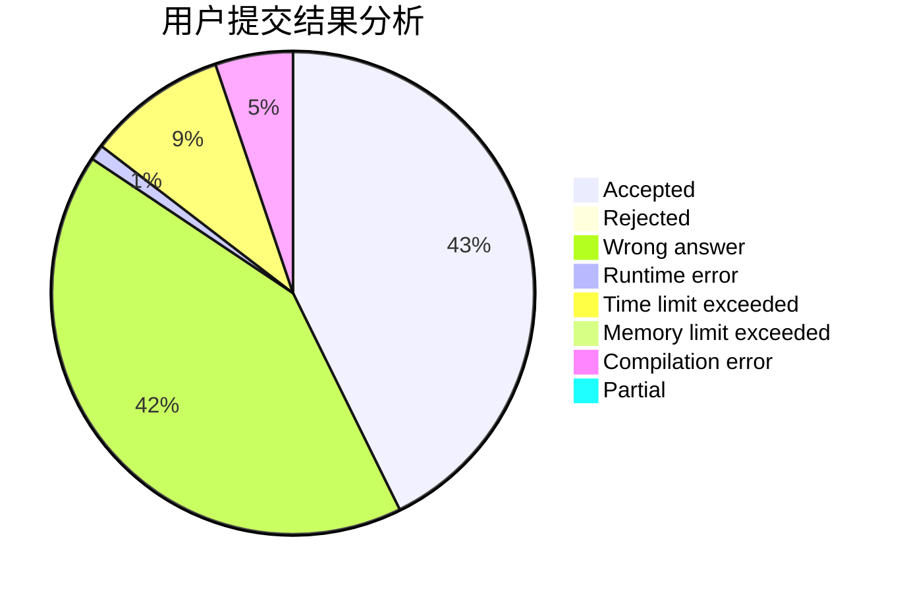
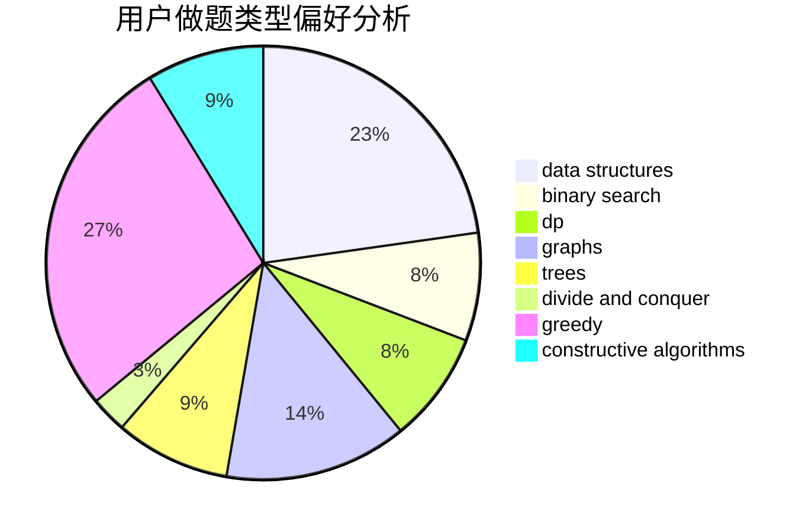
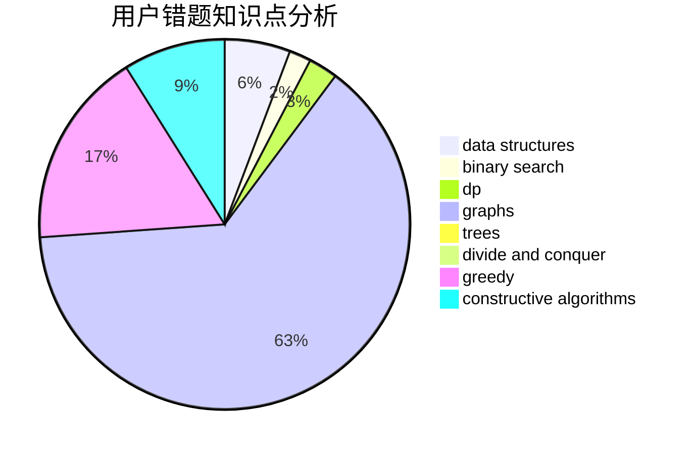

# -Faker

<!-- tabs:start -->

#### **用户提交结果分析**

#### **用户做题类型偏好分析**

#### **用户错题知识点分析**

<!-- tabs:end -->
# 推荐题目
[1010B](https://codeforces.com/contest/1010/problem/B)		binary search,
                        interactive		  
[1011C](https://codeforces.com/contest/1011/problem/C)		dsu,graphs,sortings,trees		  
[1016B](https://codeforces.com/contest/1016/problem/B)		brute force,
                        implementation		  
[1015D](https://codeforces.com/contest/1015/problem/D)		constructive algorithms,
                        greedy		  
[1013A](https://codeforces.com/contest/1013/problem/A)		math		  
[1016D](https://codeforces.com/contest/1016/problem/D)		constructive algorithms,
                        flows,
                        math		  
[1015F](https://codeforces.com/contest/1015/problem/F)		dp,
                        strings		  
[1013E](https://codeforces.com/contest/1013/problem/E)		dsu,graphs,sortings,trees		  
[10151](https://codeforces.com/contest/1015/problem/1)		dsu,graphs,sortings,trees		  
[1011D](https://codeforces.com/contest/1011/problem/D)		dsu,graphs,sortings,trees		  
