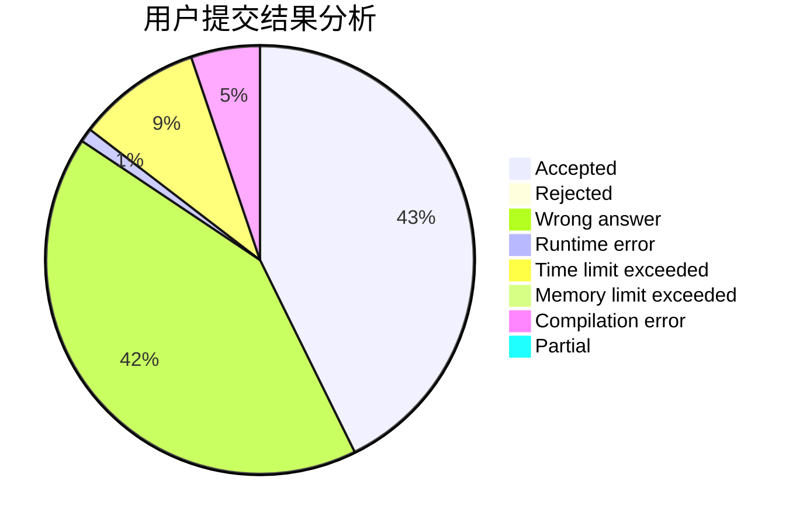
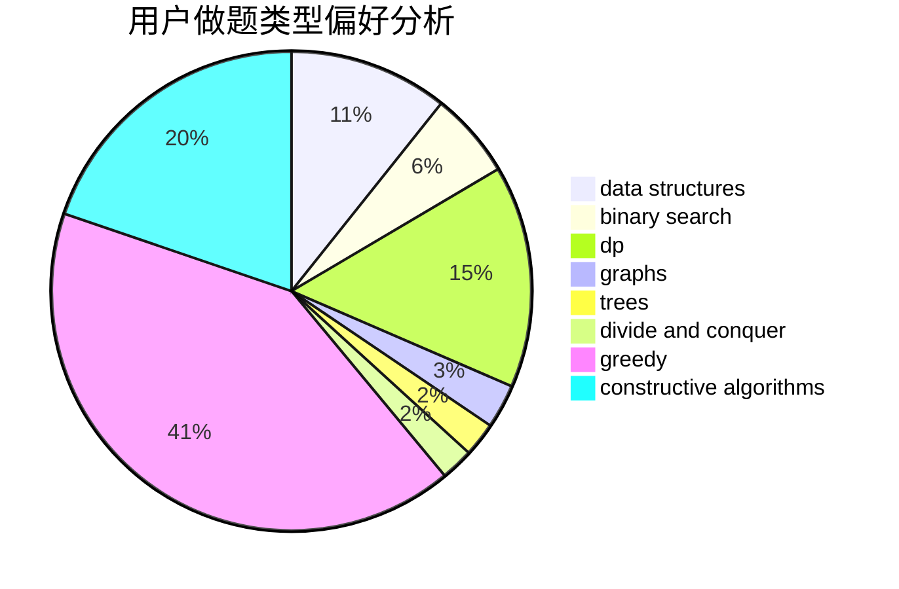
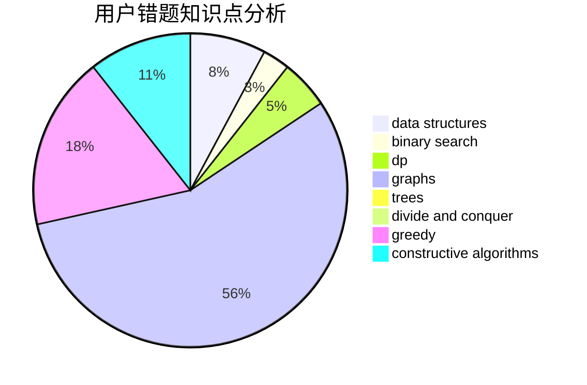

# -Faker

<!-- tabs:start -->

#### **用户提交结果分析**

#### **用户做题类型偏好分析**

#### **用户错题知识点分析**

<!-- tabs:end -->
# 推荐题目
[1009G](https://codeforces.com/contest/1009/problem/G)		bitmasks,
                        flows,
                        graph matchings,
                        graphs,
                        greedy		  
[1010F](https://codeforces.com/contest/1010/problem/F)		fft,
                        graphs,
                        trees		  
[1015E2](https://codeforces.com/contest/1015E/problem/2)		binary search,
                        dp,
                        greedy		  
[1015C](https://codeforces.com/contest/1015/problem/C)		sortings		  
[1012C](https://codeforces.com/contest/1012/problem/C)		dp		  
[1016A](https://codeforces.com/contest/1016/problem/A)		greedy,
                        implementation,
                        math		  
[1015D](https://codeforces.com/contest/1015/problem/D)		constructive algorithms,
                        greedy		  
[1013B](https://codeforces.com/contest/1013/problem/B)		greedy		  
[1013C](https://codeforces.com/contest/1013/problem/C)		dsu,graphs,sortings,trees		  
[1011A](https://codeforces.com/contest/1011/problem/A)		greedy,
                        implementation,
                        sortings		  
