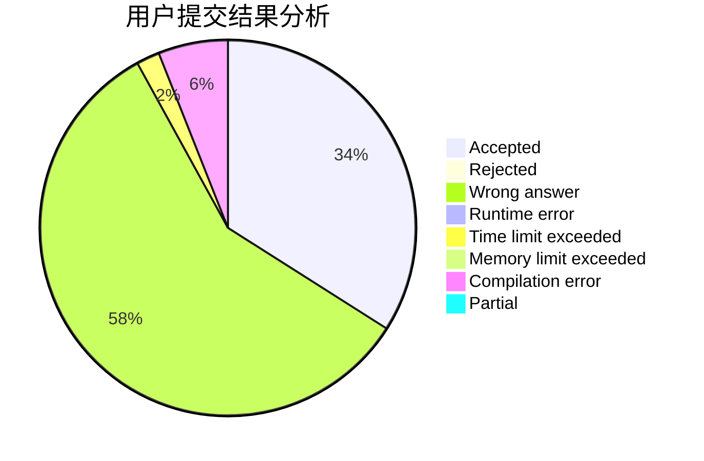
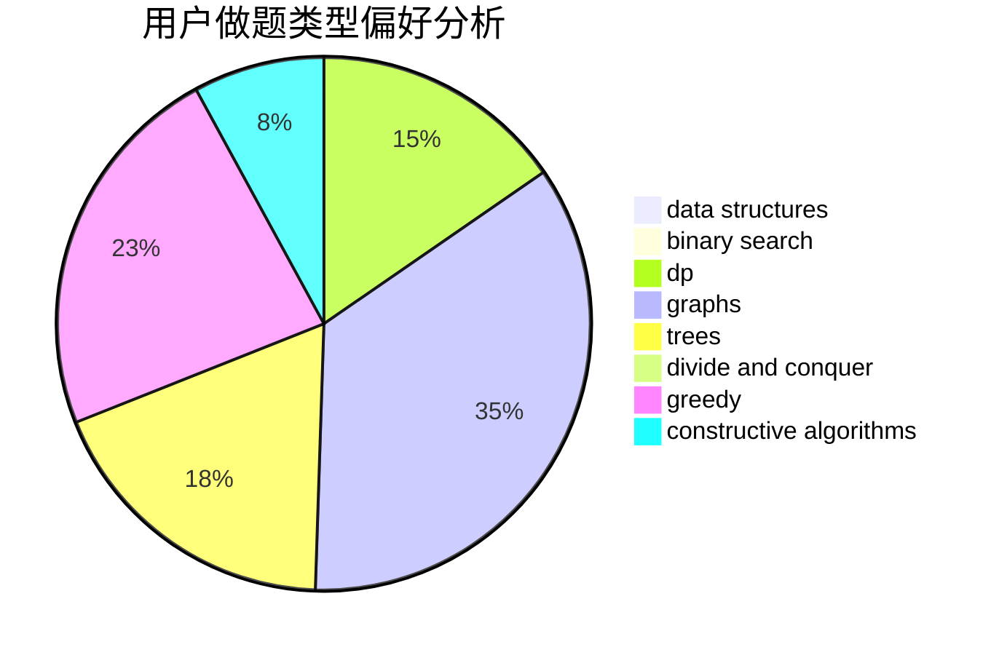

# 0xfaner

<!-- tabs:start -->

#### **用户提交结果分析**

#### **用户做题类型偏好分析**

#### **用户错题知识点分析**

<!-- tabs:end -->
# 推荐题目
[1068C](https://codeforces.com/contest/1068/problem/C)		constructive algorithms,
                        graphs		  
[1067B](https://codeforces.com/contest/1067/problem/B)		dfs and similar,
                        graphs,
                        shortest paths		  
[1067C](https://codeforces.com/contest/1067/problem/C)		constructive algorithms		  
[1068A](https://codeforces.com/contest/1068/problem/A)		math		  
[1067D](https://codeforces.com/contest/1067/problem/D)		dp,
                        greedy,
                        math,
                        probabilities		  
[1067E](https://codeforces.com/contest/1067/problem/E)		dp,
                        graph matchings,
                        math,
                        trees		  
[1068B](https://codeforces.com/contest/1068/problem/B)		math,
                        number theory		  
[1490C](https://codeforces.com/contest/1490/problem/C)		binary search,
                        brute force,
                        brute force,
                        math		  
[1497B](https://codeforces.com/contest/1497/problem/B)		constructive algorithms,
                        greedy,
                        math		  
[1491C](https://codeforces.com/contest/1491/problem/C)		brute force,
                        data structures,
                        dp,
                        greedy,
                        implementation		  
