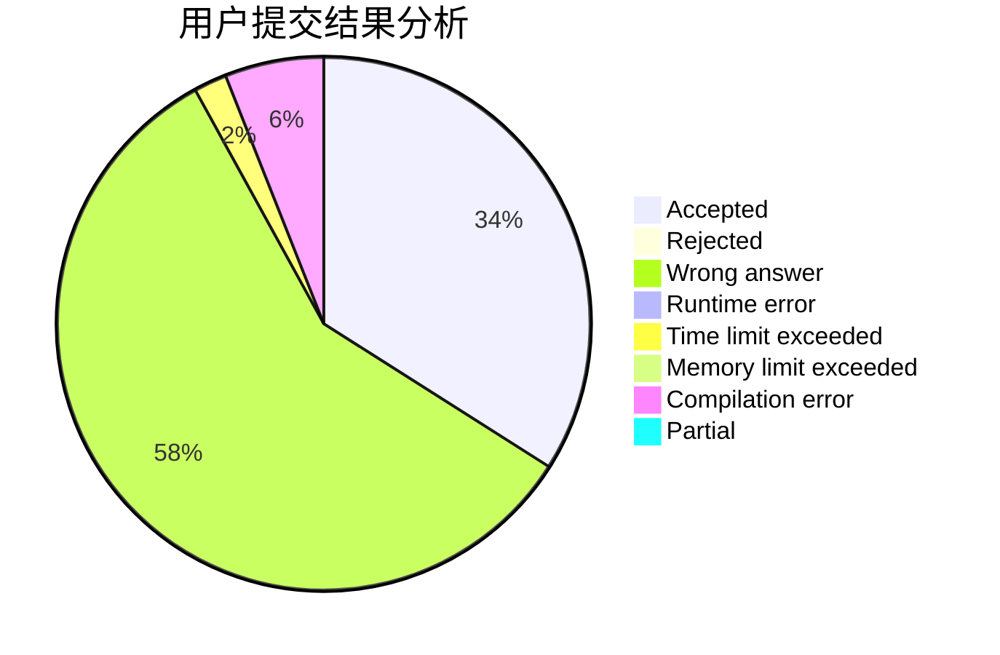
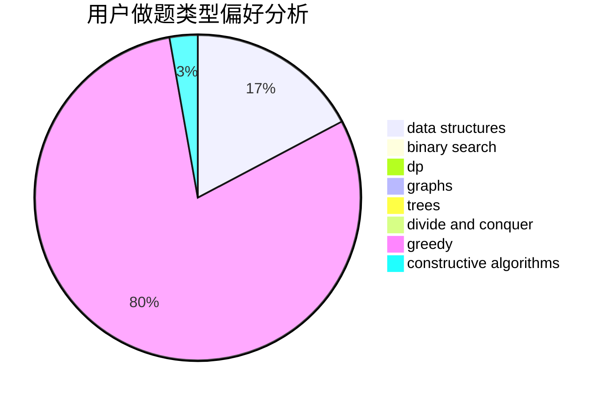

# 0xfaner

<!-- tabs:start -->

#### **用户提交结果分析**

#### **用户做题类型偏好分析**

#### **用户错题知识点分析**

<!-- tabs:end -->
# 推荐题目
[1067E](https://codeforces.com/contest/1067/problem/E)		dp,
                        graph matchings,
                        math,
                        trees		  
[1066E](https://codeforces.com/contest/1066/problem/E)		data structures,
                        implementation,
                        math		  
[1066F](https://codeforces.com/contest/1066/problem/F)		dp		  
[1067C](https://codeforces.com/contest/1067/problem/C)		constructive algorithms		  
[1067A](https://codeforces.com/contest/1067/problem/A)		dp		  
[1067B](https://codeforces.com/contest/1067/problem/B)		dfs and similar,
                        graphs,
                        shortest paths		  
[1067D](https://codeforces.com/contest/1067/problem/D)		dp,
                        greedy,
                        math,
                        probabilities		  
[1482E](https://codeforces.com/contest/1482/problem/E)		data structures,
                        divide and conquer,
                        dp		  
[1489D](https://codeforces.com/contest/1489/problem/D)		dsu,graphs,sortings,trees		  
[1483E](https://codeforces.com/contest/1483/problem/E)		dsu,graphs,sortings,trees		  
