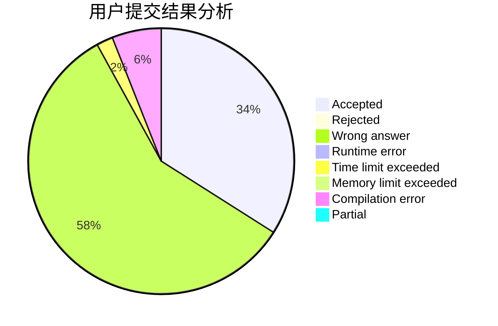
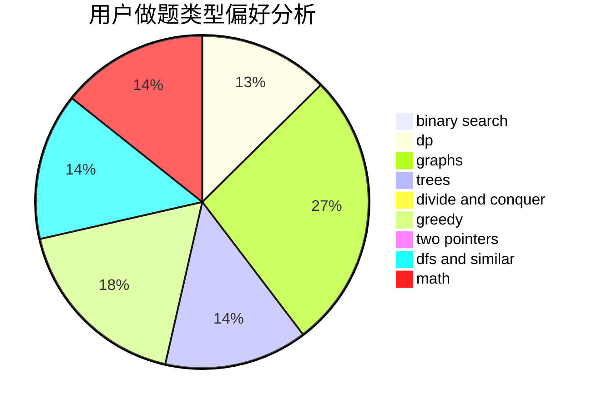

# 0xfaner

<!-- tabs:start -->

#### **用户提交结果分析**

#### **用户做题类型偏好分析**

<!-- tabs:end -->
# 推荐题目
[1068C](https://codeforces.com/contest/1068/problem/C)
[1067B](https://codeforces.com/contest/1067/problem/B)
[1067C](https://codeforces.com/contest/1067/problem/C)
[1068A](https://codeforces.com/contest/1068/problem/A)
[1067D](https://codeforces.com/contest/1067/problem/D)
[1067E](https://codeforces.com/contest/1067/problem/E)
[1068B](https://codeforces.com/contest/1068/problem/B)
[1490C](https://codeforces.com/contest/1490/problem/C)
[1497B](https://codeforces.com/contest/1497/problem/B)
[1491C](https://codeforces.com/contest/1491/problem/C)
