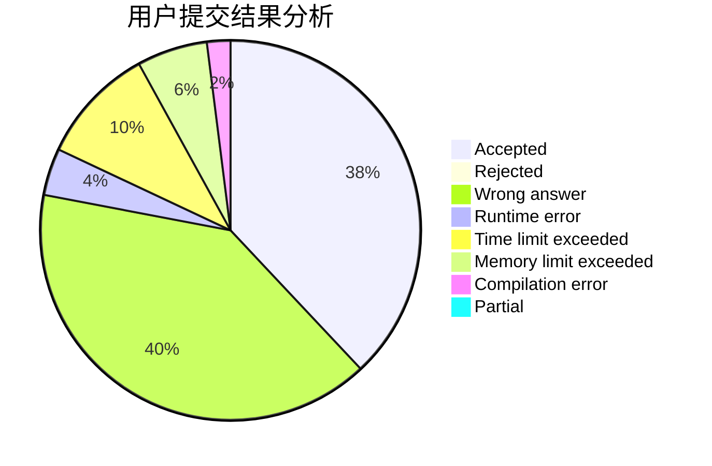
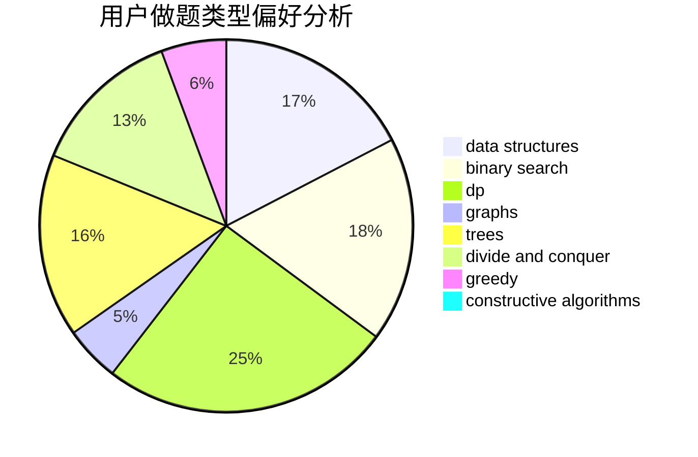

# ACroci

<!-- tabs:start -->

#### **用户提交结果分析**

#### **用户做题类型偏好分析**

#### **用户错题知识点分析**

<!-- tabs:end -->
# 推荐题目
[1491F](https://codeforces.com/contest/1491/problem/F)		binary search,
                        constructive algorithms,
                        interactive		  
[1158F](https://codeforces.com/contest/1158/problem/F)		dp,
                        math		  
[1007E](https://codeforces.com/contest/1007/problem/E)		dp		  
[1386B](https://codeforces.com/contest/1386/problem/B)		*special problem,
                        data structures,
                        geometry,
                        math,
                        sortings		  
[1194E](https://codeforces.com/contest/1194/problem/E)		bitmasks,
                        brute force,
                        data structures,
                        geometry,
                        sortings		  
[1331A](https://codeforces.com/contest/1331/problem/A)		nan		  
[1046H](https://codeforces.com/contest/1046/problem/H)		dsu,graphs,sortings,trees		  
[136B](https://codeforces.com/contest/136/problem/B)		implementation,
                        math		  
[1054B](https://codeforces.com/contest/1054/problem/B)		implementation		  
[1477F](https://codeforces.com/contest/1477/problem/F)		combinatorics,
                        fft,
                        math,
                        probabilities		  
