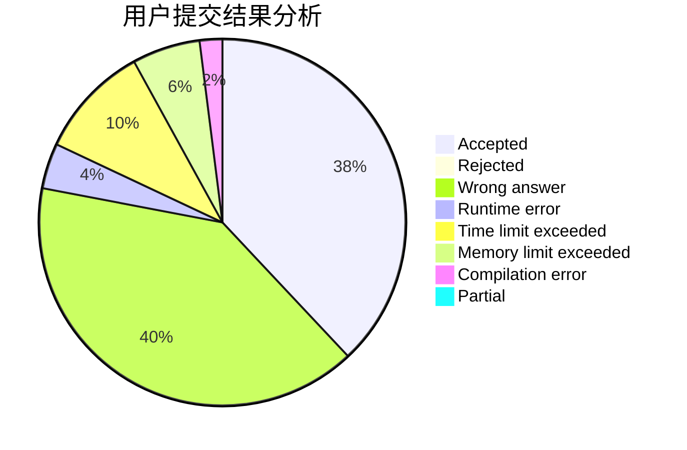
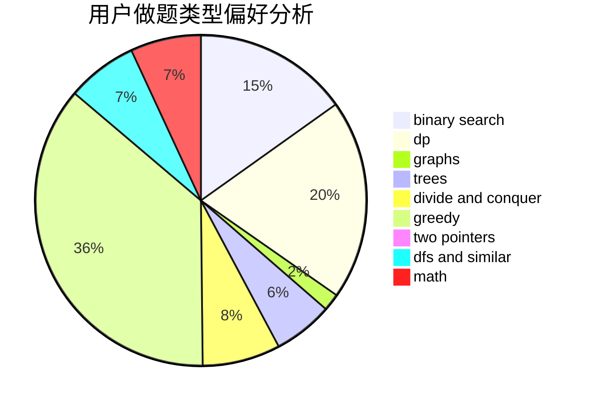

# ACroci

<!-- tabs:start -->

#### **用户提交结果分析**

#### **用户做题类型偏好分析**

<!-- tabs:end -->
# 推荐题目
[1491F](https://codeforces.com/contest/1491/problem/F)
[1158F](https://codeforces.com/contest/1158/problem/F)
[1007E](https://codeforces.com/contest/1007/problem/E)
[1386B](https://codeforces.com/contest/1386/problem/B)
[1194E](https://codeforces.com/contest/1194/problem/E)
[1331A](https://codeforces.com/contest/1331/problem/A)
[1046H](https://codeforces.com/contest/1046/problem/H)
[136B](https://codeforces.com/contest/136/problem/B)
[1054B](https://codeforces.com/contest/1054/problem/B)
[1477F](https://codeforces.com/contest/1477/problem/F)
