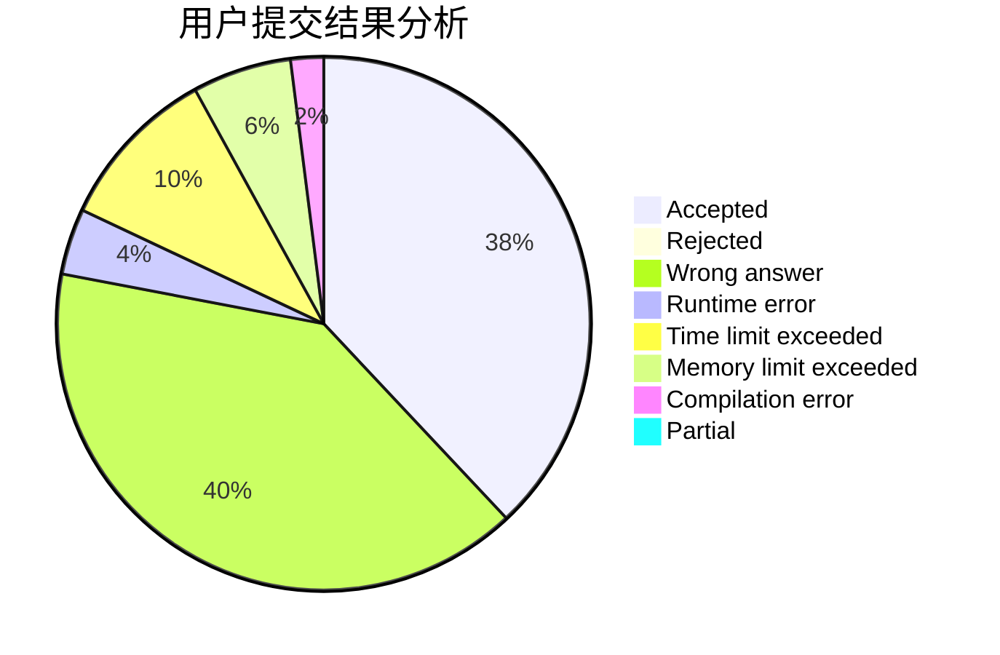
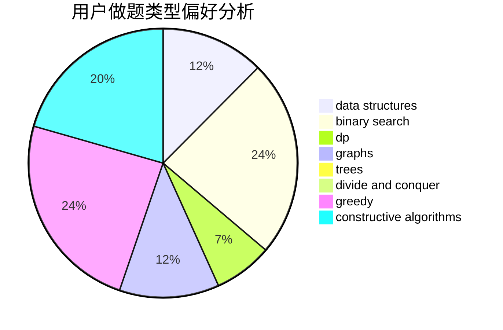

# ACroci

<!-- tabs:start -->

#### **用户提交结果分析**

#### **用户做题类型偏好分析**

#### **用户错题知识点分析**

<!-- tabs:end -->
# 推荐题目
[1484B](https://codeforces.com/contest/1484/problem/B)		dsu,graphs,sortings,trees		  
[1156G](https://codeforces.com/contest/1156/problem/G)		graphs,
                        greedy,
                        hashing,
                        implementation		  
[1007A](https://codeforces.com/contest/1007/problem/A)		combinatorics,
                        data structures,
                        math,
                        sortings,
                        two pointers		  
[1377A1](https://codeforces.com/contest/1377A/problem/1)		dsu,graphs,sortings,trees		  
[1189C](https://codeforces.com/contest/1189/problem/C)		data structures,
                        dp,
                        implementation,
                        math		  
[1324C](https://codeforces.com/contest/1324/problem/C)		binary search,
                        data structures,
                        dfs and similar,
                        greedy,
                        implementation		  
[1045I](https://codeforces.com/contest/1045/problem/I)		hashing,
                        strings		  
[1362C](https://codeforces.com/contest/1362/problem/C)		bitmasks,
                        greedy,
                        math		  
[1053C](https://codeforces.com/contest/1053/problem/C)		dsu,graphs,sortings,trees		  
[1469E](https://codeforces.com/contest/1469/problem/E)		bitmasks,
                        brute force,
                        hashing,
                        string suffix structures,
                        strings,
                        two pointers		  
