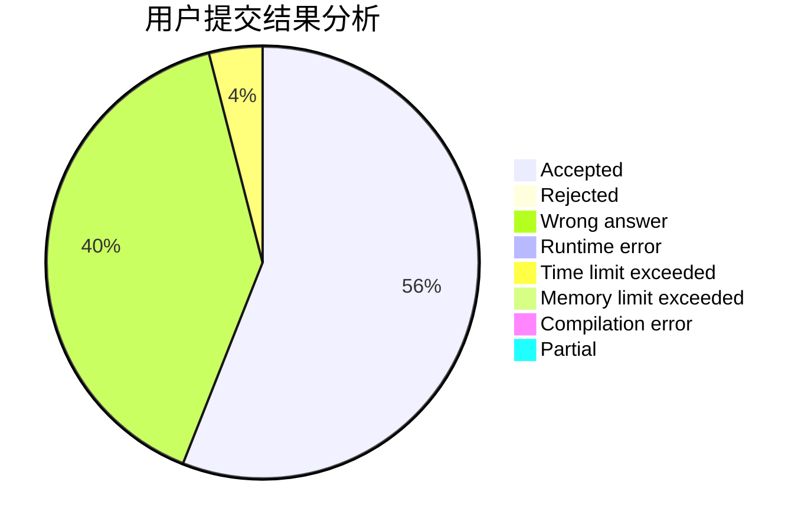
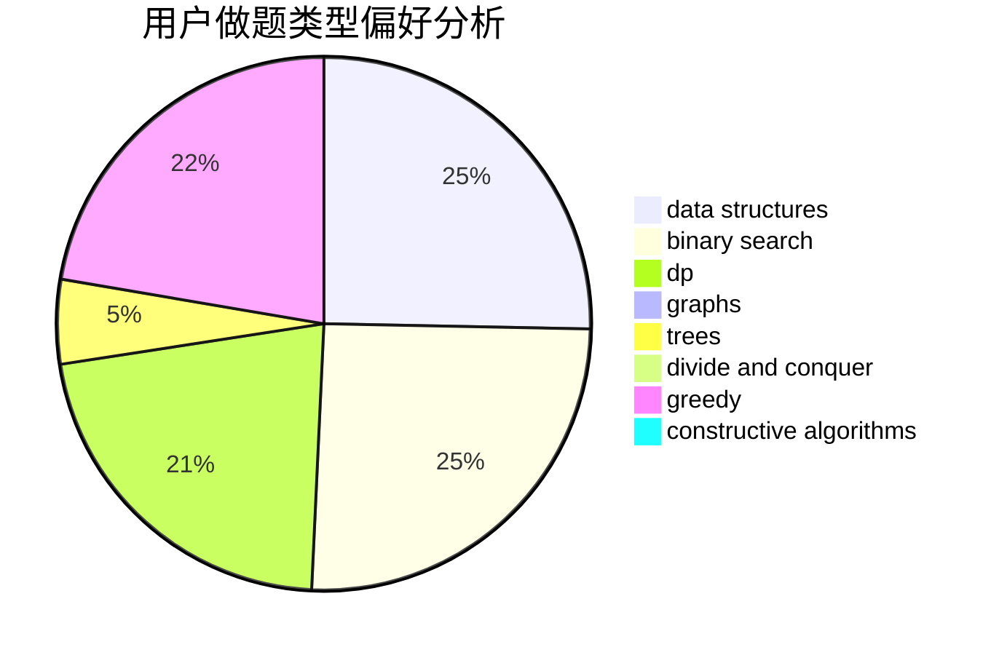
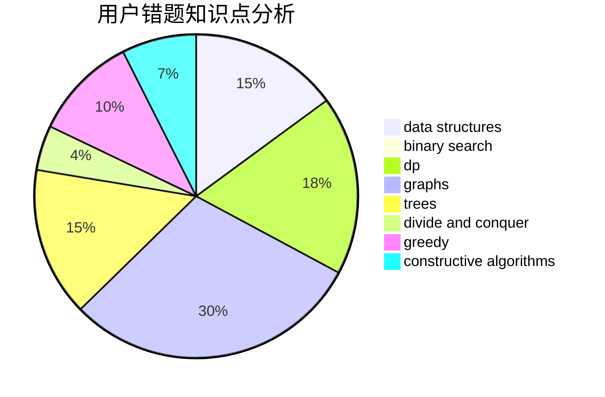

# RALZH

<!-- tabs:start -->

#### **用户提交结果分析**

#### **用户做题类型偏好分析**

#### **用户错题知识点分析**

<!-- tabs:end -->
# 推荐题目
[543C](https://codeforces.com/contest/543/problem/C)		bitmasks,
                        dp		  
[1261F](https://codeforces.com/contest/1261/problem/F)		bitmasks,
                        divide and conquer,
                        math		  
[1059B](https://codeforces.com/contest/1059/problem/B)		implementation		  
[918A](https://codeforces.com/contest/918/problem/A)		brute force,
                        implementation		  
[1158D](https://codeforces.com/contest/1158/problem/D)		constructive algorithms,
                        geometry,
                        greedy,
                        math		  
[633D](https://codeforces.com/contest/633/problem/D)		brute force,
                        dp,
                        hashing,
                        implementation,
                        math		  
[321B](https://codeforces.com/contest/321/problem/B)		dp,
                        flows,
                        greedy		  
[178F1](https://codeforces.com/contest/178F/problem/1)		nan		  
[109A](https://codeforces.com/contest/109/problem/A)		brute force,
                        implementation		  
[877D](https://codeforces.com/contest/877/problem/D)		data structures,
                        dfs and similar,
                        graphs,
                        shortest paths		  
