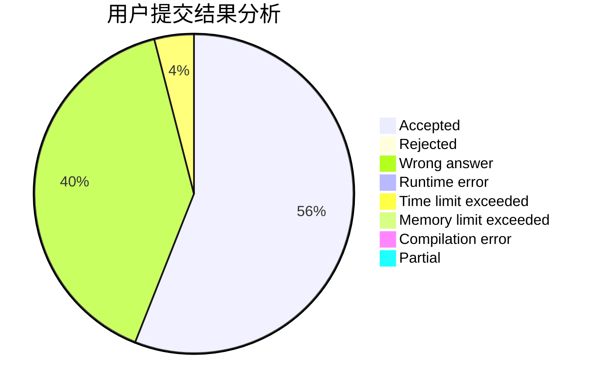
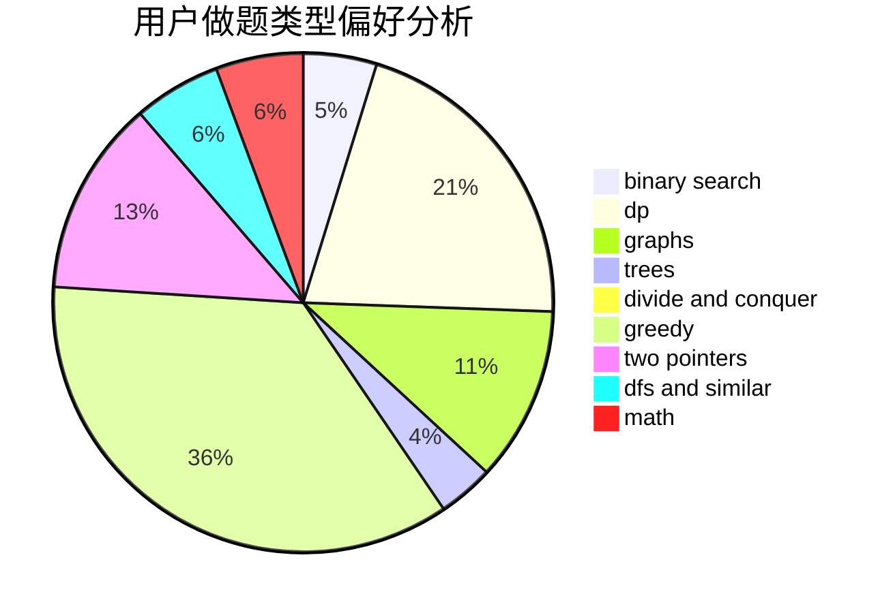

# RALZH

<!-- tabs:start -->

#### **用户提交结果分析**

#### **用户做题类型偏好分析**

<!-- tabs:end -->
# 推荐题目
[567E](https://codeforces.com/contest/567/problem/E)
[1267G](https://codeforces.com/contest/1267/problem/G)
[1059E](https://codeforces.com/contest/1059/problem/E)
[938D](https://codeforces.com/contest/938/problem/D)
[1161C](https://codeforces.com/contest/1161/problem/C)
[665F](https://codeforces.com/contest/665/problem/F)
[352A](https://codeforces.com/contest/352/problem/A)
[204D](https://codeforces.com/contest/204/problem/D)
[10C](https://codeforces.com/contest/10/problem/C)
[898C](https://codeforces.com/contest/898/problem/C)
