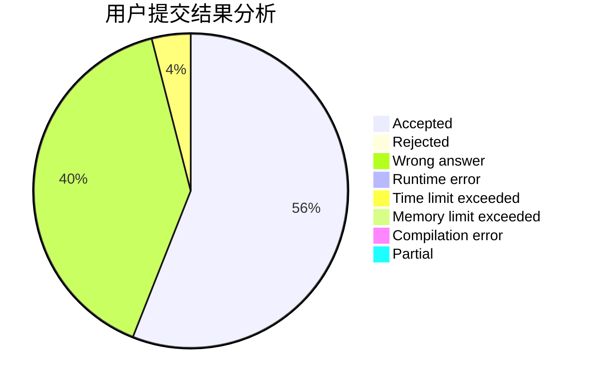
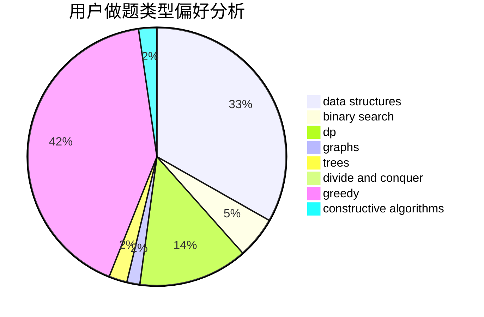
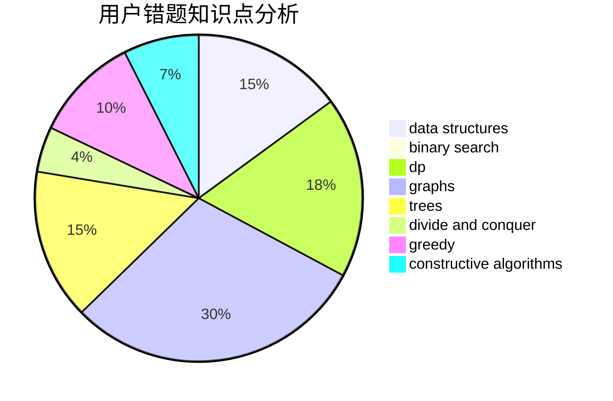

# RALZH

<!-- tabs:start -->

#### **用户提交结果分析**

#### **用户做题类型偏好分析**

#### **用户错题知识点分析**

<!-- tabs:end -->
# 推荐题目
[567E](https://codeforces.com/contest/567/problem/E)		dfs and similar,
                        graphs,
                        hashing,
                        shortest paths		  
[1267G](https://codeforces.com/contest/1267/problem/G)		math,
                        probabilities		  
[1059E](https://codeforces.com/contest/1059/problem/E)		binary search,
                        data structures,
                        dp,
                        greedy,
                        trees		  
[938D](https://codeforces.com/contest/938/problem/D)		data structures,
                        graphs,
                        shortest paths		  
[1161C](https://codeforces.com/contest/1161/problem/C)		dsu,graphs,sortings,trees		  
[665F](https://codeforces.com/contest/665/problem/F)		data structures,
                        dp,
                        math,
                        number theory,
                        sortings,
                        two pointers		  
[352A](https://codeforces.com/contest/352/problem/A)		brute force,
                        implementation,
                        math		  
[204D](https://codeforces.com/contest/204/problem/D)		dp		  
[10C](https://codeforces.com/contest/10/problem/C)		number theory		  
[898C](https://codeforces.com/contest/898/problem/C)		implementation,
                        strings		  
