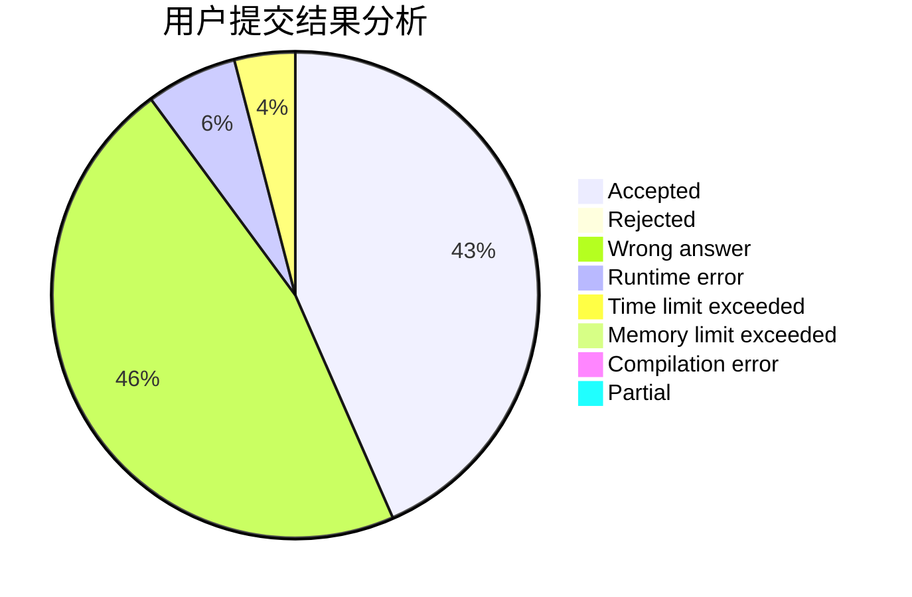
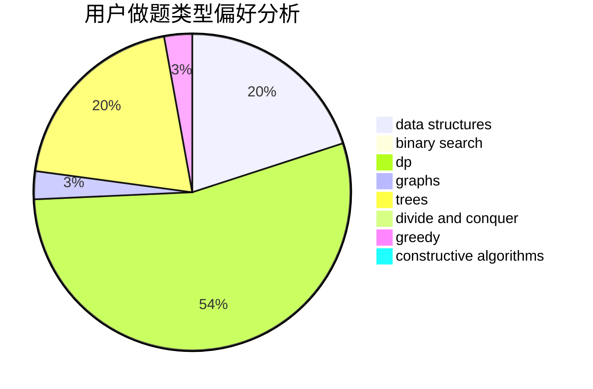

# RHliu

<!-- tabs:start -->

#### **用户提交结果分析**

#### **用户做题类型偏好分析**

#### **用户错题知识点分析**

<!-- tabs:end -->
# 推荐题目
[725A](https://codeforces.com/contest/725/problem/A)		implementation		  
[1513A](https://codeforces.com/contest/1513/problem/A)		constructive algorithms,
                        implementation		  
[1027A](https://codeforces.com/contest/1027/problem/A)		implementation,
                        strings		  
[1087B](https://codeforces.com/contest/1087/problem/B)		dsu,graphs,sortings,trees		  
[273D](https://codeforces.com/contest/273/problem/D)		dp		  
[85E](https://codeforces.com/contest/85/problem/E)		binary search,
                        dsu,
                        geometry,
                        graphs,
                        sortings		  
[1058B](https://codeforces.com/contest/1058/problem/B)		dsu,graphs,sortings,trees		  
[1363F](https://codeforces.com/contest/1363/problem/F)		dp,
                        strings		  
[1330B](https://codeforces.com/contest/1330/problem/B)		implementation,
                        math		  
[1427C](https://codeforces.com/contest/1427/problem/C)		dp		  
