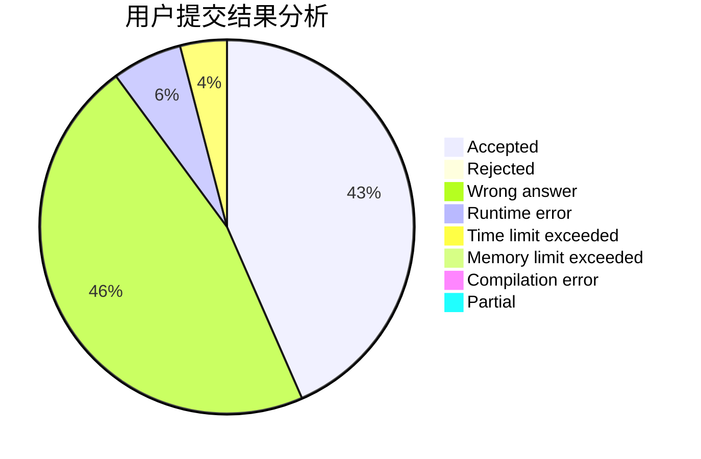
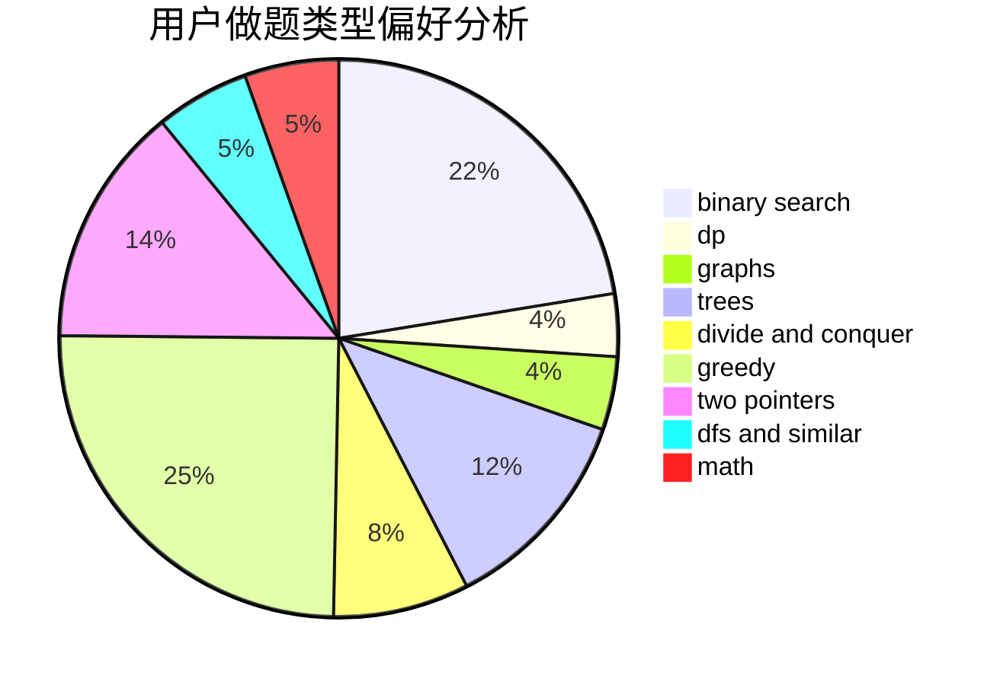

# RHliu

<!-- tabs:start -->

#### **用户提交结果分析**

#### **用户做题类型偏好分析**

<!-- tabs:end -->
# 推荐题目
[742E](https://codeforces.com/contest/742/problem/E)
[171H](https://codeforces.com/contest/171/problem/H)
[1027D](https://codeforces.com/contest/1027/problem/D)
[1087E](https://codeforces.com/contest/1087/problem/E)
[289B](https://codeforces.com/contest/289/problem/B)
[877F](https://codeforces.com/contest/877/problem/F)
[1058E](https://codeforces.com/contest/1058/problem/E)
[1370E](https://codeforces.com/contest/1370/problem/E)
[1336B](https://codeforces.com/contest/1336/problem/B)
[1436A](https://codeforces.com/contest/1436/problem/A)
