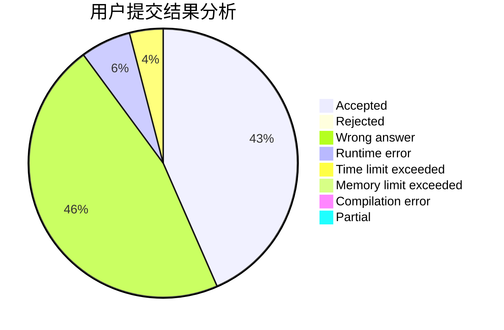
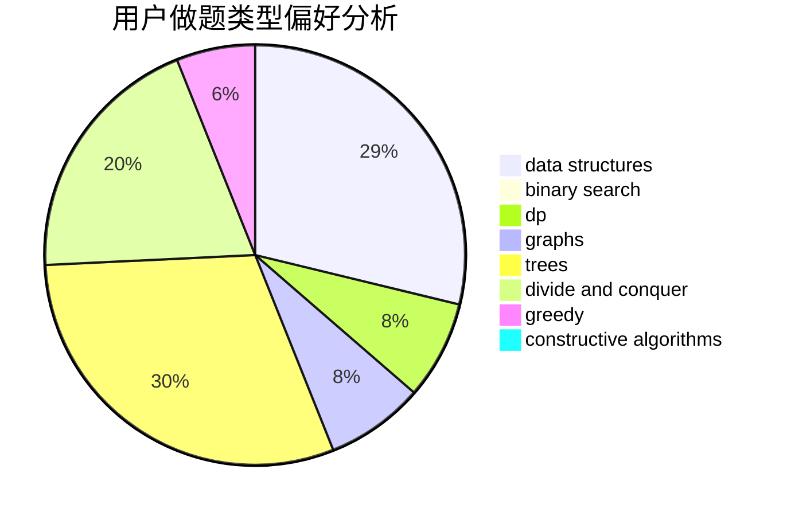

# RHliu

<!-- tabs:start -->

#### **用户提交结果分析**

#### **用户做题类型偏好分析**

#### **用户错题知识点分析**

<!-- tabs:end -->
# 推荐题目
[742E](https://codeforces.com/contest/742/problem/E)		dsu,graphs,sortings,trees		  
[171H](https://codeforces.com/contest/171/problem/H)		*special problem,
                        implementation		  
[1027D](https://codeforces.com/contest/1027/problem/D)		dfs and similar,
                        graphs		  
[1087E](https://codeforces.com/contest/1087/problem/E)		dsu,graphs,sortings,trees		  
[289B](https://codeforces.com/contest/289/problem/B)		brute force,
                        dp,
                        implementation,
                        sortings,
                        ternary search		  
[877F](https://codeforces.com/contest/877/problem/F)		data structures,
                        flows,
                        hashing		  
[1058E](https://codeforces.com/contest/1058/problem/E)		dsu,graphs,sortings,trees		  
[1370E](https://codeforces.com/contest/1370/problem/E)		binary search,
                        constructive algorithms,
                        data structures,
                        greedy		  
[1336B](https://codeforces.com/contest/1336/problem/B)		binary search,
                        greedy,
                        math,
                        sortings,
                        two pointers		  
[1436A](https://codeforces.com/contest/1436/problem/A)		math		  
