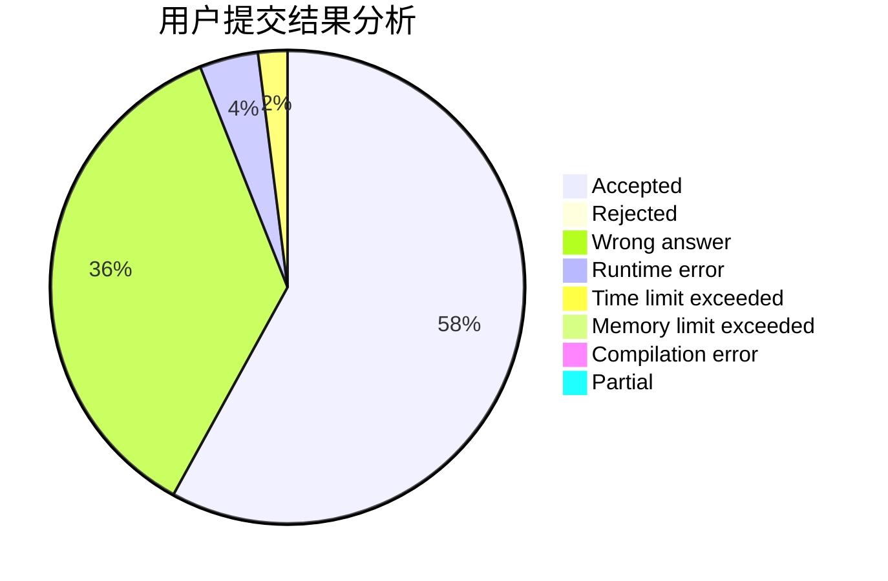
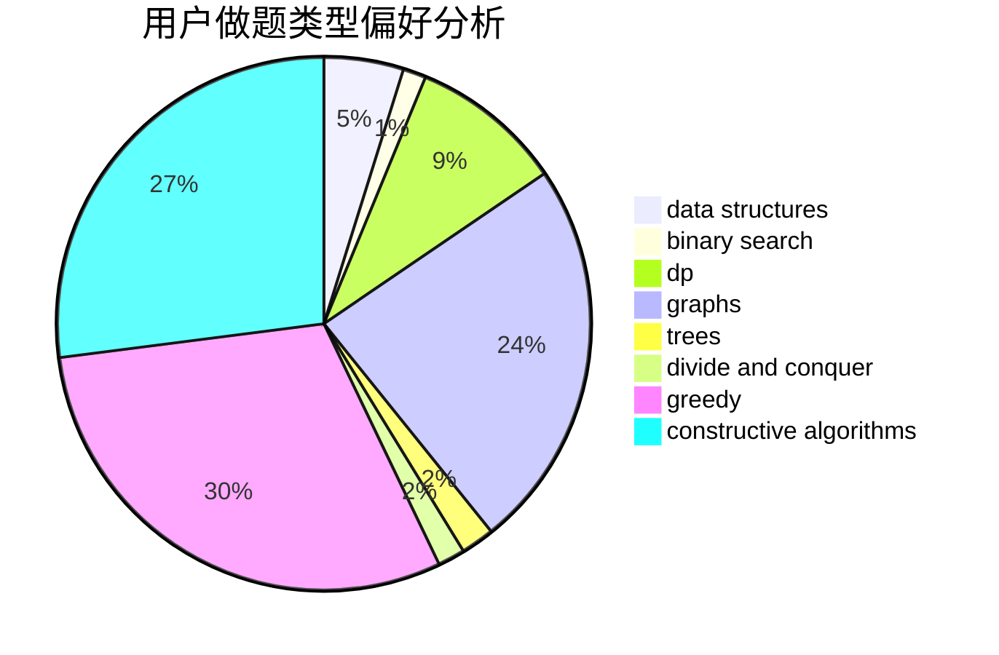

# RNG-Ming
<!-- tabs:start -->
#### **用户提交结果分析**

#### **用户做题类型偏好分析**

#### **用户错题知识点分析**

<!-- tabs:end -->
# 推荐题目
[U2](https://codeforces.com/contest/1143/problem/F)		geometry		  
[The Fair Nut and the Best Path](http://codeforces.com/problemset/problem/1083/A)		data structures,
                        dp,
                        trees		  
[Memory and Casinos](http://codeforces.com/problemset/problem/712/E)		data structures,
                        math,
                        probabilities		  
[Color the Fence](http://codeforces.com/problemset/problem/349/B)		data structures,
                        dp,
                        greedy,
                        implementation		  
[Maximum Subsequence](http://codeforces.com/problemset/problem/888/E)		bitmasks,
                        divide and conquer,
                        meet-in-the-middle		  
[Spring cleaning](http://codeforces.com/problemset/problem/1403/B)		*special problem,
                        data structures,
                        dfs and similar,
                        graphs,
                        trees		  
[Yellow Cards](http://codeforces.com/problemset/problem/1215/A)		greedy,
                        implementation,
                        math		  
[Helping People](http://codeforces.com/problemset/problem/494/C)		dp,
                        probabilities		  
[Magic, Wizardry and Wonders](http://codeforces.com/problemset/problem/231/B)		constructive algorithms,
                        greedy		  
[Valera and Elections](http://codeforces.com/problemset/problem/369/C)		dfs and similar,
                        graphs,
                        trees		  
<!-- tabs:start -->
#### **data structures**
[U2](http://codeforces.com/problemset/problem/1083/A)		data structures,
                        dp,
                        trees		  
[The Fair Nut and the Best Path](http://codeforces.com/problemset/problem/712/E)		data structures,
                        math,
                        probabilities		  
[Memory and Casinos](http://codeforces.com/problemset/problem/349/B)		data structures,
                        dp,
                        greedy,
                        implementation		  
[Color the Fence](http://codeforces.com/problemset/problem/1403/B)		*special problem,
                        data structures,
                        dfs and similar,
                        graphs,
                        trees		  
[Maximum Subsequence](http://codeforces.com/problemset/problem/484/E)		binary search,
                        constructive algorithms,
                        data structures		  
[Spring cleaning](https://codeforces.com/contest/1434/problem/D)		data structures,
                        trees		  
[Yellow Cards](http://codeforces.com/problemset/problem/1371/F)		data structures,
                        divide and conquer,
                        implementation		  
[Helping People](http://codeforces.com/problemset/problem/1348/F)		data structures,
                        dfs and similar,
                        graphs,
                        greedy		  
[Magic, Wizardry and Wonders](http://codeforces.com/problemset/problem/903/G)		data structures,
                        flows,
                        graphs		  
[Valera and Elections](http://codeforces.com/problemset/problem/1278/D)		data structures,
                        dsu,
                        graphs,
                        trees		  
#### **binary search**
[U2](http://codeforces.com/problemset/problem/484/E)		binary search,
                        constructive algorithms,
                        data structures		  
[The Fair Nut and the Best Path](http://codeforces.com/problemset/problem/1011/B)		binary search,
                        brute force,
                        implementation		  
[Memory and Casinos](http://codeforces.com/problemset/problem/434/E)		binary search,
                        divide and conquer,
                        sortings,
                        trees		  
[Color the Fence](http://codeforces.com/problemset/problem/1493/C)		binary search,
                        brute force,
                        constructive algorithms,
                        greedy,
                        strings		  
[Maximum Subsequence](http://codeforces.com/problemset/problem/1492/C)		binary search,
                        data structures,
                        dp,
                        greedy,
                        two pointers		  
[Spring cleaning](http://codeforces.com/problemset/problem/1463/D)		binary search,
                        constructive algorithms,
                        greedy,
                        two pointers		  
[Yellow Cards](http://codeforces.com/problemset/problem/1490/G)		binary search,
                        data structures,
                        math		  
[Helping People](http://codeforces.com/problemset/problem/1479/D)		binary search,
                        bitmasks,
                        brute force,
                        data structures,
                        probabilities,
                        trees		  
[Magic, Wizardry and Wonders](http://codeforces.com/problemset/problem/1436/E)		binary search,
                        data structures,
                        two pointers		  
[Valera and Elections](http://codeforces.com/problemset/problem/1461/D)		binary search,
                        brute force,
                        data structures,
                        divide and conquer,
                        implementation,
                        sortings		  
#### **dp**
[U2](http://codeforces.com/problemset/problem/1083/A)		data structures,
                        dp,
                        trees		  
[The Fair Nut and the Best Path](http://codeforces.com/problemset/problem/349/B)		data structures,
                        dp,
                        greedy,
                        implementation		  
[Memory and Casinos](http://codeforces.com/problemset/problem/494/C)		dp,
                        probabilities		  
[Color the Fence](https://codeforces.com/contest/1068/problem/D)		dp		  
[Maximum Subsequence](http://codeforces.com/problemset/problem/825/F)		dp,
                        hashing,
                        string suffix structures,
                        strings		  
[Spring cleaning](http://codeforces.com/problemset/problem/1389/C)		brute force,
                        dp,
                        greedy,
                        two pointers		  
[Yellow Cards](https://codeforces.com/contest/1053/problem/B)		bitmasks,
                        dp		  
[Helping People](http://codeforces.com/problemset/problem/1492/C)		binary search,
                        data structures,
                        dp,
                        greedy,
                        two pointers		  
[Magic, Wizardry and Wonders](https://codeforces.com/contest/1457/problem/C)		brute force,
                        dp,
                        implementation		  
[Valera and Elections](http://codeforces.com/problemset/problem/1491/C)		brute force,
                        data structures,
                        dp,
                        greedy,
                        implementation		  
#### **graph**
[U2](http://codeforces.com/problemset/problem/1403/B)		*special problem,
                        data structures,
                        dfs and similar,
                        graphs,
                        trees		  
[The Fair Nut and the Best Path](http://codeforces.com/problemset/problem/369/C)		dfs and similar,
                        graphs,
                        trees		  
[Memory and Casinos](http://codeforces.com/problemset/problem/1348/F)		data structures,
                        dfs and similar,
                        graphs,
                        greedy		  
[Color the Fence](http://codeforces.com/problemset/problem/903/G)		data structures,
                        flows,
                        graphs		  
[Maximum Subsequence](http://codeforces.com/problemset/problem/557/D)		combinatorics,
                        dfs and similar,
                        graphs,
                        math		  
[Spring cleaning](http://codeforces.com/problemset/problem/845/G)		dfs and similar,
                        graphs,
                        math		  
[Yellow Cards](http://codeforces.com/problemset/problem/1250/E)		graphs,
                        implementation		  
[Helping People](http://codeforces.com/problemset/problem/1278/D)		data structures,
                        dsu,
                        graphs,
                        trees		  
[Magic, Wizardry and Wonders](http://codeforces.com/problemset/problem/1487/C)		brute force,
                        constructive algorithms,
                        dfs and similar,
                        graphs,
                        greedy,
                        implementation,
                        math		  
[Valera and Elections](http://codeforces.com/problemset/problem/1437/C)		dp,
                        flows,
                        graph matchings,
                        greedy,
                        math,
                        sortings		  
#### **trees**
[U2](http://codeforces.com/problemset/problem/1083/A)		data structures,
                        dp,
                        trees		  
[The Fair Nut and the Best Path](http://codeforces.com/problemset/problem/1403/B)		*special problem,
                        data structures,
                        dfs and similar,
                        graphs,
                        trees		  
[Memory and Casinos](http://codeforces.com/problemset/problem/369/C)		dfs and similar,
                        graphs,
                        trees		  
[Color the Fence](https://codeforces.com/contest/1434/problem/D)		data structures,
                        trees		  
[Maximum Subsequence](http://codeforces.com/problemset/problem/434/E)		binary search,
                        divide and conquer,
                        sortings,
                        trees		  
[Spring cleaning](http://codeforces.com/problemset/problem/715/C)		dfs and similar,
                        divide and conquer,
                        dsu,
                        trees		  
[Yellow Cards](http://codeforces.com/problemset/problem/1278/D)		data structures,
                        dsu,
                        graphs,
                        trees		  
[Helping People](http://codeforces.com/problemset/problem/1479/D)		binary search,
                        bitmasks,
                        brute force,
                        data structures,
                        probabilities,
                        trees		  
[Magic, Wizardry and Wonders](http://codeforces.com/problemset/problem/1511/C)		brute force,
                        data structures,
                        implementation,
                        trees		  
[Valera and Elections](http://codeforces.com/problemset/problem/1499/F)		combinatorics,
                        dfs and similar,
                        dp,
                        trees		  
#### **divide and conquer**
[U2](http://codeforces.com/problemset/problem/888/E)		bitmasks,
                        divide and conquer,
                        meet-in-the-middle		  
[The Fair Nut and the Best Path](http://codeforces.com/problemset/problem/1371/F)		data structures,
                        divide and conquer,
                        implementation		  
[Memory and Casinos](http://codeforces.com/problemset/problem/434/E)		binary search,
                        divide and conquer,
                        sortings,
                        trees		  
[Color the Fence](http://codeforces.com/problemset/problem/715/C)		dfs and similar,
                        divide and conquer,
                        dsu,
                        trees		  
[Maximum Subsequence](http://codeforces.com/problemset/problem/1461/D)		binary search,
                        brute force,
                        data structures,
                        divide and conquer,
                        implementation,
                        sortings		  
[Spring cleaning](http://codeforces.com/problemset/problem/1466/G)		combinatorics,
                        divide and conquer,
                        hashing,
                        math,
                        string suffix structures,
                        strings		  
[Yellow Cards](http://codeforces.com/problemset/problem/1490/D)		dfs and similar,
                        divide and conquer,
                        implementation		  
[Helping People](https://codeforces.com/contest/1483/problem/C)		data structures,
                        divide and conquer,
                        dp		  
[Magic, Wizardry and Wonders](http://codeforces.com/problemset/problem/1491/E)		brute force,
                        dfs and similar,
                        divide and conquer,
                        number theory,
                        trees		  
[Valera and Elections](http://codeforces.com/problemset/problem/1303/G)		data structures,
                        divide and conquer,
                        geometry,
                        trees		  
#### **greedy**
[U2](http://codeforces.com/problemset/problem/349/B)		data structures,
                        dp,
                        greedy,
                        implementation		  
[The Fair Nut and the Best Path](http://codeforces.com/problemset/problem/1215/A)		greedy,
                        implementation,
                        math		  
[Memory and Casinos](http://codeforces.com/problemset/problem/231/B)		constructive algorithms,
                        greedy		  
[Color the Fence](http://codeforces.com/problemset/problem/1348/F)		data structures,
                        dfs and similar,
                        graphs,
                        greedy		  
[Maximum Subsequence](http://codeforces.com/problemset/problem/1389/C)		brute force,
                        dp,
                        greedy,
                        two pointers		  
[Spring cleaning](http://codeforces.com/problemset/problem/1371/D)		constructive algorithms,
                        greedy,
                        implementation		  
[Yellow Cards](http://codeforces.com/problemset/problem/1493/C)		binary search,
                        brute force,
                        constructive algorithms,
                        greedy,
                        strings		  
[Helping People](http://codeforces.com/problemset/problem/1492/C)		binary search,
                        data structures,
                        dp,
                        greedy,
                        two pointers		  
[Magic, Wizardry and Wonders](https://codeforces.com/contest/1496/problem/C)		geometry,
                        greedy,
                        math,
                        sortings		  
[Valera and Elections](http://codeforces.com/problemset/problem/1493/A)		constructive algorithms,
                        greedy		  
#### **constructive algorithms**
[U2](http://codeforces.com/problemset/problem/231/B)		constructive algorithms,
                        greedy		  
[The Fair Nut and the Best Path](http://codeforces.com/problemset/problem/1335/B)		constructive algorithms		  
[Memory and Casinos](http://codeforces.com/problemset/problem/484/E)		binary search,
                        constructive algorithms,
                        data structures		  
[Color the Fence](http://codeforces.com/problemset/problem/631/B)		constructive algorithms,
                        implementation		  
[Maximum Subsequence](http://codeforces.com/problemset/problem/1371/D)		constructive algorithms,
                        greedy,
                        implementation		  
[Spring cleaning](http://codeforces.com/problemset/problem/1493/C)		binary search,
                        brute force,
                        constructive algorithms,
                        greedy,
                        strings		  
[Yellow Cards](http://codeforces.com/problemset/problem/1493/A)		constructive algorithms,
                        greedy		  
[Helping People](http://codeforces.com/problemset/problem/1463/D)		binary search,
                        constructive algorithms,
                        greedy,
                        two pointers		  
[Magic, Wizardry and Wonders](https://codeforces.com/contest/1456/problem/B)		bitmasks,
                        brute force,
                        constructive algorithms		  
[Valera and Elections](http://codeforces.com/problemset/problem/1492/D)		bitmasks,
                        constructive algorithms,
                        greedy,
                        math		  
#### **sortings**
[U2](http://codeforces.com/problemset/problem/434/E)		binary search,
                        divide and conquer,
                        sortings,
                        trees		  
[The Fair Nut and the Best Path](https://codeforces.com/contest/1496/problem/C)		geometry,
                        greedy,
                        math,
                        sortings		  
[Memory and Casinos](http://codeforces.com/problemset/problem/1495/A)		geometry,
                        greedy,
                        math,
                        sortings		  
[Color the Fence](http://codeforces.com/problemset/problem/1497/A)		brute force,
                        data structures,
                        greedy,
                        sortings		  
[Maximum Subsequence](http://codeforces.com/problemset/problem/1427/A)		math,
                        sortings		  
[Spring cleaning](http://codeforces.com/problemset/problem/1461/D)		binary search,
                        brute force,
                        data structures,
                        divide and conquer,
                        implementation,
                        sortings		  
[Yellow Cards](http://codeforces.com/problemset/problem/1437/C)		dp,
                        flows,
                        graph matchings,
                        greedy,
                        math,
                        sortings		  
[Helping People](http://codeforces.com/problemset/problem/1473/A)		greedy,
                        implementation,
                        math,
                        sortings		  
[Magic, Wizardry and Wonders](http://codeforces.com/problemset/problem/1486/B)		binary search,
                        geometry,
                        shortest paths,
                        sortings		  
[Valera and Elections](http://codeforces.com/problemset/problem/1480/B)		greedy,
                        implementation,
                        sortings		  
<!-- tabs:end -->
