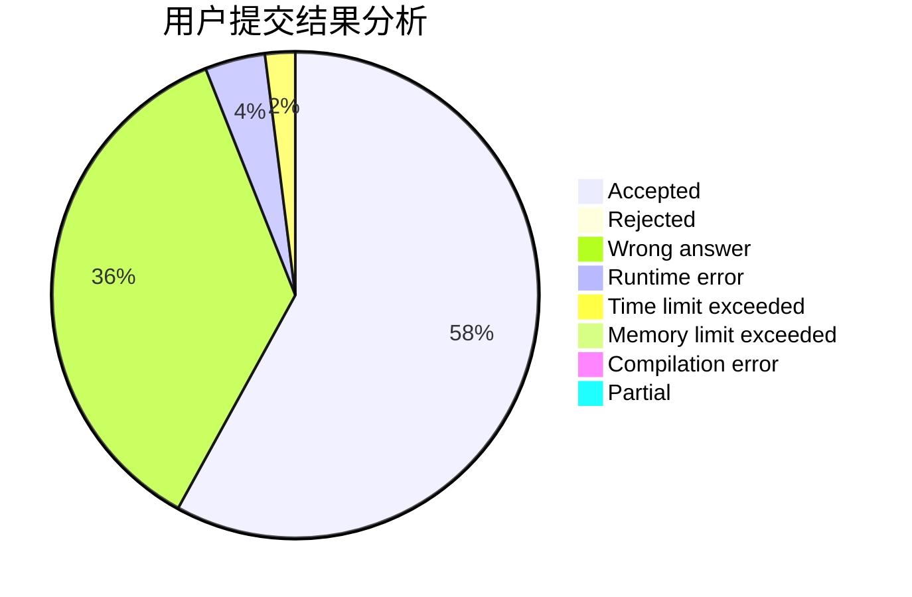
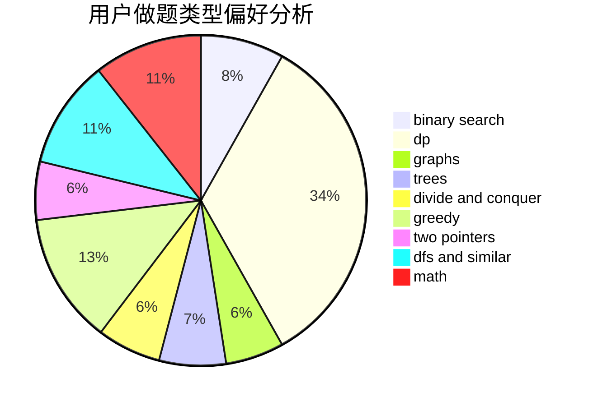

# RNG-Ming

<!-- tabs:start -->

#### **用户提交结果分析**

#### **用户做题类型偏好分析**

<!-- tabs:end -->
# 推荐题目
[1385D](https://codeforces.com/contest/1385/problem/D)
[455D](https://codeforces.com/contest/455/problem/D)
[1220E](https://codeforces.com/contest/1220/problem/E)
[1083D](https://codeforces.com/contest/1083/problem/D)
[1146A](https://codeforces.com/contest/1146/problem/A)
[732A](https://codeforces.com/contest/732/problem/A)
[908C](https://codeforces.com/contest/908/problem/C)
[376A](https://codeforces.com/contest/376/problem/A)
[1398F](https://codeforces.com/contest/1398/problem/F)
[1444D](https://codeforces.com/contest/1444/problem/D)
