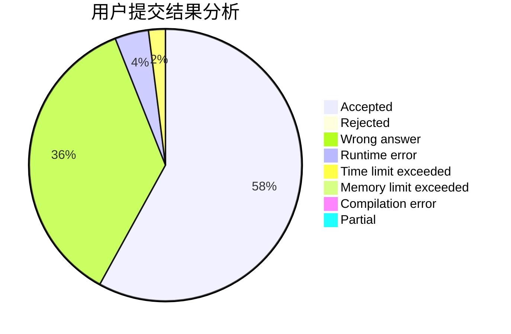
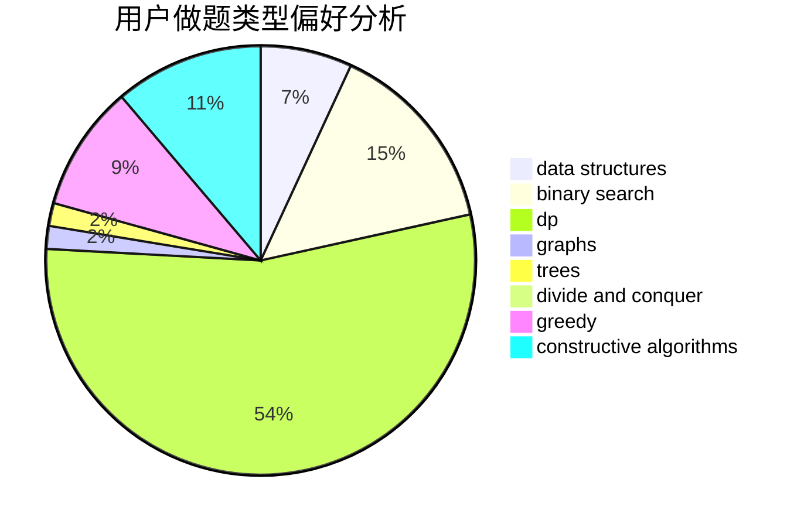

# RNG-Ming

<!-- tabs:start -->

#### **用户提交结果分析**

#### **用户做题类型偏好分析**

#### **用户错题知识点分析**

<!-- tabs:end -->
# 推荐题目
[1385D](https://codeforces.com/contest/1385/problem/D)		bitmasks,
                        brute force,
                        divide and conquer,
                        dp,
                        implementation		  
[455D](https://codeforces.com/contest/455/problem/D)		data structures		  
[1220E](https://codeforces.com/contest/1220/problem/E)		dfs and similar,
                        dp,
                        dsu,
                        graphs,
                        greedy,
                        trees		  
[1083D](https://codeforces.com/contest/1083/problem/D)		data structures,
                        implementation		  
[1146A](https://codeforces.com/contest/1146/problem/A)		implementation,
                        strings		  
[732A](https://codeforces.com/contest/732/problem/A)		brute force,
                        constructive algorithms,
                        implementation,
                        math		  
[908C](https://codeforces.com/contest/908/problem/C)		brute force,
                        geometry,
                        implementation,
                        math		  
[376A](https://codeforces.com/contest/376/problem/A)		implementation,
                        math		  
[1398F](https://codeforces.com/contest/1398/problem/F)		binary search,
                        data structures,
                        dp,
                        greedy,
                        two pointers		  
[1444D](https://codeforces.com/contest/1444/problem/D)		constructive algorithms,
                        dp,
                        geometry		  
