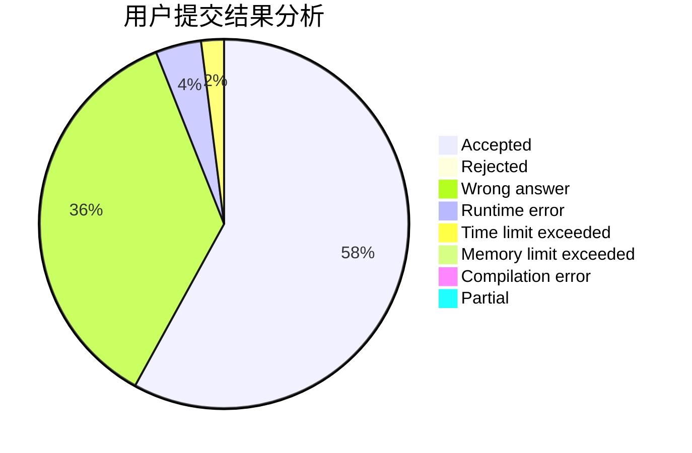
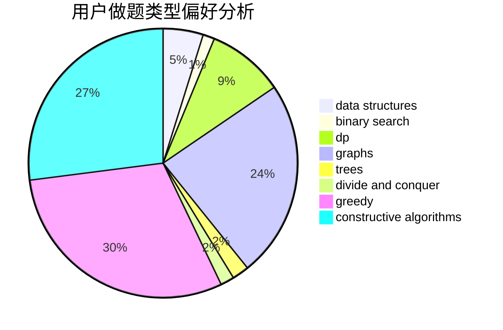

# RNG-Ming

<!-- tabs:start -->

#### **用户提交结果分析**

#### **用户做题类型偏好分析**

#### **用户错题知识点分析**

<!-- tabs:end -->
# 推荐题目
[1376A1](https://codeforces.com/contest/1376A/problem/1)		dsu,graphs,sortings,trees		  
[434E](https://codeforces.com/contest/434/problem/E)		binary search,
                        divide and conquer,
                        sortings,
                        trees		  
[1215A](https://codeforces.com/contest/1215/problem/A)		greedy,
                        implementation,
                        math		  
[1083A](https://codeforces.com/contest/1083/problem/A)		data structures,
                        dp,
                        trees		  
[1143F](https://codeforces.com/contest/1143/problem/F)		dsu,graphs,sortings,trees		  
[712E](https://codeforces.com/contest/712/problem/E)		data structures,
                        math,
                        probabilities		  
[888E](https://codeforces.com/contest/888/problem/E)		bitmasks,
                        divide and conquer,
                        meet-in-the-middle		  
[349B](https://codeforces.com/contest/349/problem/B)		data structures,
                        dp,
                        greedy,
                        implementation		  
[1389C](https://codeforces.com/contest/1389/problem/C)		brute force,
                        dp,
                        greedy,
                        two pointers		  
[1434D](https://codeforces.com/contest/1434/problem/D)		dsu,graphs,sortings,trees		  
