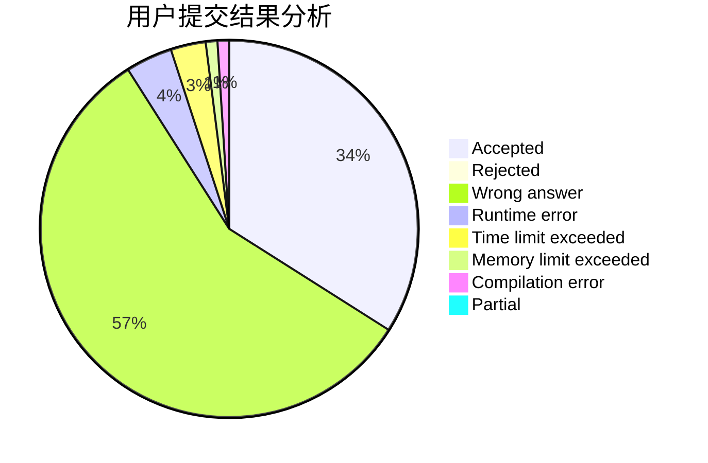
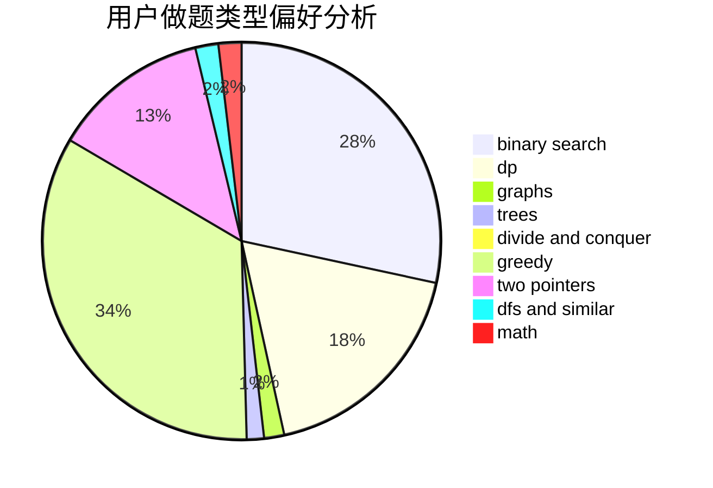

# RNGUmp9

<!-- tabs:start -->

#### **用户提交结果分析**

#### **用户做题类型偏好分析**

<!-- tabs:end -->
# 推荐题目
[1133C](https://codeforces.com/contest/1133/problem/C)
[1145B](https://codeforces.com/contest/1145/problem/B)
[39D](https://codeforces.com/contest/39/problem/D)
[510D](https://codeforces.com/contest/510/problem/D)
[567F](https://codeforces.com/contest/567/problem/F)
[106A](https://codeforces.com/contest/106/problem/A)
[448D](https://codeforces.com/contest/448/problem/D)
[364A](https://codeforces.com/contest/364/problem/A)
[463D](https://codeforces.com/contest/463/problem/D)
[769A](https://codeforces.com/contest/769/problem/A)
