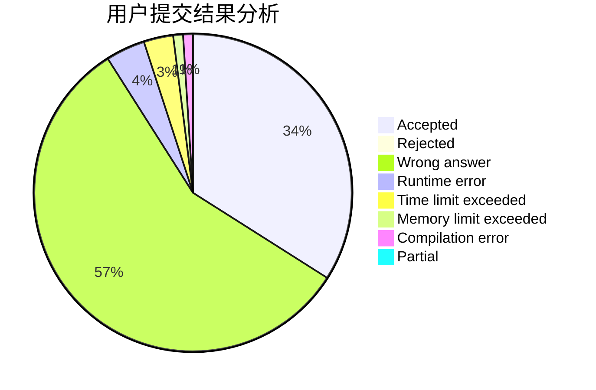
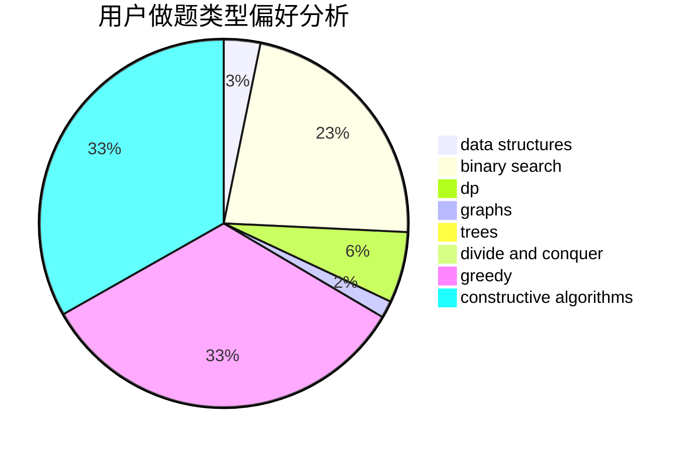
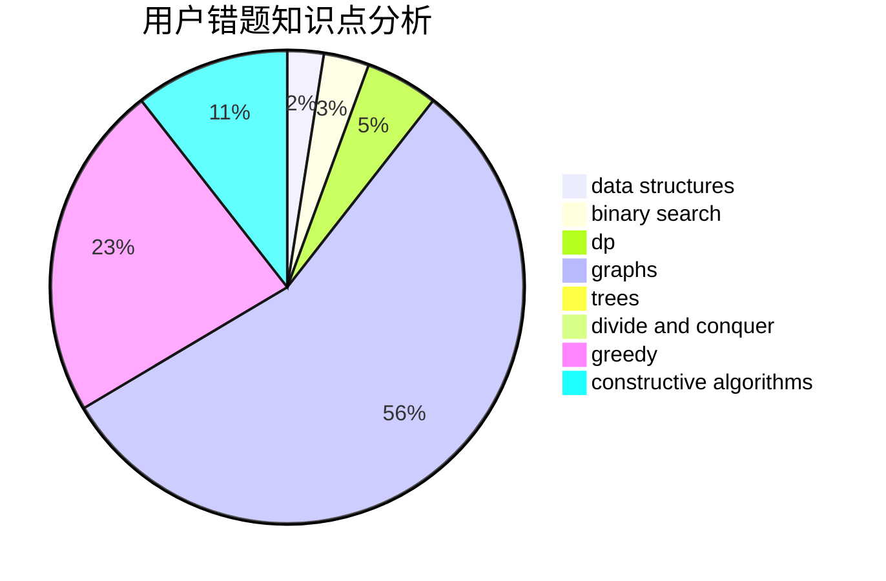

# RNGUmp9

<!-- tabs:start -->

#### **用户提交结果分析**

#### **用户做题类型偏好分析**

#### **用户错题知识点分析**

<!-- tabs:end -->
# 推荐题目
[1133C](https://codeforces.com/contest/1133/problem/C)		sortings,
                        two pointers		  
[1145B](https://codeforces.com/contest/1145/problem/B)		brute force		  
[39D](https://codeforces.com/contest/39/problem/D)		math		  
[510D](https://codeforces.com/contest/510/problem/D)		bitmasks,
                        brute force,
                        dp,
                        math		  
[567F](https://codeforces.com/contest/567/problem/F)		dp		  
[106A](https://codeforces.com/contest/106/problem/A)		implementation		  
[448D](https://codeforces.com/contest/448/problem/D)		binary search,
                        brute force		  
[364A](https://codeforces.com/contest/364/problem/A)		combinatorics,
                        data structures,
                        implementation		  
[463D](https://codeforces.com/contest/463/problem/D)		dfs and similar,
                        dp,
                        graphs,
                        implementation		  
[769A](https://codeforces.com/contest/769/problem/A)		*special problem,
                        implementation,
                        sortings		  
