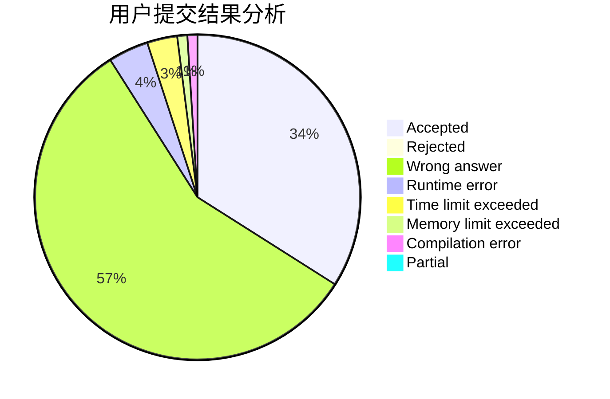
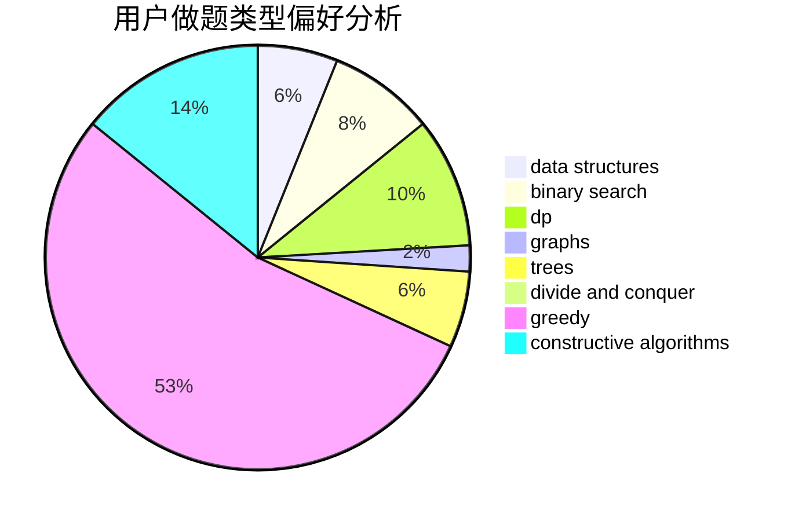
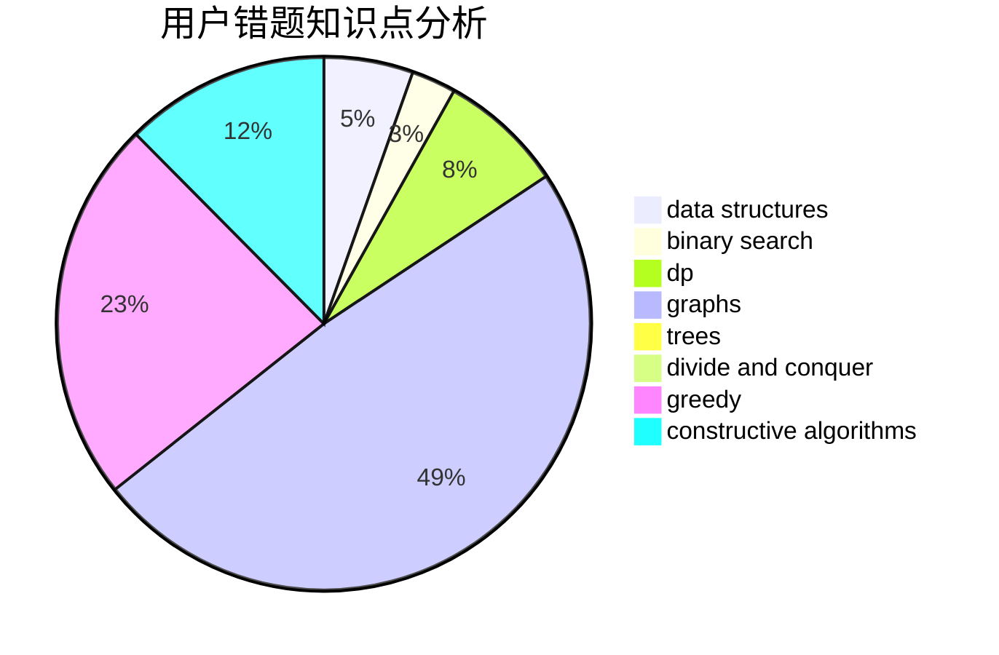

# RNGUmp9

<!-- tabs:start -->

#### **用户提交结果分析**

#### **用户做题类型偏好分析**

#### **用户错题知识点分析**

<!-- tabs:end -->
# 推荐题目
[1131F](https://codeforces.com/contest/1131/problem/F)		constructive algorithms,
                        dsu		  
[1143B](https://codeforces.com/contest/1143/problem/B)		brute force,
                        math,
                        number theory		  
[369B](https://codeforces.com/contest/369/problem/B)		constructive algorithms,
                        implementation,
                        math		  
[490E](https://codeforces.com/contest/490/problem/E)		binary search,
                        brute force,
                        greedy,
                        implementation		  
[543D](https://codeforces.com/contest/543/problem/D)		dp,
                        trees		  
[1068C](https://codeforces.com/contest/1068/problem/C)		constructive algorithms,
                        graphs		  
[425B](https://codeforces.com/contest/425/problem/B)		bitmasks,
                        greedy		  
[337C](https://codeforces.com/contest/337/problem/C)		binary search,
                        greedy,
                        math,
                        matrices,
                        number theory		  
[443A](https://codeforces.com/contest/443/problem/A)		constructive algorithms,
                        implementation		  
[74B](https://codeforces.com/contest/74/problem/B)		dp,
                        games,
                        greedy		  
