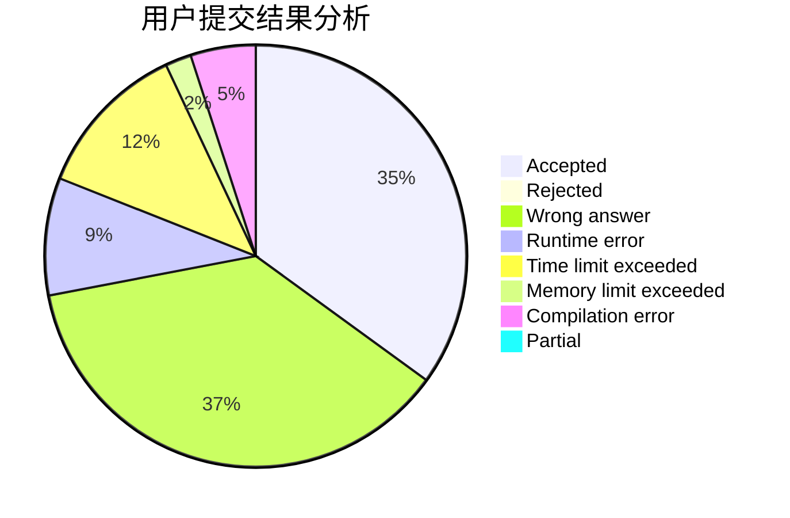
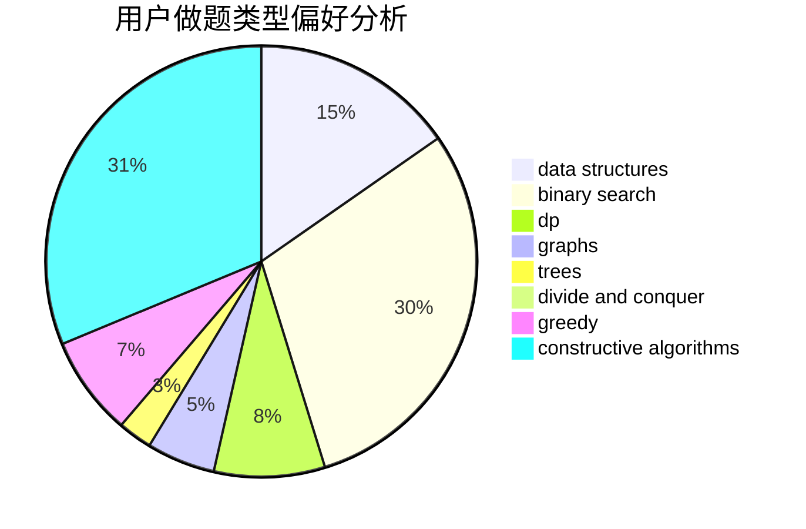
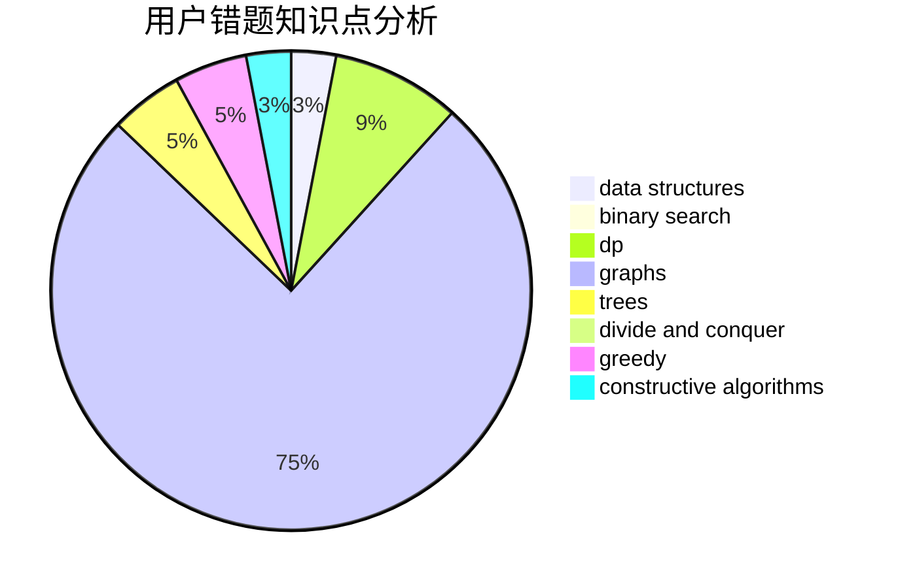

# RSHS

<!-- tabs:start -->

#### **用户提交结果分析**

#### **用户做题类型偏好分析**

#### **用户错题知识点分析**

<!-- tabs:end -->
# 推荐题目
[1380B](https://codeforces.com/contest/1380/problem/B)		greedy		  
[875F](https://codeforces.com/contest/875/problem/F)		dsu,
                        graphs,
                        greedy		  
[1110B](https://codeforces.com/contest/1110/problem/B)		greedy,
                        sortings		  
[393C](https://codeforces.com/contest/393/problem/C)		dsu,graphs,sortings,trees		  
[828E](https://codeforces.com/contest/828/problem/E)		dsu,graphs,sortings,trees		  
[93A](https://codeforces.com/contest/93/problem/A)		implementation		  
[158C](https://codeforces.com/contest/158/problem/C)		*special problem,
                        data structures,
                        implementation		  
[717E](https://codeforces.com/contest/717/problem/E)		dfs and similar		  
[1183A](https://codeforces.com/contest/1183/problem/A)		implementation		  
[218A](https://codeforces.com/contest/218/problem/A)		brute force,
                        constructive algorithms,
                        implementation		  
