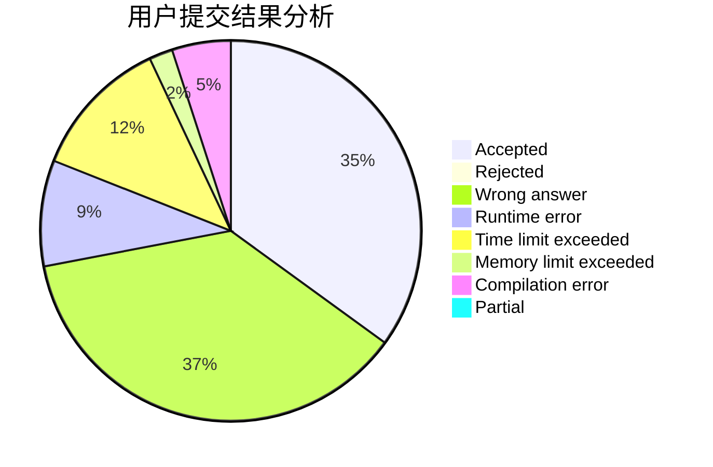
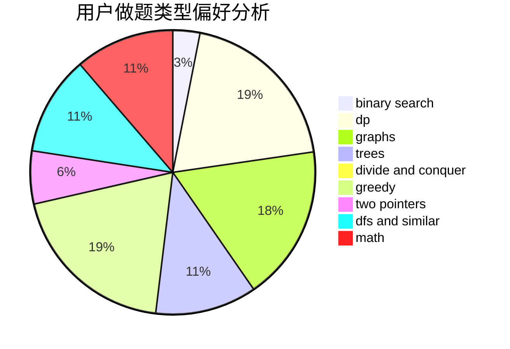

# RSHS

<!-- tabs:start -->

#### **用户提交结果分析**

#### **用户做题类型偏好分析**

<!-- tabs:end -->
# 推荐题目
[1389E](https://codeforces.com/contest/1389/problem/E)
[896A](https://codeforces.com/contest/896/problem/A)
[1110E](https://codeforces.com/contest/1110/problem/E)
[421B](https://codeforces.com/contest/421/problem/B)
[847E](https://codeforces.com/contest/847/problem/E)
[961B](https://codeforces.com/contest/961/problem/B)
[180C](https://codeforces.com/contest/180/problem/C)
[735A](https://codeforces.com/contest/735/problem/A)
[1185D](https://codeforces.com/contest/1185/problem/D)
[236D](https://codeforces.com/contest/236/problem/D)
