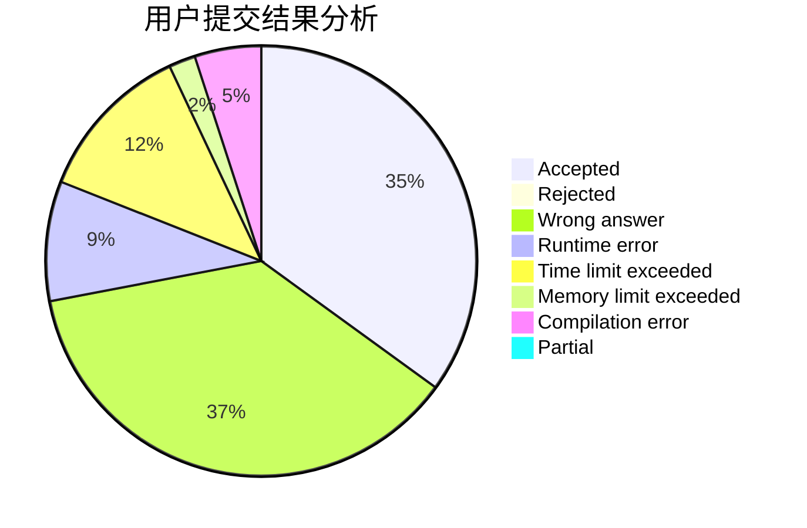
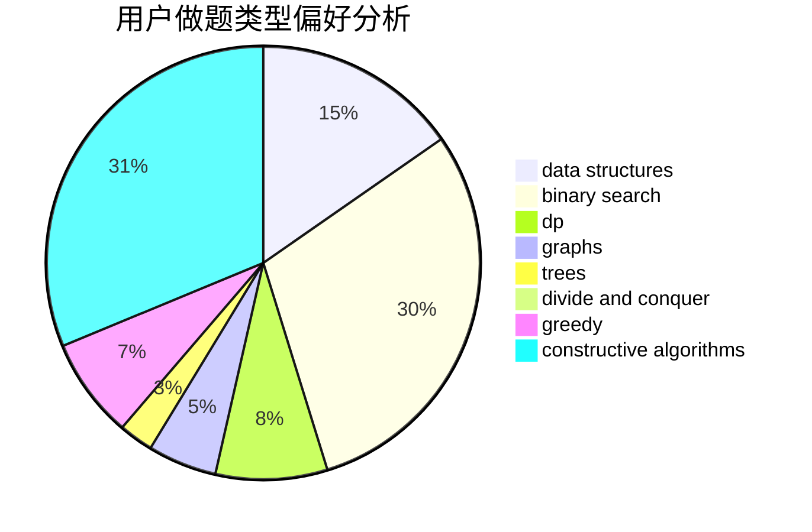
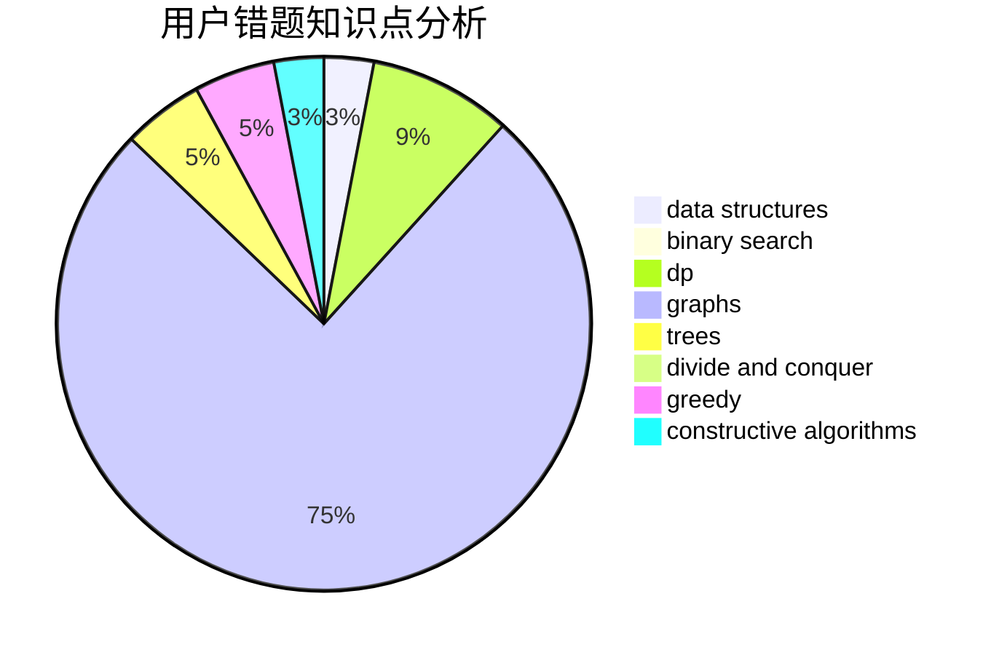

# RSHS
<!-- tabs:start -->
#### **用户提交结果分析**

#### **用户做题类型偏好分析**

#### **用户错题知识点分析**

<!-- tabs:end -->
# 推荐题目
[Universal Solution](http://codeforces.com/problemset/problem/1380/B)		greedy		  
[Royal Questions](http://codeforces.com/problemset/problem/875/F)		dsu,
                        graphs,
                        greedy		  
[Paint it really, really dark gray](http://codeforces.com/problemset/problem/717/E)		dfs and similar		  
[Blocked Points](https://codeforces.com/contest/393/problem/C)		math		  
[Nearest Interesting Number](http://codeforces.com/problemset/problem/1183/A)		implementation		  
[Andryusha and Socks](https://codeforces.com/contest/782/problem/A)		implementation		  
[Beautiful Fibonacci Problem](http://codeforces.com/problemset/problem/1264/F)		constructive algorithms,
                        number theory		  
[Frames](http://codeforces.com/problemset/problem/93/A)		implementation		  
[Cd and pwd commands](http://codeforces.com/problemset/problem/158/C)		*special problem,
                        data structures,
                        implementation		  
[Mountain Scenery](http://codeforces.com/problemset/problem/218/A)		brute force,
                        constructive algorithms,
                        implementation		  
<!-- tabs:start -->
#### **data structures**
[Universal Solution](http://codeforces.com/problemset/problem/158/C)		*special problem,
                        data structures,
                        implementation		  
[Royal Questions](http://codeforces.com/problemset/problem/280/B)		data structures,
                        implementation,
                        two pointers		  
[Paint it really, really dark gray](https://codeforces.com/contest/828/problem/E)		data structures,
                        strings		  
[Blocked Points](http://codeforces.com/problemset/problem/818/E)		binary search,
                        data structures,
                        number theory,
                        two pointers		  
[Nearest Interesting Number](http://codeforces.com/problemset/problem/665/F)		data structures,
                        dp,
                        math,
                        number theory,
                        sortings,
                        two pointers		  
[Andryusha and Socks](http://codeforces.com/problemset/problem/464/E)		data structures,
                        graphs,
                        shortest paths		  
[Beautiful Fibonacci Problem](http://codeforces.com/problemset/problem/1492/C)		binary search,
                        data structures,
                        dp,
                        greedy,
                        two pointers		  
[Frames](http://codeforces.com/problemset/problem/1490/G)		binary search,
                        data structures,
                        math		  
[Cd and pwd commands](http://codeforces.com/problemset/problem/1479/D)		binary search,
                        bitmasks,
                        brute force,
                        data structures,
                        probabilities,
                        trees		  
[Mountain Scenery](http://codeforces.com/problemset/problem/1497/A)		brute force,
                        data structures,
                        greedy,
                        sortings		  
#### **binary search**
[Universal Solution](http://codeforces.com/problemset/problem/853/D)		binary search,
                        dp,
                        greedy		  
[Royal Questions](http://codeforces.com/problemset/problem/837/E)		binary search,
                        implementation,
                        math		  
[Paint it really, really dark gray](http://codeforces.com/problemset/problem/818/E)		binary search,
                        data structures,
                        number theory,
                        two pointers		  
[Blocked Points](http://codeforces.com/problemset/problem/727/F)		binary search,
                        dp,
                        greedy		  
[Nearest Interesting Number](http://codeforces.com/problemset/problem/1463/A)		binary search,
                        math		  
[Andryusha and Socks](http://codeforces.com/problemset/problem/1492/C)		binary search,
                        data structures,
                        dp,
                        greedy,
                        two pointers		  
[Beautiful Fibonacci Problem](http://codeforces.com/problemset/problem/1463/D)		binary search,
                        constructive algorithms,
                        greedy,
                        two pointers		  
[Frames](http://codeforces.com/problemset/problem/1490/G)		binary search,
                        data structures,
                        math		  
[Cd and pwd commands](http://codeforces.com/problemset/problem/1479/D)		binary search,
                        bitmasks,
                        brute force,
                        data structures,
                        probabilities,
                        trees		  
[Mountain Scenery](http://codeforces.com/problemset/problem/1436/E)		binary search,
                        data structures,
                        two pointers		  
#### **dp**
[Universal Solution](http://codeforces.com/problemset/problem/37/D)		combinatorics,
                        dp,
                        math		  
[Royal Questions](http://codeforces.com/problemset/problem/853/D)		binary search,
                        dp,
                        greedy		  
[Paint it really, really dark gray](http://codeforces.com/problemset/problem/1153/F)		combinatorics,
                        dp,
                        math,
                        probabilities		  
[Blocked Points](http://codeforces.com/problemset/problem/1174/E)		combinatorics,
                        dp,
                        math,
                        number theory		  
[Nearest Interesting Number](http://codeforces.com/problemset/problem/665/F)		data structures,
                        dp,
                        math,
                        number theory,
                        sortings,
                        two pointers		  
[Andryusha and Socks](http://codeforces.com/problemset/problem/727/F)		binary search,
                        dp,
                        greedy		  
[Beautiful Fibonacci Problem](http://codeforces.com/problemset/problem/1338/D)		constructive algorithms,
                        dfs and similar,
                        dp,
                        math,
                        trees		  
[Frames](http://codeforces.com/problemset/problem/1491/D)		bitmasks,
                        constructive algorithms,
                        dp,
                        greedy,
                        math		  
[Cd and pwd commands](http://codeforces.com/problemset/problem/1336/A)		dfs and similar,
                        dp,
                        greedy,
                        sortings,
                        trees		  
[Mountain Scenery](http://codeforces.com/problemset/problem/1492/C)		binary search,
                        data structures,
                        dp,
                        greedy,
                        two pointers		  
#### **graph**
[Universal Solution](http://codeforces.com/problemset/problem/875/F)		dsu,
                        graphs,
                        greedy		  
[Royal Questions](http://codeforces.com/problemset/problem/402/E)		graphs,
                        math		  
[Paint it really, really dark gray](http://codeforces.com/problemset/problem/464/E)		data structures,
                        graphs,
                        shortest paths		  
[Blocked Points](http://codeforces.com/problemset/problem/1487/C)		brute force,
                        constructive algorithms,
                        dfs and similar,
                        graphs,
                        greedy,
                        implementation,
                        math		  
[Nearest Interesting Number](http://codeforces.com/problemset/problem/1437/C)		dp,
                        flows,
                        graph matchings,
                        greedy,
                        math,
                        sortings		  
[Andryusha and Socks](http://codeforces.com/problemset/problem/1470/D)		constructive algorithms,
                        dfs and similar,
                        graph matchings,
                        graphs,
                        greedy		  
[Beautiful Fibonacci Problem](http://codeforces.com/problemset/problem/1476/C)		dp,
                        graphs,
                        greedy		  
[Frames](http://codeforces.com/problemset/problem/1304/D)		constructive algorithms,
                        graphs,
                        greedy,
                        two pointers		  
[Cd and pwd commands](http://codeforces.com/problemset/problem/1475/C)		combinatorics,
                        graphs,
                        math		  
[Mountain Scenery](http://codeforces.com/problemset/problem/553/E)		dp,
                        fft,
                        graphs,
                        math,
                        probabilities		  
#### **trees**
[Universal Solution](http://codeforces.com/problemset/problem/1338/D)		constructive algorithms,
                        dfs and similar,
                        dp,
                        math,
                        trees		  
[Royal Questions](http://codeforces.com/problemset/problem/1336/A)		dfs and similar,
                        dp,
                        greedy,
                        sortings,
                        trees		  
[Paint it really, really dark gray](http://codeforces.com/problemset/problem/1479/D)		binary search,
                        bitmasks,
                        brute force,
                        data structures,
                        probabilities,
                        trees		  
[Blocked Points](http://codeforces.com/problemset/problem/1511/C)		brute force,
                        data structures,
                        implementation,
                        trees		  
[Nearest Interesting Number](http://codeforces.com/problemset/problem/1499/F)		combinatorics,
                        dfs and similar,
                        dp,
                        trees		  
[Andryusha and Socks](http://codeforces.com/problemset/problem/1491/E)		brute force,
                        dfs and similar,
                        divide and conquer,
                        number theory,
                        trees		  
[Beautiful Fibonacci Problem](http://codeforces.com/problemset/problem/1466/D)		data structures,
                        greedy,
                        sortings,
                        trees		  
[Frames](http://codeforces.com/problemset/problem/1495/D)		combinatorics,
                        dfs and similar,
                        graphs,
                        math,
                        shortest paths,
                        trees		  
[Cd and pwd commands](http://codeforces.com/problemset/problem/1303/G)		data structures,
                        divide and conquer,
                        geometry,
                        trees		  
[Mountain Scenery](http://codeforces.com/problemset/problem/1454/E)		combinatorics,
                        dfs and similar,
                        graphs,
                        trees		  
#### **divide and conquer**
[Universal Solution](http://codeforces.com/problemset/problem/1461/D)		binary search,
                        brute force,
                        data structures,
                        divide and conquer,
                        implementation,
                        sortings		  
[Royal Questions](http://codeforces.com/problemset/problem/1466/G)		combinatorics,
                        divide and conquer,
                        hashing,
                        math,
                        string suffix structures,
                        strings		  
[Paint it really, really dark gray](http://codeforces.com/problemset/problem/1490/D)		dfs and similar,
                        divide and conquer,
                        implementation		  
[Blocked Points](https://codeforces.com/contest/1483/problem/C)		data structures,
                        divide and conquer,
                        dp		  
[Nearest Interesting Number](http://codeforces.com/problemset/problem/1491/E)		brute force,
                        dfs and similar,
                        divide and conquer,
                        number theory,
                        trees		  
[Andryusha and Socks](http://codeforces.com/problemset/problem/1303/G)		data structures,
                        divide and conquer,
                        geometry,
                        trees		  
[Beautiful Fibonacci Problem](http://codeforces.com/problemset/problem/1494/D)		constructive algorithms,
                        data structures,
                        dfs and similar,
                        divide and conquer,
                        dsu,
                        greedy,
                        sortings,
                        trees		  
[Frames](http://codeforces.com/problemset/problem/1482/E)		data structures,
                        divide and conquer,
                        dp		  
[Cd and pwd commands](http://codeforces.com/problemset/problem/566/C)		dfs and similar,
                        divide and conquer,
                        trees		  
[Mountain Scenery](http://codeforces.com/problemset/problem/1428/F)		binary search,
                        data structures,
                        divide and conquer,
                        dp,
                        two pointers		  
#### **greedy**
[Universal Solution](http://codeforces.com/problemset/problem/1380/B)		greedy		  
[Royal Questions](http://codeforces.com/problemset/problem/875/F)		dsu,
                        graphs,
                        greedy		  
[Paint it really, really dark gray](http://codeforces.com/problemset/problem/853/D)		binary search,
                        dp,
                        greedy		  
[Blocked Points](http://codeforces.com/problemset/problem/862/A)		greedy,
                        implementation		  
[Nearest Interesting Number](http://codeforces.com/problemset/problem/1110/B)		greedy,
                        sortings		  
[Andryusha and Socks](http://codeforces.com/problemset/problem/727/F)		binary search,
                        dp,
                        greedy		  
[Beautiful Fibonacci Problem](http://codeforces.com/problemset/problem/774/C)		*special problem,
                        constructive algorithms,
                        greedy,
                        implementation		  
[Frames](http://codeforces.com/problemset/problem/1375/E)		constructive algorithms,
                        greedy,
                        sortings		  
[Cd and pwd commands](http://codeforces.com/problemset/problem/1491/D)		bitmasks,
                        constructive algorithms,
                        dp,
                        greedy,
                        math		  
[Mountain Scenery](http://codeforces.com/problemset/problem/1336/A)		dfs and similar,
                        dp,
                        greedy,
                        sortings,
                        trees		  
#### **constructive algorithms**
[Universal Solution](http://codeforces.com/problemset/problem/1264/F)		constructive algorithms,
                        number theory		  
[Royal Questions](http://codeforces.com/problemset/problem/218/A)		brute force,
                        constructive algorithms,
                        implementation		  
[Paint it really, really dark gray](http://codeforces.com/problemset/problem/1144/C)		constructive algorithms,
                        sortings		  
[Blocked Points](http://codeforces.com/problemset/problem/774/C)		*special problem,
                        constructive algorithms,
                        greedy,
                        implementation		  
[Nearest Interesting Number](http://codeforces.com/problemset/problem/1339/B)		constructive algorithms,
                        sortings		  
[Andryusha and Socks](http://codeforces.com/problemset/problem/1338/D)		constructive algorithms,
                        dfs and similar,
                        dp,
                        math,
                        trees		  
[Beautiful Fibonacci Problem](http://codeforces.com/problemset/problem/1375/E)		constructive algorithms,
                        greedy,
                        sortings		  
[Frames](http://codeforces.com/problemset/problem/1491/D)		bitmasks,
                        constructive algorithms,
                        dp,
                        greedy,
                        math		  
[Cd and pwd commands](http://codeforces.com/problemset/problem/1493/A)		constructive algorithms,
                        greedy		  
[Mountain Scenery](http://codeforces.com/problemset/problem/1463/D)		binary search,
                        constructive algorithms,
                        greedy,
                        two pointers		  
#### **sortings**
[Universal Solution](http://codeforces.com/problemset/problem/1110/B)		greedy,
                        sortings		  
[Royal Questions](http://codeforces.com/problemset/problem/1144/C)		constructive algorithms,
                        sortings		  
[Paint it really, really dark gray](http://codeforces.com/problemset/problem/665/F)		data structures,
                        dp,
                        math,
                        number theory,
                        sortings,
                        two pointers		  
[Blocked Points](http://codeforces.com/problemset/problem/1339/B)		constructive algorithms,
                        sortings		  
[Nearest Interesting Number](http://codeforces.com/problemset/problem/1375/E)		constructive algorithms,
                        greedy,
                        sortings		  
[Andryusha and Socks](http://codeforces.com/problemset/problem/1336/A)		dfs and similar,
                        dp,
                        greedy,
                        sortings,
                        trees		  
[Beautiful Fibonacci Problem](http://codeforces.com/problemset/problem/1165/E)		greedy,
                        math,
                        sortings		  
[Frames](https://codeforces.com/contest/1496/problem/C)		geometry,
                        greedy,
                        math,
                        sortings		  
[Cd and pwd commands](http://codeforces.com/problemset/problem/1495/A)		geometry,
                        greedy,
                        math,
                        sortings		  
[Mountain Scenery](http://codeforces.com/problemset/problem/1497/A)		brute force,
                        data structures,
                        greedy,
                        sortings		  
<!-- tabs:end -->
