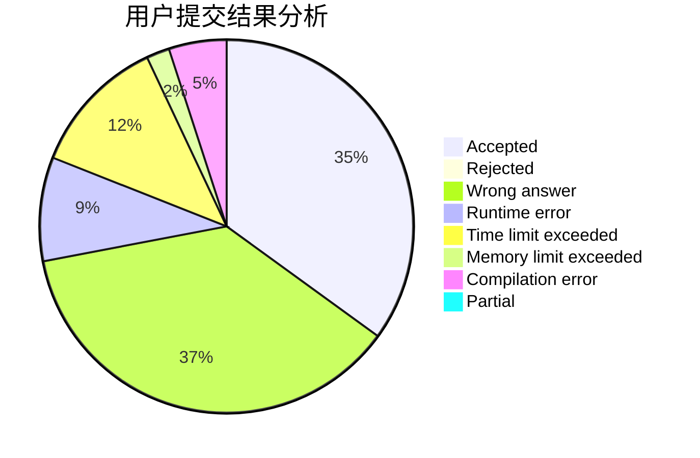
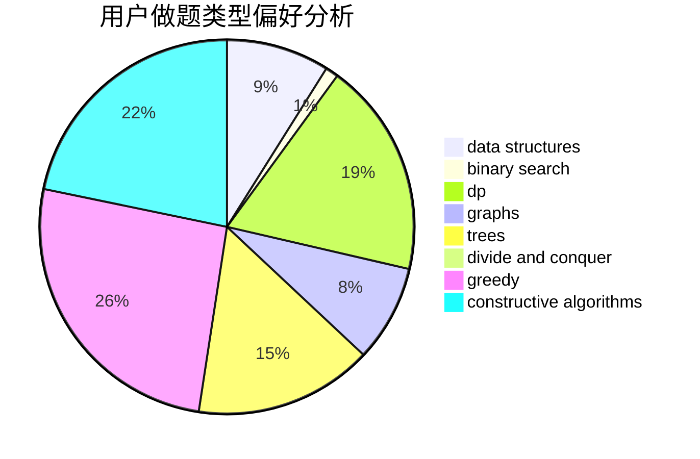
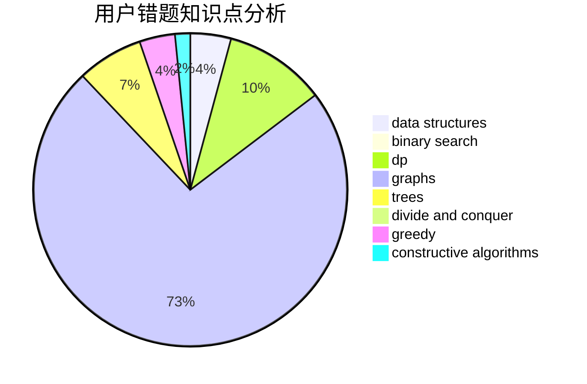

# RSHS

<!-- tabs:start -->

#### **用户提交结果分析**

#### **用户做题类型偏好分析**

#### **用户错题知识点分析**

<!-- tabs:end -->
# 推荐题目
[1389E](https://codeforces.com/contest/1389/problem/E)		math,
                        number theory		  
[896A](https://codeforces.com/contest/896/problem/A)		binary search,
                        dfs and similar		  
[1110E](https://codeforces.com/contest/1110/problem/E)		constructive algorithms,
                        math,
                        sortings		  
[421B](https://codeforces.com/contest/421/problem/B)		dsu,graphs,sortings,trees		  
[847E](https://codeforces.com/contest/847/problem/E)		binary search,
                        dp		  
[961B](https://codeforces.com/contest/961/problem/B)		data structures,
                        dp,
                        implementation,
                        two pointers		  
[180C](https://codeforces.com/contest/180/problem/C)		dp		  
[735A](https://codeforces.com/contest/735/problem/A)		implementation,
                        strings		  
[1185D](https://codeforces.com/contest/1185/problem/D)		implementation,
                        math		  
[236D](https://codeforces.com/contest/236/problem/D)		dsu,graphs,sortings,trees		  
