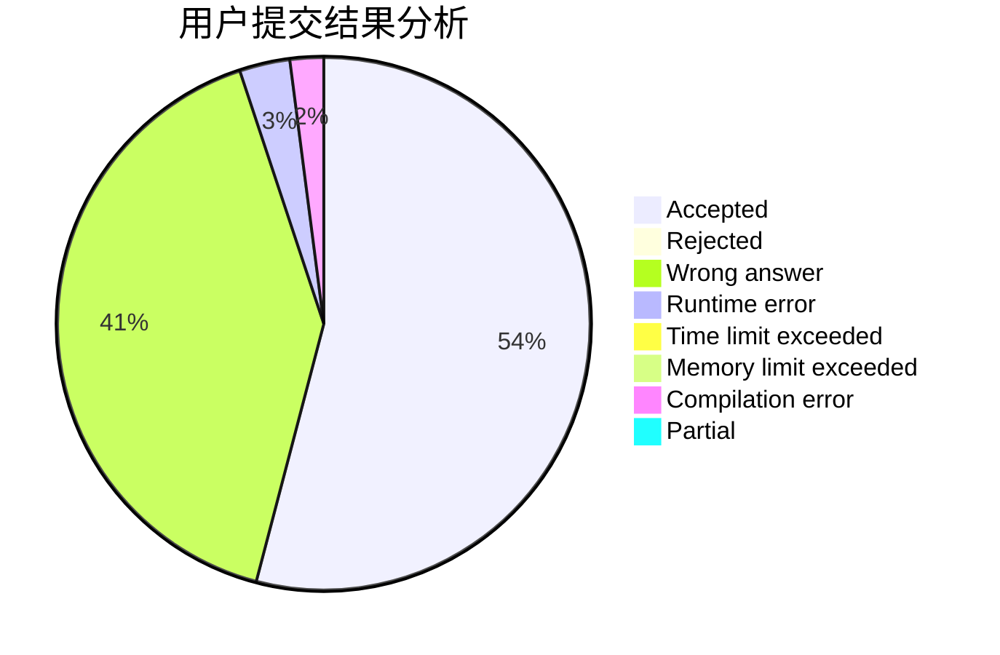
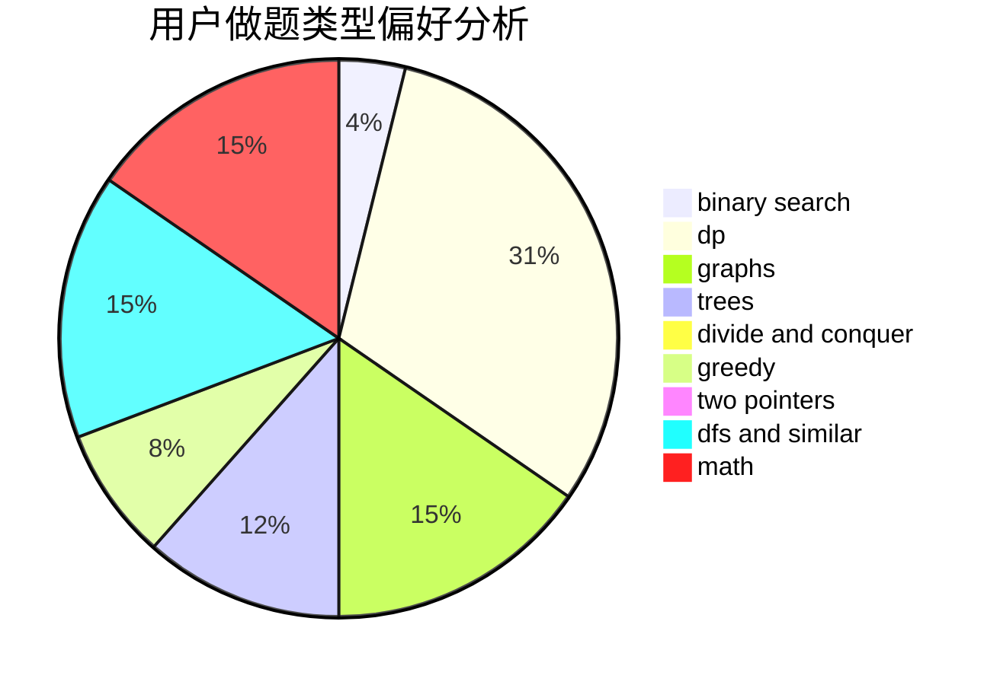

# RUSH_D_CAT

<!-- tabs:start -->

#### **用户提交结果分析**

#### **用户做题类型偏好分析**

<!-- tabs:end -->
# 推荐题目
[913G](https://codeforces.com/contest/913/problem/G)
[632C](https://codeforces.com/contest/632/problem/C)
[630C](https://codeforces.com/contest/630/problem/C)
[650C](https://codeforces.com/contest/650/problem/C)
[989E](https://codeforces.com/contest/989/problem/E)
[709A](https://codeforces.com/contest/709/problem/A)
[1176B](https://codeforces.com/contest/1176/problem/B)
[1490C](https://codeforces.com/contest/1490/problem/C)
[1497B](https://codeforces.com/contest/1497/problem/B)
[1491C](https://codeforces.com/contest/1491/problem/C)
