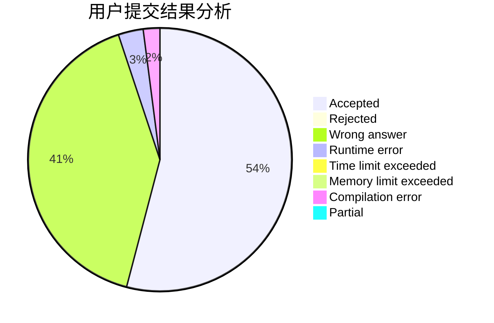
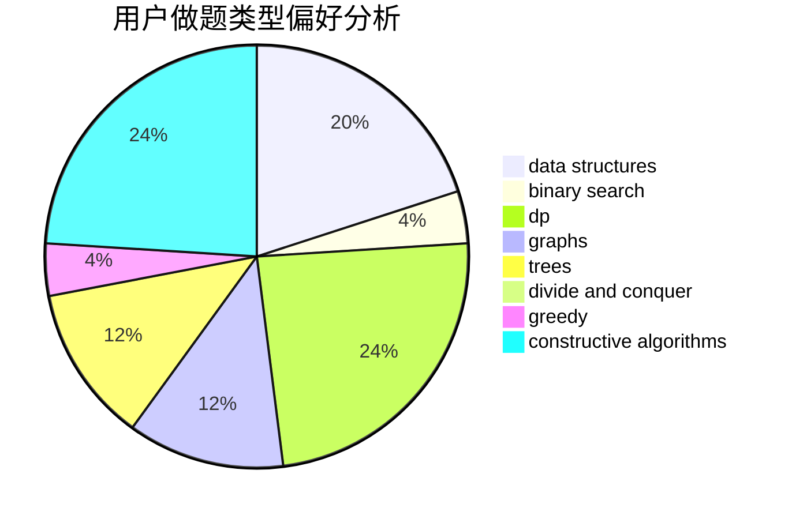
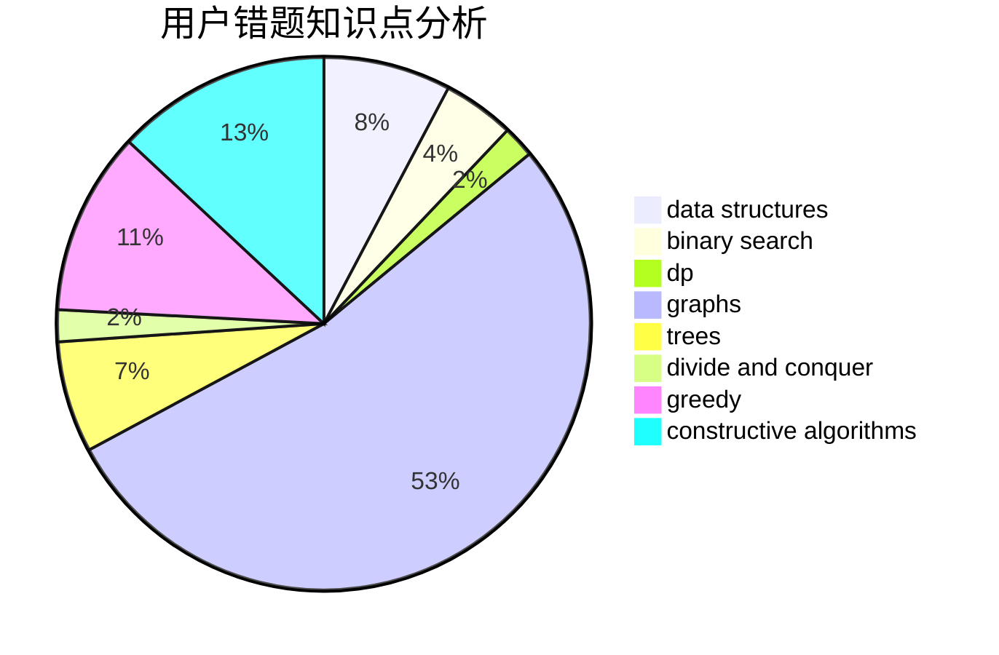

# RUSH_D_CAT

<!-- tabs:start -->

#### **用户提交结果分析**

#### **用户做题类型偏好分析**

#### **用户错题知识点分析**

<!-- tabs:end -->
# 推荐题目
[913G](https://codeforces.com/contest/913/problem/G)		math,
                        number theory		  
[632C](https://codeforces.com/contest/632/problem/C)		sortings,
                        strings		  
[630C](https://codeforces.com/contest/630/problem/C)		combinatorics,
                        math		  
[650C](https://codeforces.com/contest/650/problem/C)		dfs and similar,
                        dp,
                        dsu,
                        graphs,
                        greedy		  
[989E](https://codeforces.com/contest/989/problem/E)		dp,
                        geometry,
                        matrices,
                        probabilities		  
[709A](https://codeforces.com/contest/709/problem/A)		implementation		  
[1176B](https://codeforces.com/contest/1176/problem/B)		math		  
[1490C](https://codeforces.com/contest/1490/problem/C)		binary search,
                        brute force,
                        brute force,
                        math		  
[1497B](https://codeforces.com/contest/1497/problem/B)		constructive algorithms,
                        greedy,
                        math		  
[1491C](https://codeforces.com/contest/1491/problem/C)		brute force,
                        data structures,
                        dp,
                        greedy,
                        implementation		  
