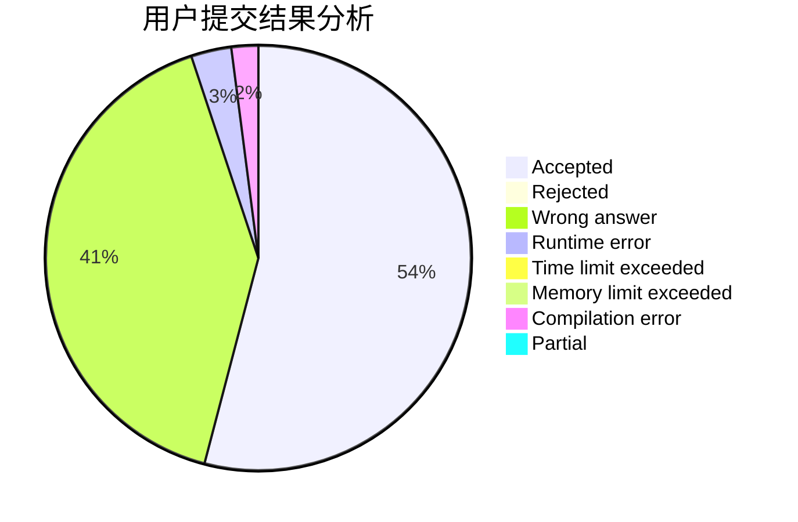
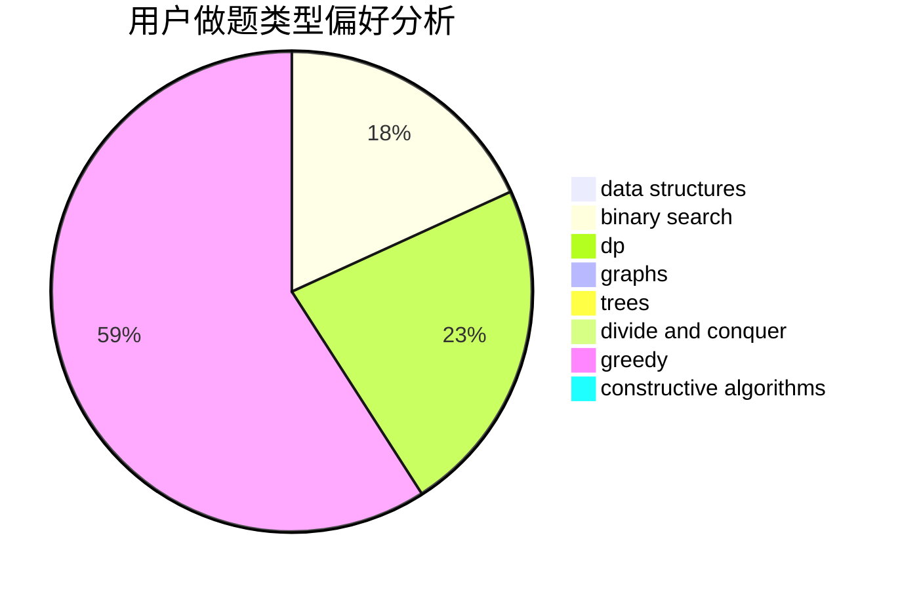
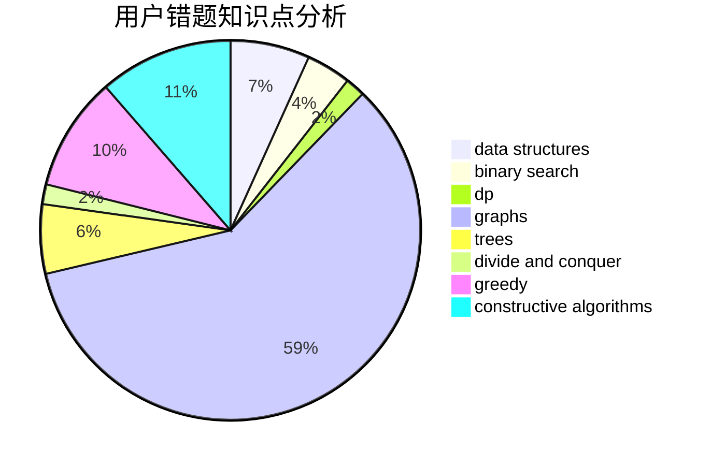

# RUSH_D_CAT

<!-- tabs:start -->

#### **用户提交结果分析**

#### **用户做题类型偏好分析**

#### **用户错题知识点分析**

<!-- tabs:end -->
# 推荐题目
[896D](https://codeforces.com/contest/896/problem/D)		chinese remainder theorem,
                        combinatorics,
                        math,
                        number theory		  
[612F](https://codeforces.com/contest/612/problem/F)		dp		  
[611B](https://codeforces.com/contest/611/problem/B)		bitmasks,
                        brute force,
                        implementation		  
[622C](https://codeforces.com/contest/622/problem/C)		data structures,
                        implementation		  
[975A](https://codeforces.com/contest/975/problem/A)		implementation,
                        strings		  
[687B](https://codeforces.com/contest/687/problem/B)		chinese remainder theorem,
                        math,
                        number theory		  
[1173F](https://codeforces.com/contest/1173/problem/F)		dsu,graphs,sortings,trees		  
[1482E](https://codeforces.com/contest/1482/problem/E)		data structures,
                        divide and conquer,
                        dp		  
[1489D](https://codeforces.com/contest/1489/problem/D)		dsu,graphs,sortings,trees		  
[1483E](https://codeforces.com/contest/1483/problem/E)		dsu,graphs,sortings,trees		  
