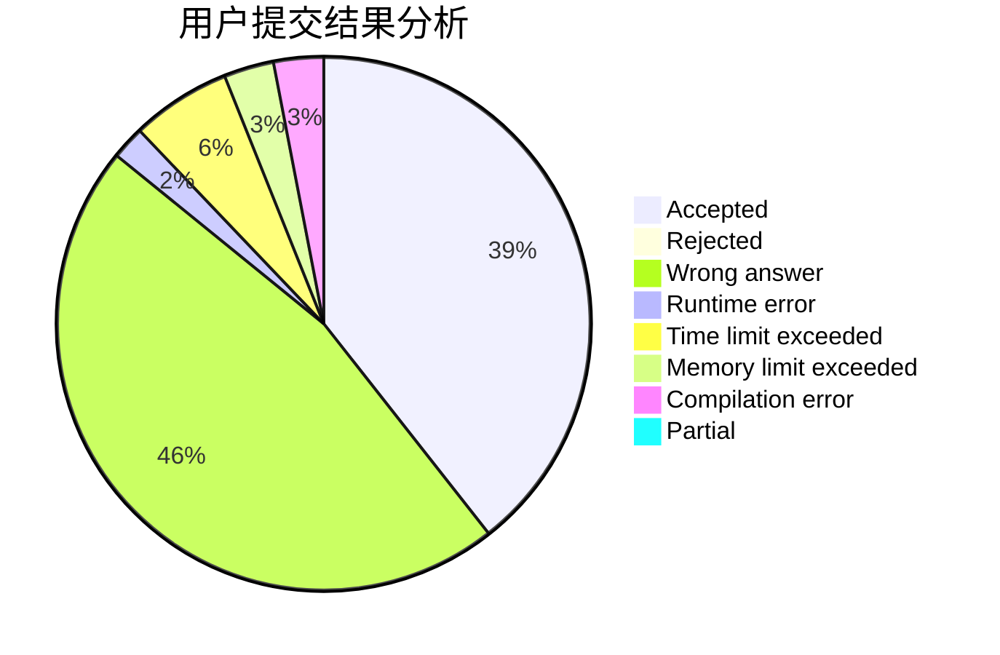
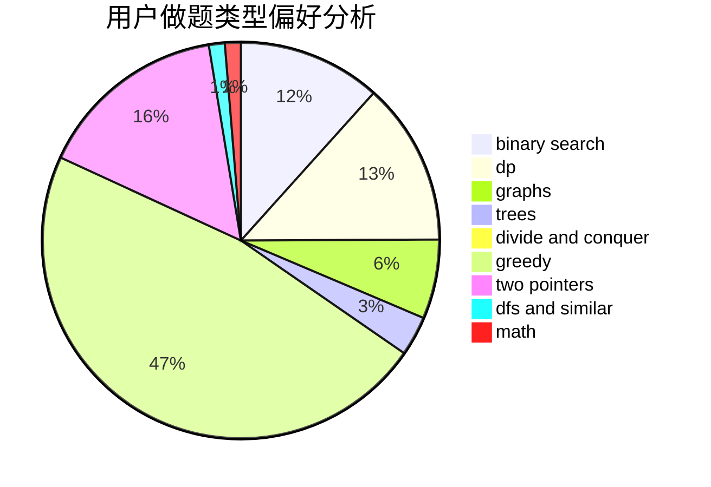

# RainAir

<!-- tabs:start -->

#### **用户提交结果分析**

#### **用户做题类型偏好分析**

<!-- tabs:end -->
# 推荐题目
[869E](https://codeforces.com/contest/869/problem/E)
[1214E](https://codeforces.com/contest/1214/problem/E)
[987A](https://codeforces.com/contest/987/problem/A)
[686D](https://codeforces.com/contest/686/problem/D)
[1434E](https://codeforces.com/contest/1434/problem/E)
[380D](https://codeforces.com/contest/380/problem/D)
[871E](https://codeforces.com/contest/871/problem/E)
[551D](https://codeforces.com/contest/551/problem/D)
[1031D](https://codeforces.com/contest/1031/problem/D)
[610C](https://codeforces.com/contest/610/problem/C)
