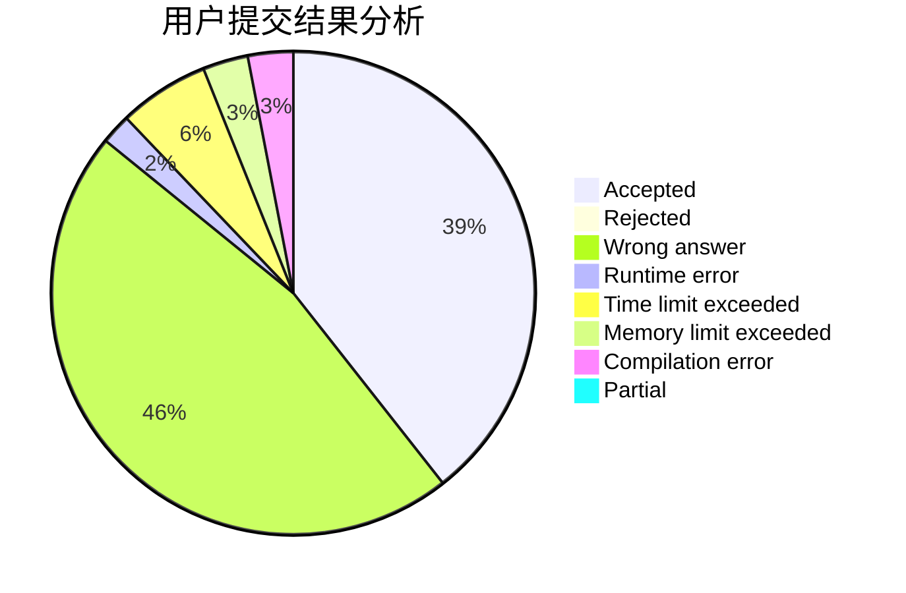
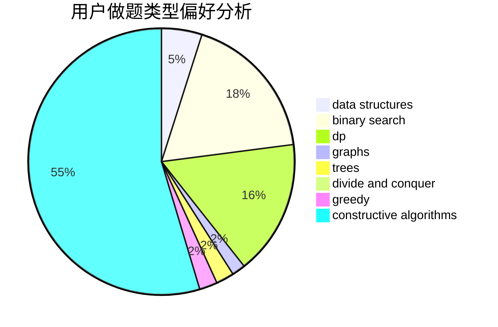
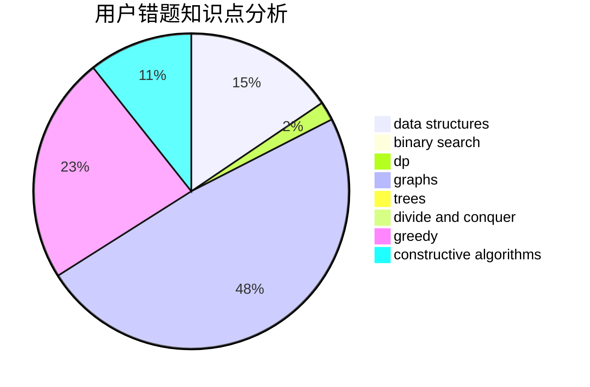

# RainAir

<!-- tabs:start -->

#### **用户提交结果分析**

#### **用户做题类型偏好分析**

#### **用户错题知识点分析**

<!-- tabs:end -->
# 推荐题目
[869E](https://codeforces.com/contest/869/problem/E)		data structures,
                        hashing		  
[1214E](https://codeforces.com/contest/1214/problem/E)		constructive algorithms,
                        graphs,
                        math,
                        sortings,
                        trees		  
[987A](https://codeforces.com/contest/987/problem/A)		implementation		  
[686D](https://codeforces.com/contest/686/problem/D)		dsu,graphs,sortings,trees		  
[1434E](https://codeforces.com/contest/1434/problem/E)		dsu,
                        games		  
[380D](https://codeforces.com/contest/380/problem/D)		combinatorics,
                        math		  
[871E](https://codeforces.com/contest/871/problem/E)		graphs,
                        greedy,
                        trees		  
[551D](https://codeforces.com/contest/551/problem/D)		combinatorics,
                        implementation,
                        math,
                        matrices,
                        number theory		  
[1031D](https://codeforces.com/contest/1031/problem/D)		greedy		  
[610C](https://codeforces.com/contest/610/problem/C)		constructive algorithms		  
