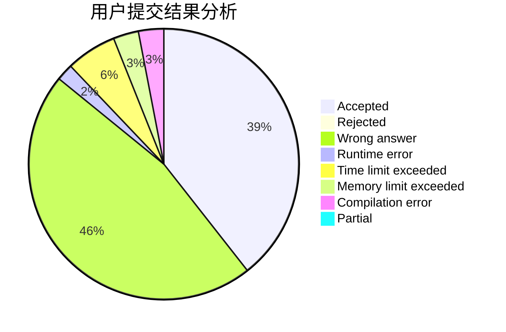
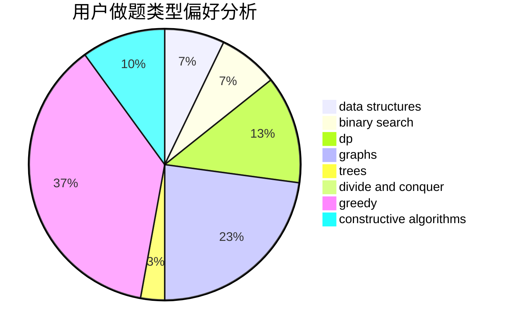
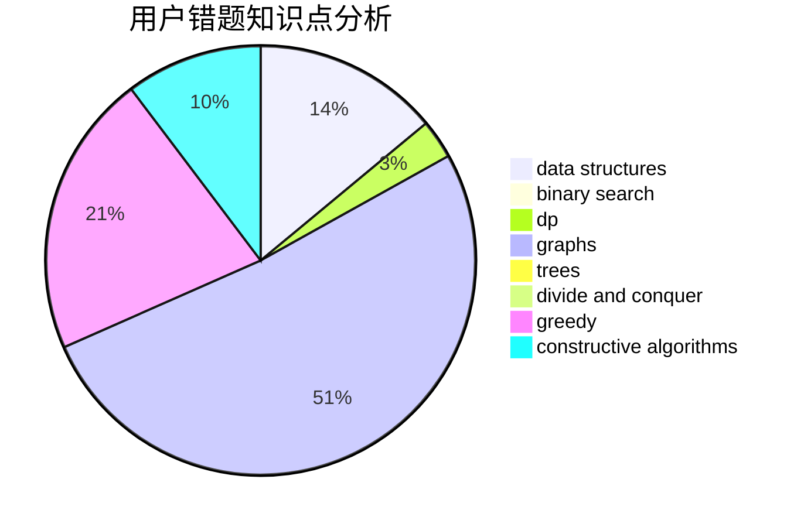

# RainAir

<!-- tabs:start -->

#### **用户提交结果分析**

#### **用户做题类型偏好分析**

#### **用户错题知识点分析**

<!-- tabs:end -->
# 推荐题目
[850F](https://codeforces.com/contest/850/problem/F)		math		  
[1209A](https://codeforces.com/contest/1209/problem/A)		greedy,
                        implementation,
                        math		  
[965A](https://codeforces.com/contest/965/problem/A)		math		  
[665F](https://codeforces.com/contest/665/problem/F)		data structures,
                        dp,
                        math,
                        number theory,
                        sortings,
                        two pointers		  
[1426C](https://codeforces.com/contest/1426/problem/C)		binary search,
                        constructive algorithms,
                        math		  
[354E](https://codeforces.com/contest/354/problem/E)		constructive algorithms,
                        dfs and similar,
                        dp		  
[853C](https://codeforces.com/contest/853/problem/C)		data structures		  
[527D](https://codeforces.com/contest/527/problem/D)		data structures,
                        dp,
                        greedy,
                        implementation,
                        sortings		  
[1031A](https://codeforces.com/contest/1031/problem/A)		implementation,
                        math		  
[590E](https://codeforces.com/contest/590/problem/E)		graph matchings,
                        strings		  
