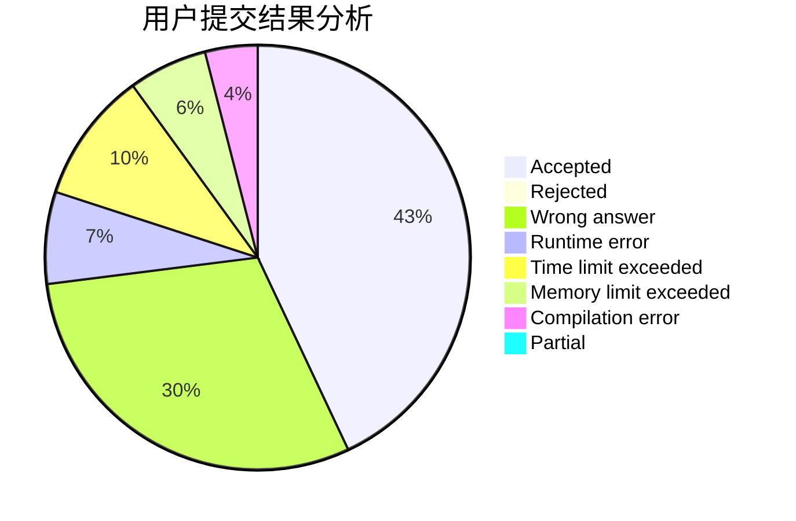
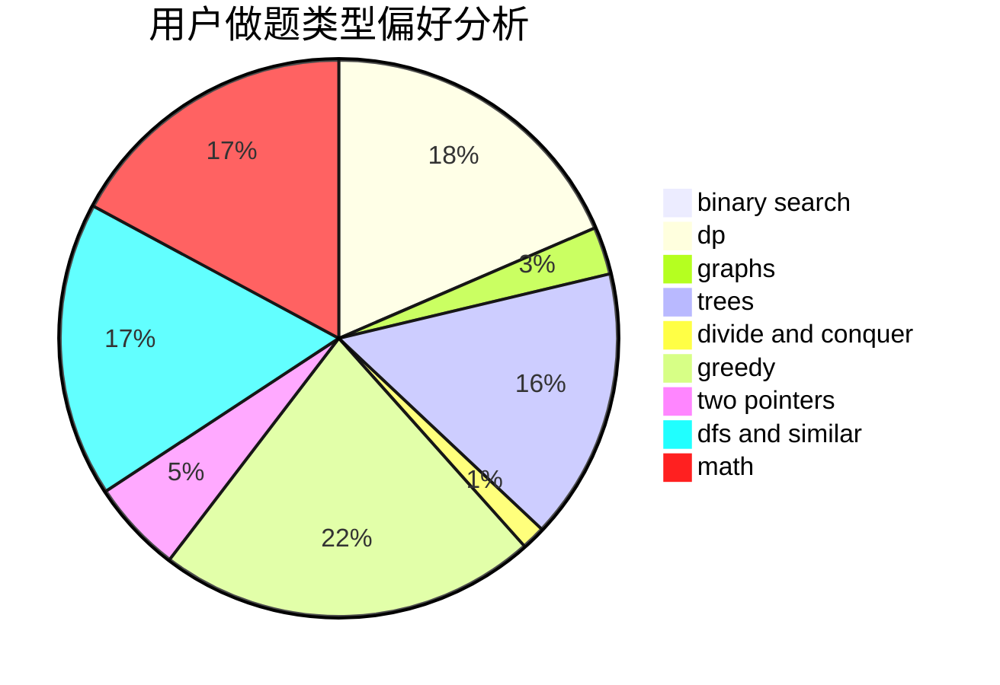

# Rainbow_sjy.qwq

<!-- tabs:start -->

#### **用户提交结果分析**

#### **用户做题类型偏好分析**

<!-- tabs:end -->
# 推荐题目
[282C](https://codeforces.com/contest/282/problem/C)
[1156D](https://codeforces.com/contest/1156/problem/D)
[861C](https://codeforces.com/contest/861/problem/C)
[360E](https://codeforces.com/contest/360/problem/E)
[1403A](https://codeforces.com/contest/1403/problem/A)
[253A](https://codeforces.com/contest/253/problem/A)
[916A](https://codeforces.com/contest/916/problem/A)
[74A](https://codeforces.com/contest/74/problem/A)
[1078A](https://codeforces.com/contest/1078/problem/A)
[1152B](https://codeforces.com/contest/1152/problem/B)
