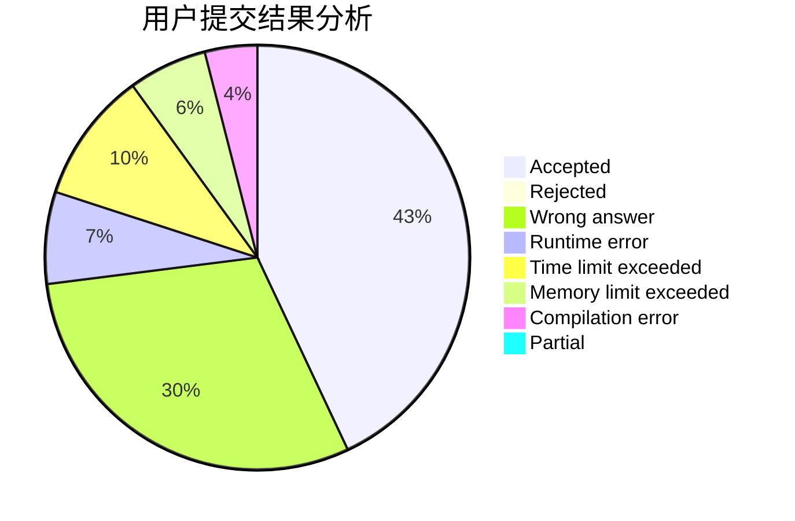
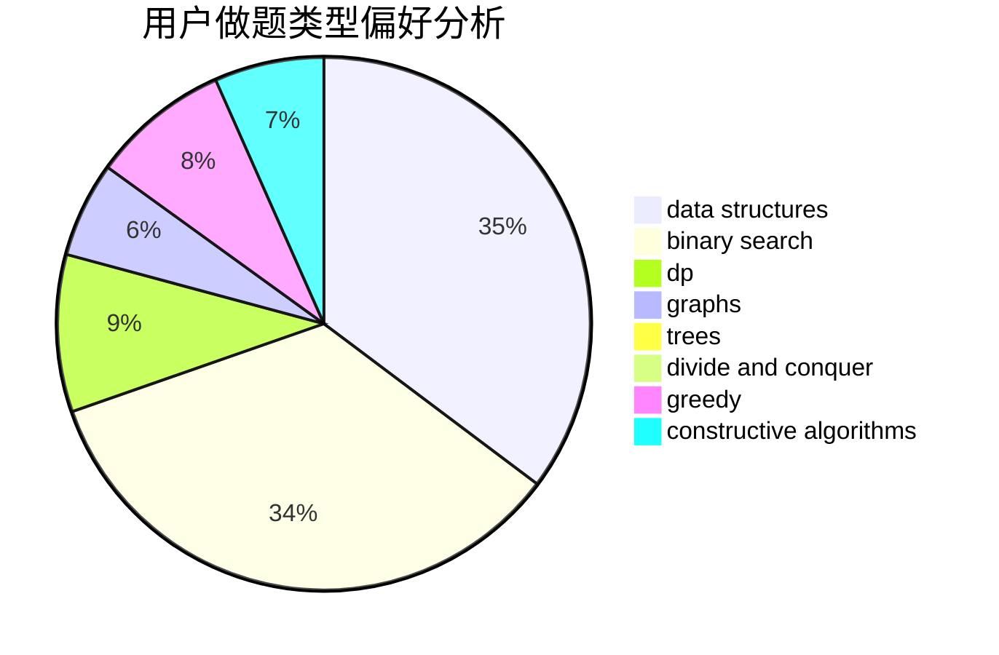
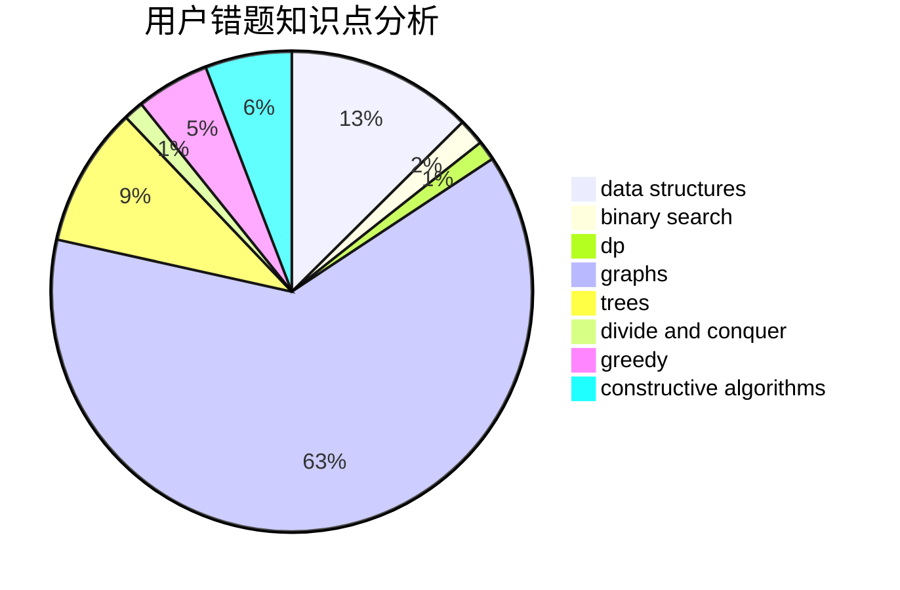

# Rainbow_sjy.qwq

<!-- tabs:start -->

#### **用户提交结果分析**

#### **用户做题类型偏好分析**

#### **用户错题知识点分析**

<!-- tabs:end -->
# 推荐题目
[266D](https://codeforces.com/contest/266/problem/D)		graphs,
                        math,
                        shortest paths		  
[1154D](https://codeforces.com/contest/1154/problem/D)		greedy		  
[842D](https://codeforces.com/contest/842/problem/D)		binary search,
                        data structures		  
[335A](https://codeforces.com/contest/335/problem/A)		binary search,
                        constructive algorithms,
                        greedy		  
[1394E](https://codeforces.com/contest/1394/problem/E)		strings		  
[231C](https://codeforces.com/contest/231/problem/C)		binary search,
                        sortings,
                        two pointers		  
[8C](https://codeforces.com/contest/8/problem/C)		bitmasks,
                        dp		  
[731E](https://codeforces.com/contest/731/problem/E)		dp,
                        games		  
[1077E](https://codeforces.com/contest/1077/problem/E)		greedy,
                        sortings		  
[1150B](https://codeforces.com/contest/1150/problem/B)		greedy,
                        implementation		  
