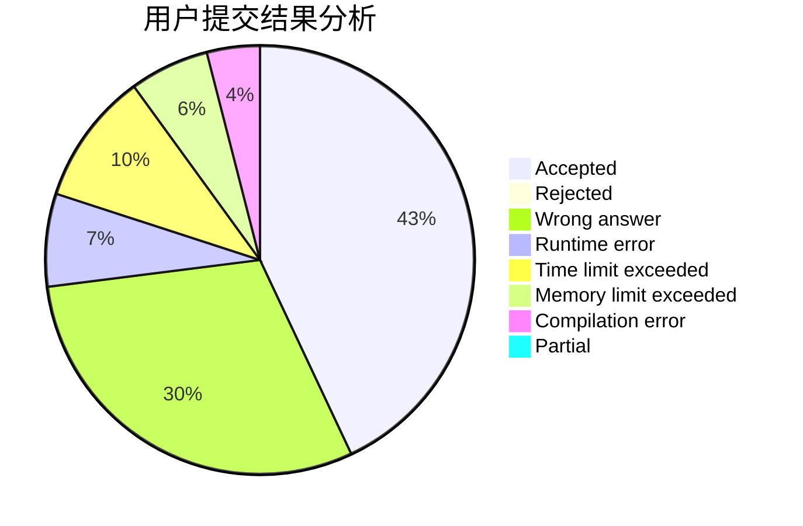
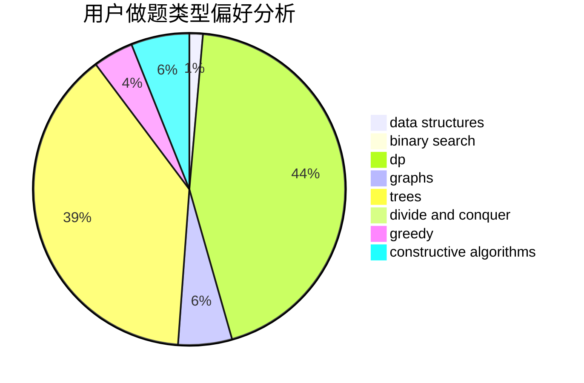
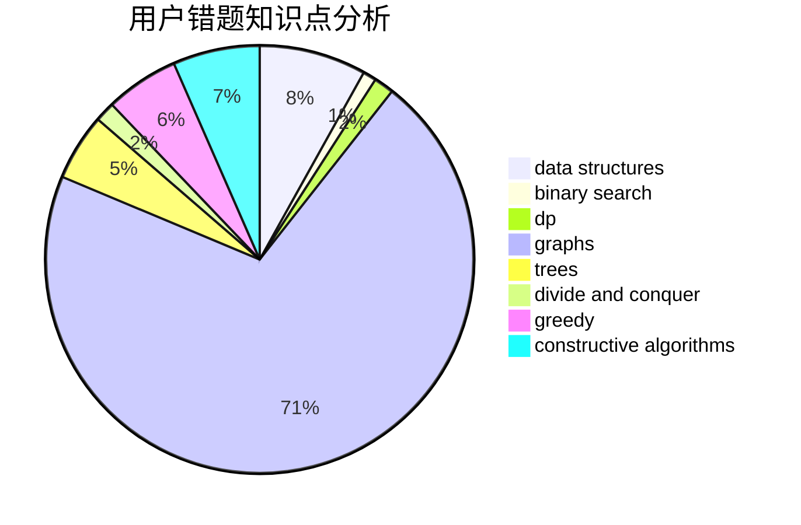

# Rainbow_sjy.qwq

<!-- tabs:start -->

#### **用户提交结果分析**

#### **用户做题类型偏好分析**

#### **用户错题知识点分析**

<!-- tabs:end -->
# 推荐题目
[282C](https://codeforces.com/contest/282/problem/C)		constructive algorithms,
                        implementation,
                        math		  
[1156D](https://codeforces.com/contest/1156/problem/D)		dfs and similar,
                        divide and conquer,
                        dp,
                        dsu,
                        trees		  
[861C](https://codeforces.com/contest/861/problem/C)		dsu,graphs,sortings,trees		  
[360E](https://codeforces.com/contest/360/problem/E)		graphs,
                        greedy,
                        shortest paths		  
[1403A](https://codeforces.com/contest/1403/problem/A)		*special problem,
                        2-sat,
                        binary search,
                        data structures,
                        graphs,
                        interactive,
                        sortings,
                        two pointers		  
[253A](https://codeforces.com/contest/253/problem/A)		greedy		  
[916A](https://codeforces.com/contest/916/problem/A)		brute force,
                        implementation,
                        math		  
[74A](https://codeforces.com/contest/74/problem/A)		implementation		  
[1078A](https://codeforces.com/contest/1078/problem/A)		dsu,graphs,sortings,trees		  
[1152B](https://codeforces.com/contest/1152/problem/B)		bitmasks,
                        constructive algorithms,
                        dfs and similar,
                        math		  
