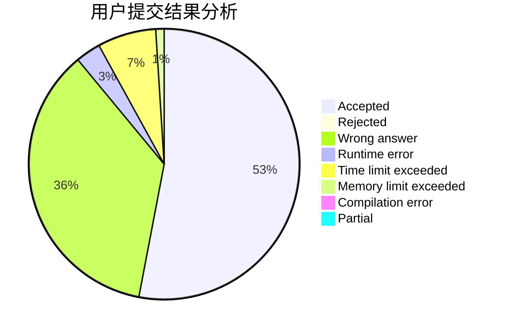
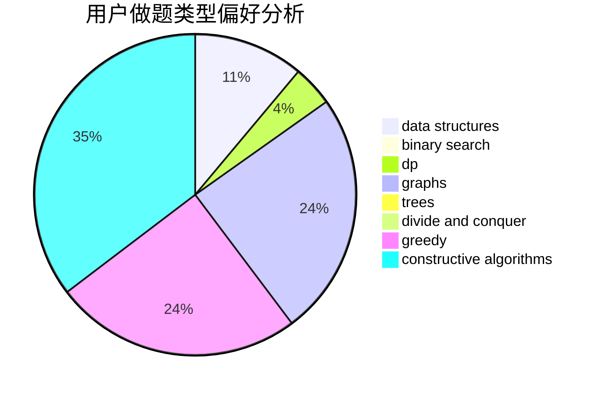
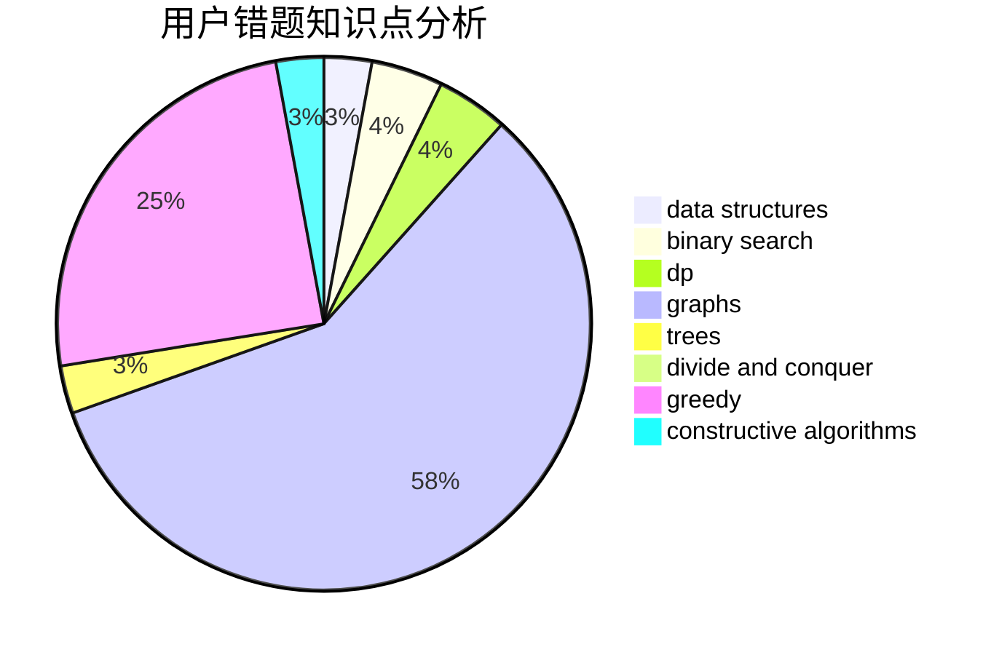

# Rainto96

<!-- tabs:start -->

#### **用户提交结果分析**

#### **用户做题类型偏好分析**

#### **用户错题知识点分析**

<!-- tabs:end -->
# 推荐题目
[992D](https://codeforces.com/contest/992/problem/D)		brute force,
                        implementation,
                        math		  
[1183C](https://codeforces.com/contest/1183/problem/C)		binary search,
                        math		  
[447A](https://codeforces.com/contest/447/problem/A)		implementation		  
[1118B](https://codeforces.com/contest/1118/problem/B)		implementation		  
[841A](https://codeforces.com/contest/841/problem/A)		brute force,
                        implementation		  
[1155F](https://codeforces.com/contest/1155/problem/F)		brute force,
                        dp,
                        graphs		  
[908B](https://codeforces.com/contest/908/problem/B)		brute force,
                        implementation		  
[772C](https://codeforces.com/contest/772/problem/C)		constructive algorithms,
                        dp,
                        graphs,
                        math,
                        number theory		  
[892A](https://codeforces.com/contest/892/problem/A)		greedy,
                        implementation		  
[44I](https://codeforces.com/contest/44/problem/I)		brute force,
                        combinatorics		  
