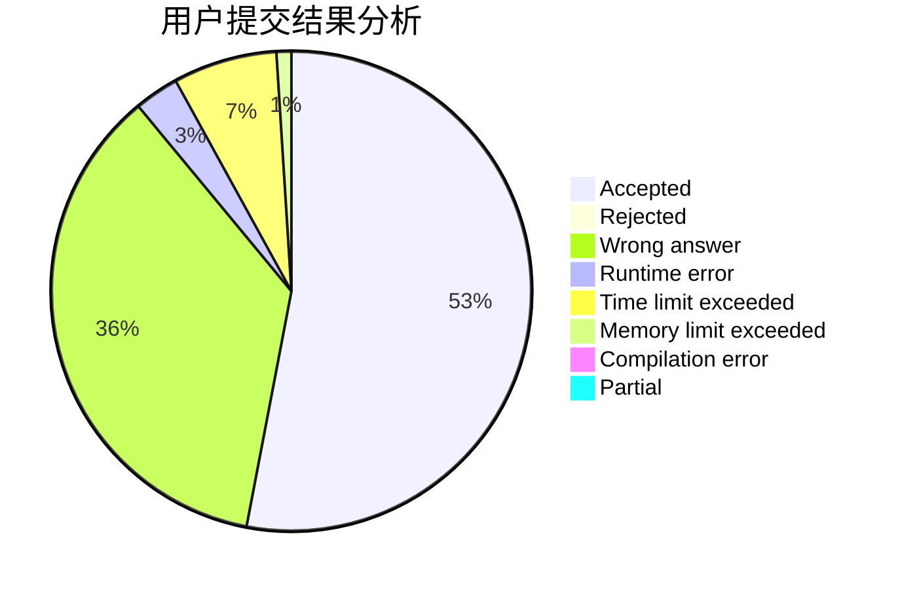
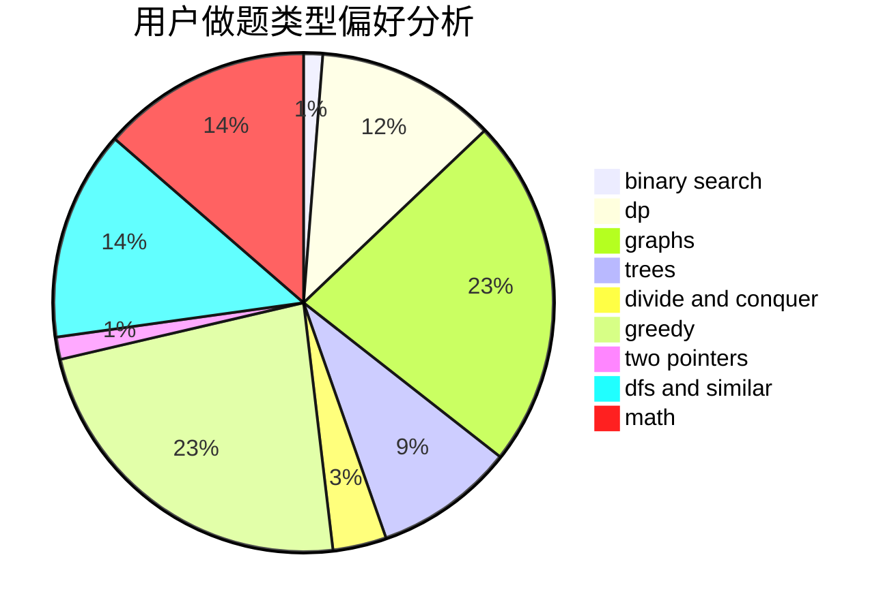

# Rainto96

<!-- tabs:start -->

#### **用户提交结果分析**

#### **用户做题类型偏好分析**

<!-- tabs:end -->
# 推荐题目
[992D](https://codeforces.com/contest/992/problem/D)
[1183C](https://codeforces.com/contest/1183/problem/C)
[447A](https://codeforces.com/contest/447/problem/A)
[1118B](https://codeforces.com/contest/1118/problem/B)
[841A](https://codeforces.com/contest/841/problem/A)
[1155F](https://codeforces.com/contest/1155/problem/F)
[908B](https://codeforces.com/contest/908/problem/B)
[772C](https://codeforces.com/contest/772/problem/C)
[892A](https://codeforces.com/contest/892/problem/A)
[44I](https://codeforces.com/contest/44/problem/I)
