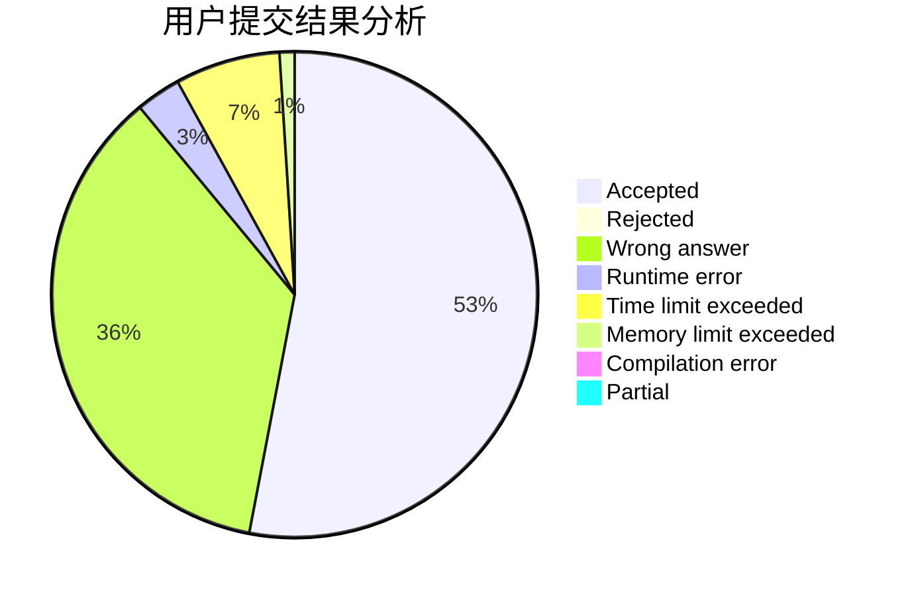
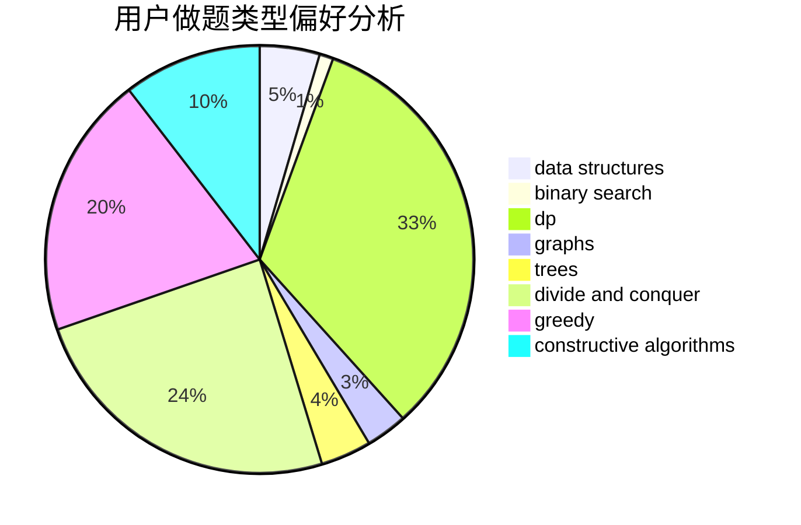
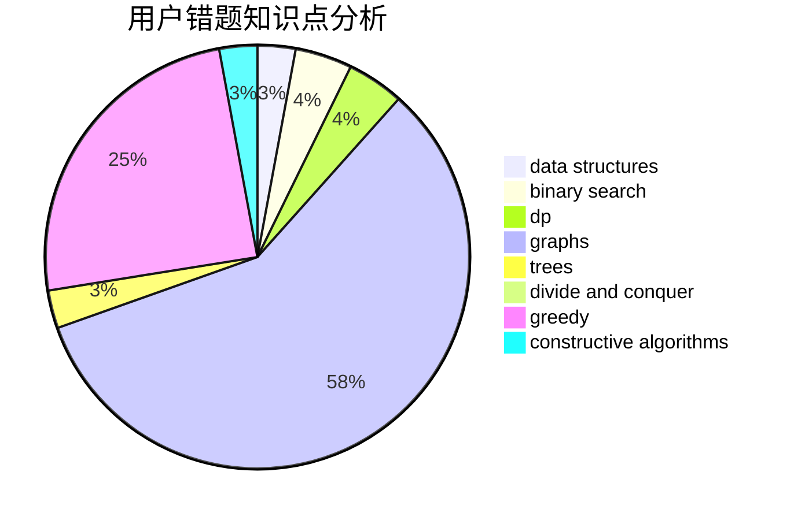

# Rainto96

<!-- tabs:start -->

#### **用户提交结果分析**

#### **用户做题类型偏好分析**

#### **用户错题知识点分析**

<!-- tabs:end -->
# 推荐题目
[978F](https://codeforces.com/contest/978/problem/F)		binary search,
                        data structures,
                        implementation		  
[1180B](https://codeforces.com/contest/1180/problem/B)		greedy,
                        implementation		  
[424B](https://codeforces.com/contest/424/problem/B)		binary search,
                        greedy,
                        implementation,
                        sortings		  
[1116D2](https://codeforces.com/contest/1116D/problem/2)		nan		  
[821B](https://codeforces.com/contest/821/problem/B)		brute force,
                        math		  
[1153F](https://codeforces.com/contest/1153/problem/F)		combinatorics,
                        dp,
                        math,
                        probabilities		  
[888D](https://codeforces.com/contest/888/problem/D)		combinatorics,
                        dp,
                        math		  
[754B](https://codeforces.com/contest/754/problem/B)		brute force,
                        implementation		  
[871C](https://codeforces.com/contest/871/problem/C)		dsu,graphs,sortings,trees		  
[429C](https://codeforces.com/contest/429/problem/C)		bitmasks,
                        constructive algorithms,
                        dp,
                        greedy,
                        trees		  
