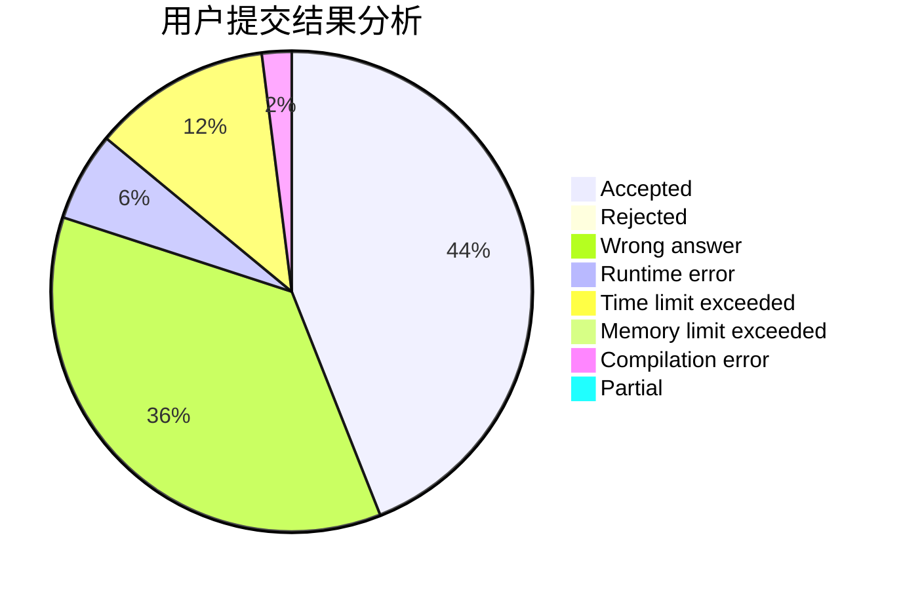
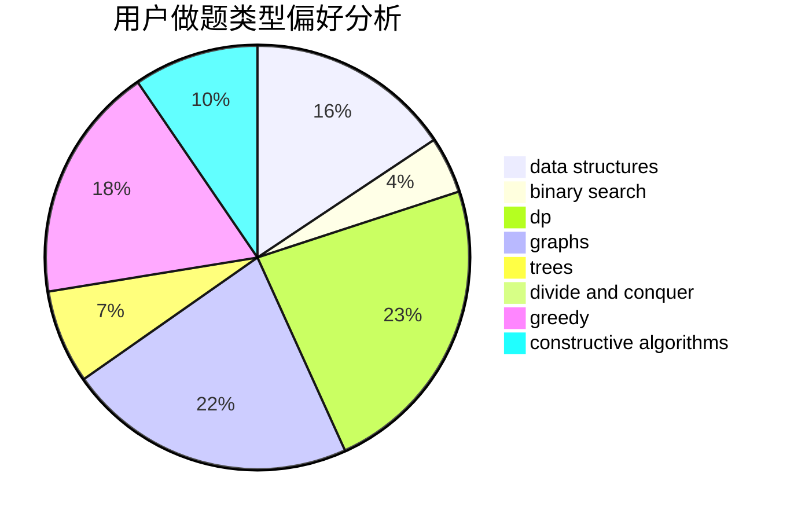
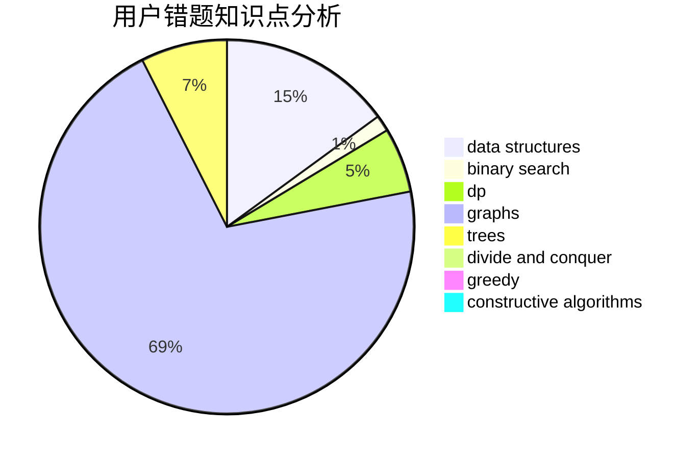

# Rainybunny

<!-- tabs:start -->

#### **用户提交结果分析**

#### **用户做题类型偏好分析**

#### **用户错题知识点分析**

<!-- tabs:end -->
# 推荐题目
[893D](https://codeforces.com/contest/893/problem/D)		data structures,
                        dp,
                        greedy,
                        implementation		  
[548A](https://codeforces.com/contest/548/problem/A)		brute force,
                        implementation,
                        strings		  
[1063F](https://codeforces.com/contest/1063/problem/F)		data structures,
                        dp,
                        string suffix structures		  
[1030G](https://codeforces.com/contest/1030/problem/G)		number theory		  
[501C](https://codeforces.com/contest/501/problem/C)		constructive algorithms,
                        data structures,
                        greedy,
                        sortings,
                        trees		  
[1059A](https://codeforces.com/contest/1059/problem/A)		implementation		  
[860D](https://codeforces.com/contest/860/problem/D)		dsu,graphs,sortings,trees		  
[1300E](https://codeforces.com/contest/1300/problem/E)		dsu,graphs,sortings,trees		  
[599B](https://codeforces.com/contest/599/problem/B)		implementation		  
[1312A](https://codeforces.com/contest/1312/problem/A)		geometry,
                        greedy,
                        math,
                        number theory		  
