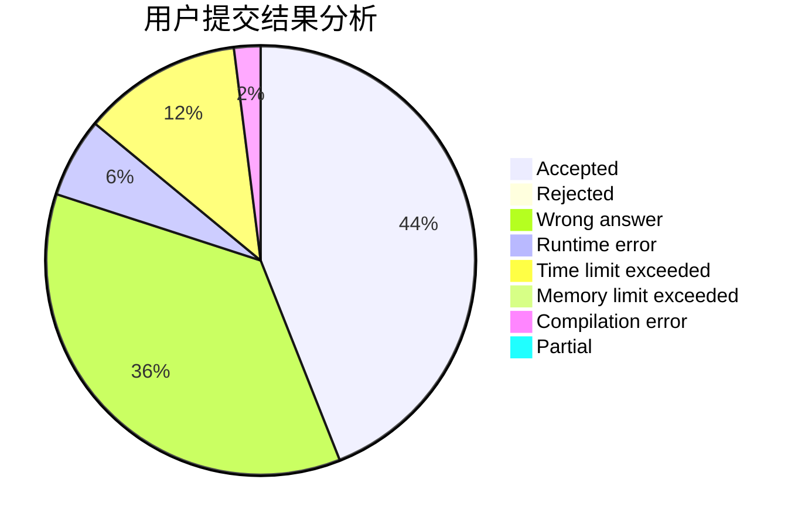
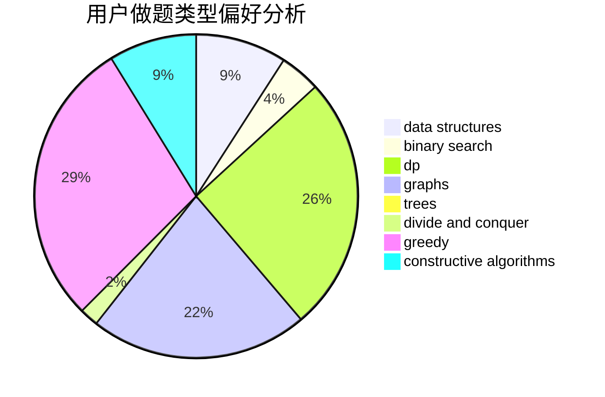
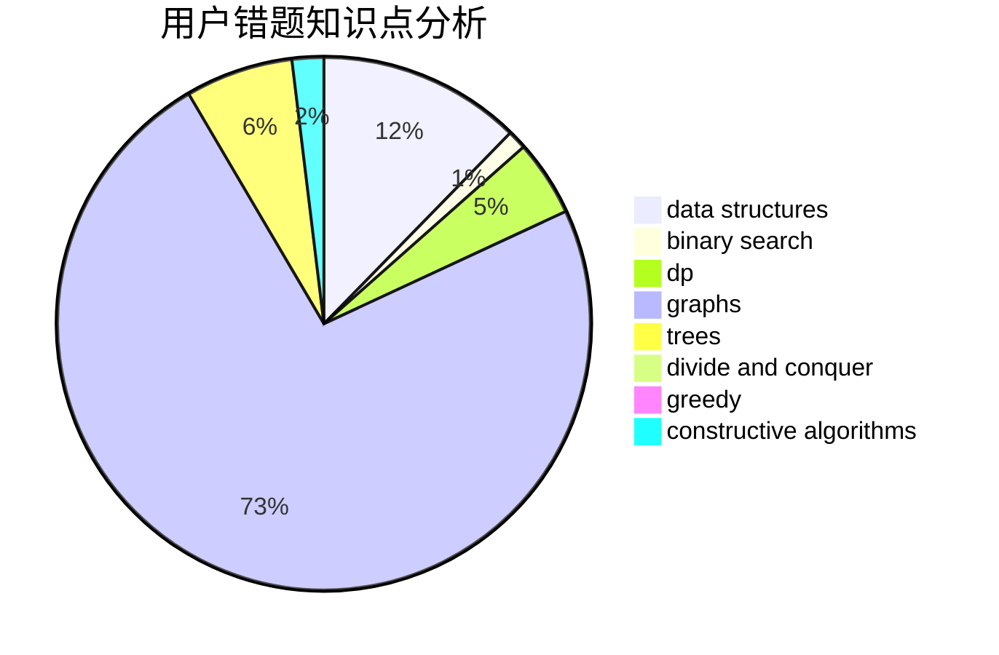

# Rainybunny

<!-- tabs:start -->

#### **用户提交结果分析**

#### **用户做题类型偏好分析**

#### **用户错题知识点分析**

<!-- tabs:end -->
# 推荐题目
[872B](https://codeforces.com/contest/872/problem/B)		dsu,graphs,sortings,trees		  
[522D](https://codeforces.com/contest/522/problem/D)		*special problem,
                        data structures		  
[1063C](https://codeforces.com/contest/1063/problem/C)		binary search,
                        constructive algorithms,
                        geometry,
                        interactive		  
[1030C](https://codeforces.com/contest/1030/problem/C)		implementation		  
[482D](https://codeforces.com/contest/482/problem/D)		combinatorics,
                        dp,
                        trees		  
[1058C](https://codeforces.com/contest/1058/problem/C)		dsu,graphs,sortings,trees		  
[841D](https://codeforces.com/contest/841/problem/D)		dsu,graphs,sortings,trees		  
[1294C](https://codeforces.com/contest/1294/problem/C)		greedy,
                        math,
                        number theory		  
[577E](https://codeforces.com/contest/577/problem/E)		dsu,graphs,sortings,trees		  
[1303C](https://codeforces.com/contest/1303/problem/C)		dfs and similar,
                        greedy,
                        implementation		  
