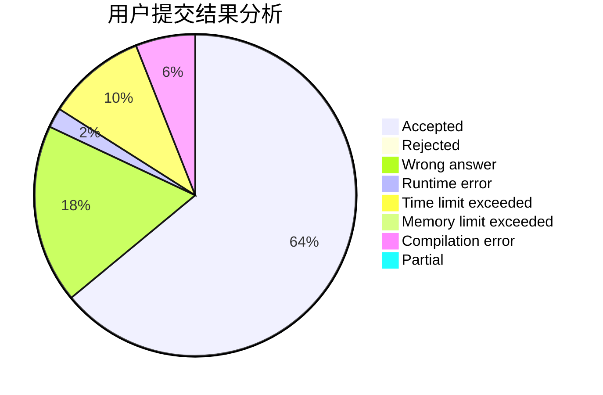
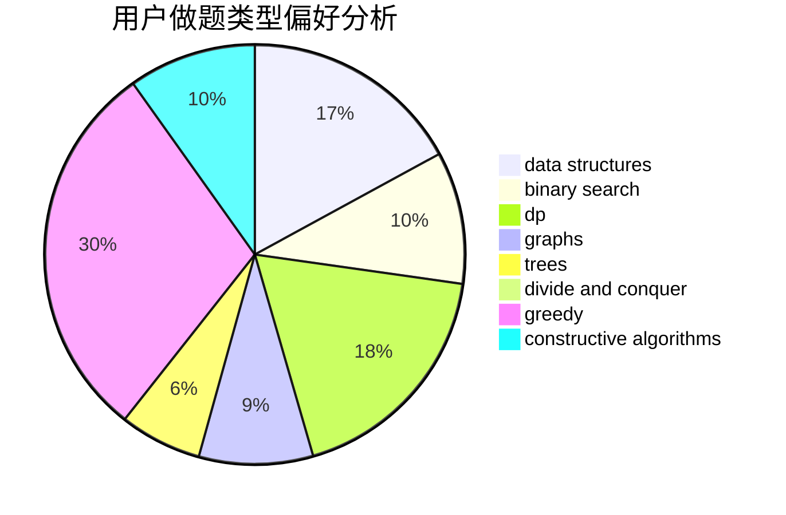
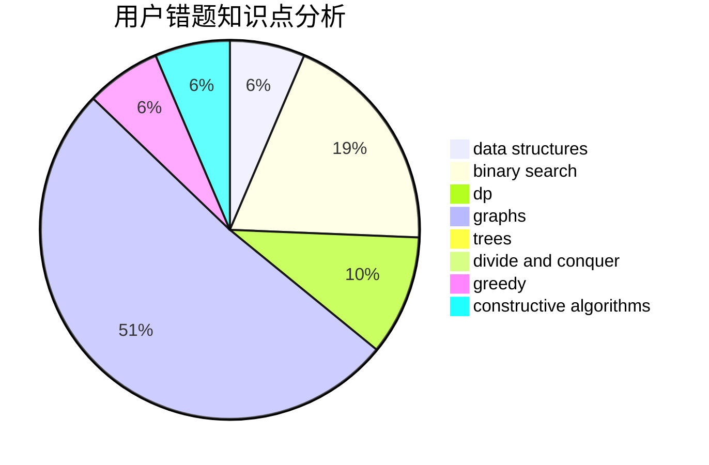

# ADOHAHA

<!-- tabs:start -->

#### **用户提交结果分析**

#### **用户做题类型偏好分析**

#### **用户错题知识点分析**

<!-- tabs:end -->
# 推荐题目
[1333B](https://codeforces.com/contest/1333/problem/B)		greedy,
                        implementation		  
[1487C](https://codeforces.com/contest/1487/problem/C)		brute force,
                        constructive algorithms,
                        dfs and similar,
                        graphs,
                        greedy,
                        implementation,
                        math		  
[1349C](https://codeforces.com/contest/1349/problem/C)		dfs and similar,
                        graphs,
                        implementation,
                        shortest paths		  
[1352B](https://codeforces.com/contest/1352/problem/B)		constructive algorithms,
                        math		  
[1354C2](https://codeforces.com/contest/1354C/problem/2)		binary search,
                        brute force,
                        geometry,
                        math		  
[1488A](https://codeforces.com/contest/1488/problem/A)		*special problem,
                        math		  
[1376B2](https://codeforces.com/contest/1376B/problem/2)		dsu,graphs,sortings,trees		  
[1016B](https://codeforces.com/contest/1016/problem/B)		brute force,
                        implementation		  
[1010C](https://codeforces.com/contest/1010/problem/C)		number theory		  
[1011E](https://codeforces.com/contest/1011/problem/E)		dsu,graphs,sortings,trees		  
