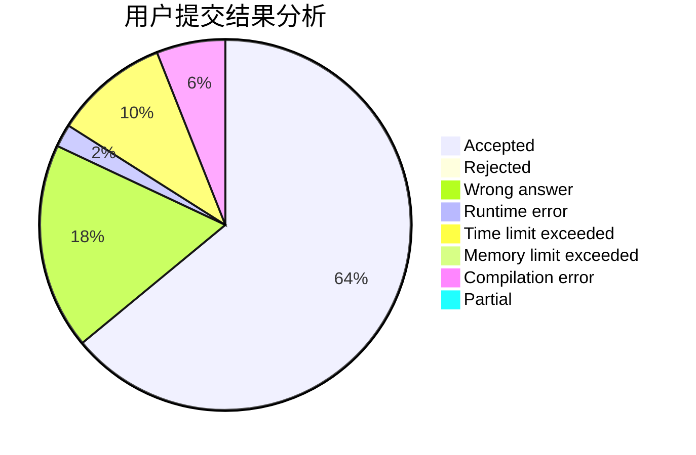
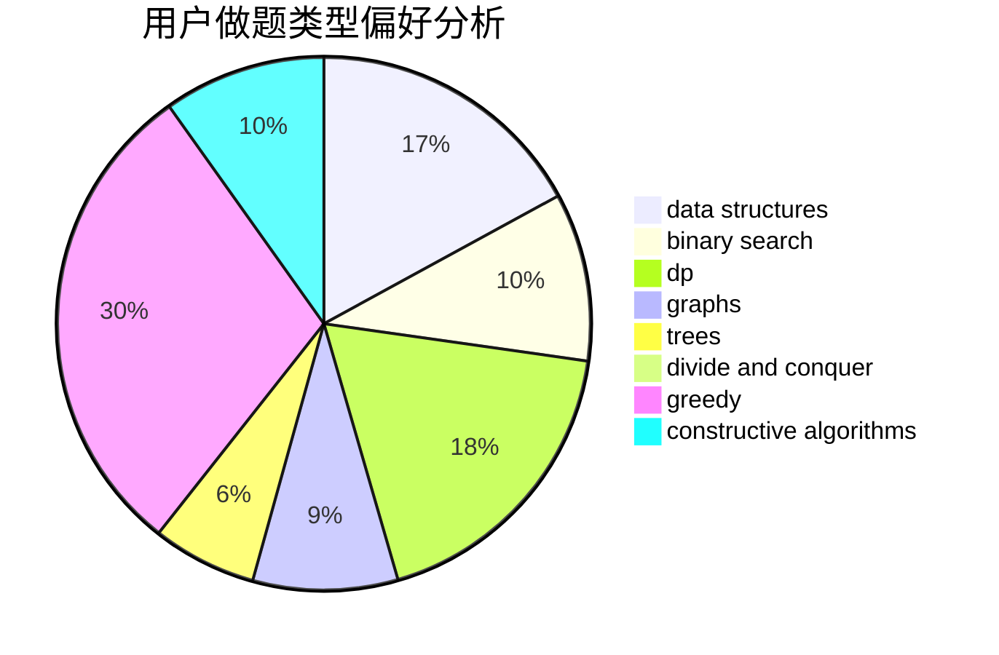
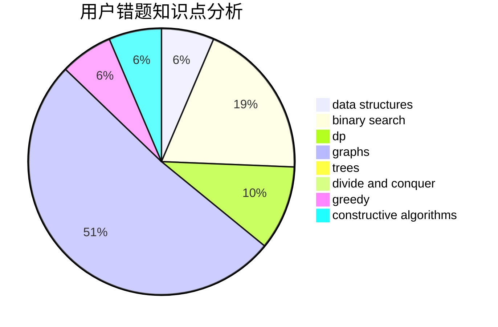

# ADOHAHA
<!-- tabs:start -->
#### **用户提交结果分析**

#### **用户做题类型偏好分析**

#### **用户错题知识点分析**

<!-- tabs:end -->
# 推荐题目
[Pairs of Paths](http://codeforces.com/problemset/problem/1486/F)		combinatorics,
                        data structures,
                        dfs and similar,
                        dp,
                        trees		  
[Orac and Game of Life](http://codeforces.com/problemset/problem/1349/C)		dfs and similar,
                        graphs,
                        implementation,
                        shortest paths		  
[Two Policemen](http://codeforces.com/problemset/problem/1488/C)		*special problem,
                        binary search,
                        brute force,
                        math		  
[Border](http://codeforces.com/problemset/problem/1010/C)		number theory		  
[Reorder the Array](https://codeforces.com/contest/1008/problem/C)		combinatorics,
                        data structures,
                        math,
                        sortings,
                        two pointers		  
[Maximal Independent Set](https://codeforces.com/contest/1376/problem/B2)		nan		  
[Yui and Mahjong Set](http://codeforces.com/problemset/problem/1336/D)		constructive algorithms,
                        interactive		  
[Bracket Substring](http://codeforces.com/problemset/problem/1015/F)		dp,
                        strings		  
[Planning The Expedition](http://codeforces.com/problemset/problem/1011/B)		binary search,
                        brute force,
                        implementation		  
[Border](https://codeforces.com/contest/1011/problem/E)		number theory		  
<!-- tabs:start -->
#### **data structures**
[Pairs of Paths](http://codeforces.com/problemset/problem/1486/F)		combinatorics,
                        data structures,
                        dfs and similar,
                        dp,
                        trees		  
[Orac and Game of Life](https://codeforces.com/contest/1008/problem/C)		combinatorics,
                        data structures,
                        math,
                        sortings,
                        two pointers		  
[Two Policemen](http://codeforces.com/problemset/problem/1265/B)		data structures,
                        implementation,
                        math,
                        two pointers		  
[Border](http://codeforces.com/problemset/problem/1485/F)		combinatorics,
                        data structures,
                        dp,
                        sortings		  
[Reorder the Array](http://codeforces.com/problemset/problem/1009/F)		data structures,
                        dsu,
                        trees		  
[Maximal Independent Set](http://codeforces.com/problemset/problem/1486/D)		binary search,
                        data structures,
                        dp		  
[Yui and Mahjong Set](http://codeforces.com/problemset/problem/1446/C)		binary search,
                        bitmasks,
                        data structures,
                        divide and conquer,
                        dp,
                        trees		  
[Bracket Substring](http://codeforces.com/problemset/problem/1487/E)		brute force,
                        data structures,
                        graphs,
                        greedy,
                        implementation,
                        sortings,
                        two pointers		  
[Planning The Expedition](http://codeforces.com/problemset/problem/1492/C)		binary search,
                        data structures,
                        dp,
                        greedy,
                        two pointers		  
[Border](http://codeforces.com/problemset/problem/1490/G)		binary search,
                        data structures,
                        math		  
#### **binary search**
[Pairs of Paths](http://codeforces.com/problemset/problem/1488/C)		*special problem,
                        binary search,
                        brute force,
                        math		  
[Orac and Game of Life](http://codeforces.com/problemset/problem/1011/B)		binary search,
                        brute force,
                        implementation		  
[Two Policemen](http://codeforces.com/problemset/problem/1488/D)		*special problem,
                        binary search,
                        greedy		  
[Border](https://codeforces.com/contest/1011/problem/D)		binary search,
                        interactive		  
[Reorder the Array](http://codeforces.com/problemset/problem/1486/C1)		binary search,
                        interactive		  
[Maximal Independent Set](http://codeforces.com/problemset/problem/1485/C)		binary search,
                        brute force,
                        math,
                        number theory		  
[Yui and Mahjong Set](http://codeforces.com/problemset/problem/1486/D)		binary search,
                        data structures,
                        dp		  
[Bracket Substring](http://codeforces.com/problemset/problem/1354/C2)		binary search,
                        brute force,
                        geometry,
                        math		  
[Planning The Expedition](http://codeforces.com/problemset/problem/1487/D)		binary search,
                        brute force,
                        math,
                        number theory		  
[Border](http://codeforces.com/problemset/problem/1486/E)		binary search,
                        brute force,
                        constructive algorithms,
                        dp,
                        flows,
                        graphs,
                        shortest paths		  
#### **dp**
[Pairs of Paths](http://codeforces.com/problemset/problem/1486/F)		combinatorics,
                        data structures,
                        dfs and similar,
                        dp,
                        trees		  
[Orac and Game of Life](http://codeforces.com/problemset/problem/1015/F)		dp,
                        strings		  
[Two Policemen](https://codeforces.com/contest/116/problem/C)		bitmasks,
                        brute force,
                        dp,
                        graphs		  
[Border](http://codeforces.com/problemset/problem/1456/E)		dp,
                        greedy		  
[Reorder the Array](http://codeforces.com/problemset/problem/1421/E)		brute force,
                        dp,
                        implementation		  
[Maximal Independent Set](http://codeforces.com/problemset/problem/1485/F)		combinatorics,
                        data structures,
                        dp,
                        sortings		  
[Yui and Mahjong Set](http://codeforces.com/problemset/problem/1487/G)		combinatorics,
                        dp,
                        fft,
                        math		  
[Bracket Substring](http://codeforces.com/problemset/problem/1487/F)		dp,
                        greedy,
                        shortest paths		  
[Planning The Expedition](http://codeforces.com/problemset/problem/1486/D)		binary search,
                        data structures,
                        dp		  
[Border](http://codeforces.com/problemset/problem/1485/B)		dp,
                        implementation,
                        math		  
#### **graph**
[Pairs of Paths](http://codeforces.com/problemset/problem/1349/C)		dfs and similar,
                        graphs,
                        implementation,
                        shortest paths		  
[Orac and Game of Life](https://codeforces.com/contest/116/problem/C)		bitmasks,
                        brute force,
                        dp,
                        graphs		  
[Two Policemen](https://codeforces.com/contest/1484/problem/F)		graphs,
                        shortest paths		  
[Border](http://codeforces.com/problemset/problem/1487/C)		brute force,
                        constructive algorithms,
                        dfs and similar,
                        graphs,
                        greedy,
                        implementation,
                        math		  
[Reorder the Array](http://codeforces.com/problemset/problem/1009/G)		bitmasks,
                        flows,
                        graph matchings,
                        graphs,
                        greedy		  
[Maximal Independent Set](http://codeforces.com/problemset/problem/1485/D)		constructive algorithms,
                        graphs,
                        math,
                        number theory		  
[Yui and Mahjong Set](http://codeforces.com/problemset/problem/1486/E)		binary search,
                        brute force,
                        constructive algorithms,
                        dp,
                        flows,
                        graphs,
                        shortest paths		  
[Bracket Substring](http://codeforces.com/problemset/problem/1487/E)		brute force,
                        data structures,
                        graphs,
                        greedy,
                        implementation,
                        sortings,
                        two pointers		  
[Planning The Expedition](http://codeforces.com/problemset/problem/1487/C)		brute force,
                        constructive algorithms,
                        dfs and similar,
                        graphs,
                        greedy,
                        implementation,
                        math		  
[Border](http://codeforces.com/problemset/problem/1437/C)		dp,
                        flows,
                        graph matchings,
                        greedy,
                        math,
                        sortings		  
#### **trees**
[Pairs of Paths](http://codeforces.com/problemset/problem/1486/F)		combinatorics,
                        data structures,
                        dfs and similar,
                        dp,
                        trees		  
[Orac and Game of Life](http://codeforces.com/problemset/problem/1009/F)		data structures,
                        dsu,
                        trees		  
[Two Policemen](http://codeforces.com/problemset/problem/1446/C)		binary search,
                        bitmasks,
                        data structures,
                        divide and conquer,
                        dp,
                        trees		  
[Border](http://codeforces.com/problemset/problem/1485/E)		dfs and similar,
                        dp,
                        greedy,
                        trees		  
[Reorder the Array](http://codeforces.com/problemset/problem/1479/D)		binary search,
                        bitmasks,
                        brute force,
                        data structures,
                        probabilities,
                        trees		  
[Maximal Independent Set](http://codeforces.com/problemset/problem/1511/C)		brute force,
                        data structures,
                        implementation,
                        trees		  
[Yui and Mahjong Set](http://codeforces.com/problemset/problem/1499/F)		combinatorics,
                        dfs and similar,
                        dp,
                        trees		  
[Bracket Substring](http://codeforces.com/problemset/problem/1491/E)		brute force,
                        dfs and similar,
                        divide and conquer,
                        number theory,
                        trees		  
[Planning The Expedition](http://codeforces.com/problemset/problem/1466/D)		data structures,
                        greedy,
                        sortings,
                        trees		  
[Border](http://codeforces.com/problemset/problem/1495/D)		combinatorics,
                        dfs and similar,
                        graphs,
                        math,
                        shortest paths,
                        trees		  
#### **divide and conquer**
[Pairs of Paths](http://codeforces.com/problemset/problem/1446/C)		binary search,
                        bitmasks,
                        data structures,
                        divide and conquer,
                        dp,
                        trees		  
[Orac and Game of Life](http://codeforces.com/problemset/problem/1461/D)		binary search,
                        brute force,
                        data structures,
                        divide and conquer,
                        implementation,
                        sortings		  
[Two Policemen](http://codeforces.com/problemset/problem/1466/G)		combinatorics,
                        divide and conquer,
                        hashing,
                        math,
                        string suffix structures,
                        strings		  
[Border](http://codeforces.com/problemset/problem/1490/D)		dfs and similar,
                        divide and conquer,
                        implementation		  
[Reorder the Array](https://codeforces.com/contest/1483/problem/C)		data structures,
                        divide and conquer,
                        dp		  
[Maximal Independent Set](http://codeforces.com/problemset/problem/1491/E)		brute force,
                        dfs and similar,
                        divide and conquer,
                        number theory,
                        trees		  
[Yui and Mahjong Set](http://codeforces.com/problemset/problem/1303/G)		data structures,
                        divide and conquer,
                        geometry,
                        trees		  
[Bracket Substring](http://codeforces.com/problemset/problem/1494/D)		constructive algorithms,
                        data structures,
                        dfs and similar,
                        divide and conquer,
                        dsu,
                        greedy,
                        sortings,
                        trees		  
[Planning The Expedition](http://codeforces.com/problemset/problem/1482/E)		data structures,
                        divide and conquer,
                        dp		  
[Border](http://codeforces.com/problemset/problem/566/C)		dfs and similar,
                        divide and conquer,
                        trees		  
#### **greedy**
[Pairs of Paths](http://codeforces.com/problemset/problem/1456/E)		dp,
                        greedy		  
[Orac and Game of Life](http://codeforces.com/problemset/problem/1488/D)		*special problem,
                        binary search,
                        greedy		  
[Two Policemen](http://codeforces.com/problemset/problem/1487/F)		dp,
                        greedy,
                        shortest paths		  
[Border](http://codeforces.com/problemset/problem/1445/B)		greedy,
                        math		  
[Reorder the Array](http://codeforces.com/problemset/problem/1175/D)		greedy,
                        sortings		  
[Maximal Independent Set](http://codeforces.com/problemset/problem/1486/A)		greedy,
                        implementation		  
[Yui and Mahjong Set](http://codeforces.com/problemset/problem/1015/D)		constructive algorithms,
                        greedy		  
[Bracket Substring](http://codeforces.com/problemset/problem/1487/C)		brute force,
                        constructive algorithms,
                        dfs and similar,
                        graphs,
                        greedy,
                        implementation,
                        math		  
[Planning The Expedition](http://codeforces.com/problemset/problem/1009/G)		bitmasks,
                        flows,
                        graph matchings,
                        graphs,
                        greedy		  
[Border](http://codeforces.com/problemset/problem/1485/A)		brute force,
                        greedy,
                        math,
                        number theory		  
#### **constructive algorithms**
[Pairs of Paths](http://codeforces.com/problemset/problem/1336/D)		constructive algorithms,
                        interactive		  
[Orac and Game of Life](http://codeforces.com/problemset/problem/1015/D)		constructive algorithms,
                        greedy		  
[Two Policemen](http://codeforces.com/problemset/problem/1487/C)		brute force,
                        constructive algorithms,
                        dfs and similar,
                        graphs,
                        greedy,
                        implementation,
                        math		  
[Border](http://codeforces.com/problemset/problem/1485/D)		constructive algorithms,
                        graphs,
                        math,
                        number theory		  
[Reorder the Array](http://codeforces.com/problemset/problem/1352/B)		constructive algorithms,
                        math		  
[Maximal Independent Set](http://codeforces.com/problemset/problem/1486/E)		binary search,
                        brute force,
                        constructive algorithms,
                        dp,
                        flows,
                        graphs,
                        shortest paths		  
[Yui and Mahjong Set](http://codeforces.com/problemset/problem/1493/A)		constructive algorithms,
                        greedy		  
[Bracket Substring](http://codeforces.com/problemset/problem/1463/D)		binary search,
                        constructive algorithms,
                        greedy,
                        two pointers		  
[Planning The Expedition](https://codeforces.com/contest/1456/problem/B)		bitmasks,
                        brute force,
                        constructive algorithms		  
[Border](http://codeforces.com/problemset/problem/1492/D)		bitmasks,
                        constructive algorithms,
                        greedy,
                        math		  
#### **sortings**
[Pairs of Paths](https://codeforces.com/contest/1008/problem/C)		combinatorics,
                        data structures,
                        math,
                        sortings,
                        two pointers		  
[Orac and Game of Life](http://codeforces.com/problemset/problem/1485/F)		combinatorics,
                        data structures,
                        dp,
                        sortings		  
[Two Policemen](http://codeforces.com/problemset/problem/1175/D)		greedy,
                        sortings		  
[Border](http://codeforces.com/problemset/problem/1487/A)		implementation,
                        sortings		  
[Reorder the Array](http://codeforces.com/problemset/problem/1487/E)		brute force,
                        data structures,
                        graphs,
                        greedy,
                        implementation,
                        sortings,
                        two pointers		  
[Maximal Independent Set](http://codeforces.com/problemset/problem/1486/B)		binary search,
                        geometry,
                        shortest paths,
                        sortings		  
[Yui and Mahjong Set](https://codeforces.com/contest/1496/problem/C)		geometry,
                        greedy,
                        math,
                        sortings		  
[Bracket Substring](http://codeforces.com/problemset/problem/1495/A)		geometry,
                        greedy,
                        math,
                        sortings		  
[Planning The Expedition](http://codeforces.com/problemset/problem/1497/A)		brute force,
                        data structures,
                        greedy,
                        sortings		  
[Border](http://codeforces.com/problemset/problem/1427/A)		math,
                        sortings		  
<!-- tabs:end -->
