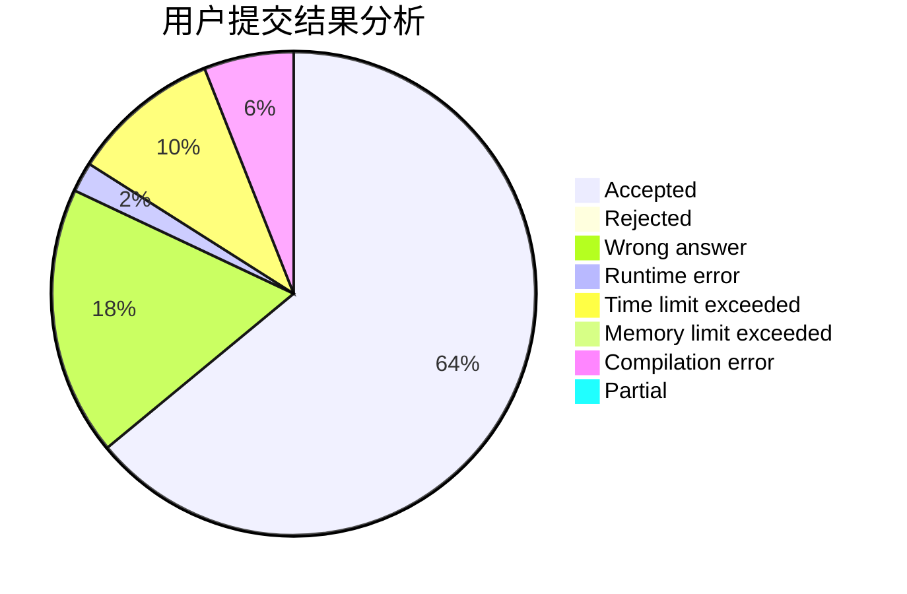
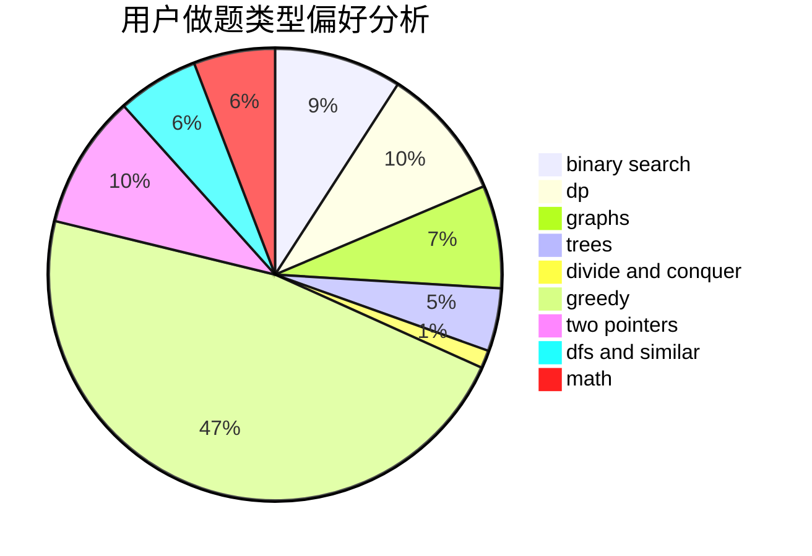

# ADOHAHA

<!-- tabs:start -->

#### **用户提交结果分析**

#### **用户做题类型偏好分析**

<!-- tabs:end -->
# 推荐题目
[1340A](https://codeforces.com/contest/1340/problem/A)
[1494F](https://codeforces.com/contest/1494/problem/F)
[13561](https://codeforces.com/contest/1356/problem/1)
[1358F](https://codeforces.com/contest/1358/problem/F)
[1360H](https://codeforces.com/contest/1360/problem/H)
[1495E](https://codeforces.com/contest/1495/problem/E)
[1385F](https://codeforces.com/contest/1385/problem/F)
[1016E](https://codeforces.com/contest/1016/problem/E)
[1010F](https://codeforces.com/contest/1010/problem/F)
[1012B](https://codeforces.com/contest/1012/problem/B)
