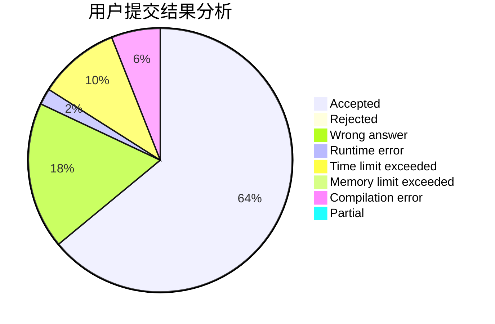
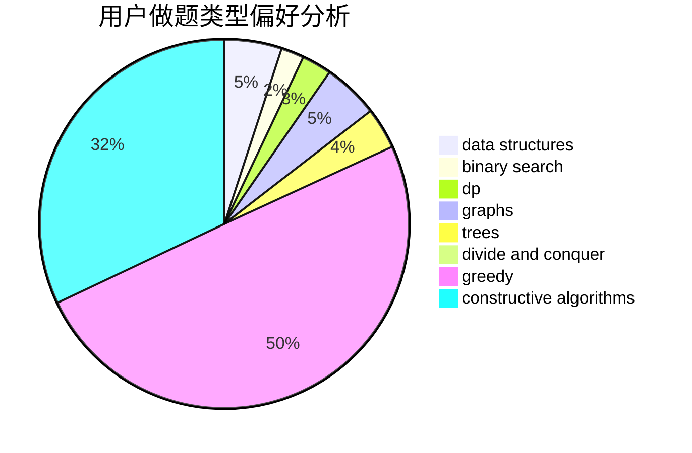
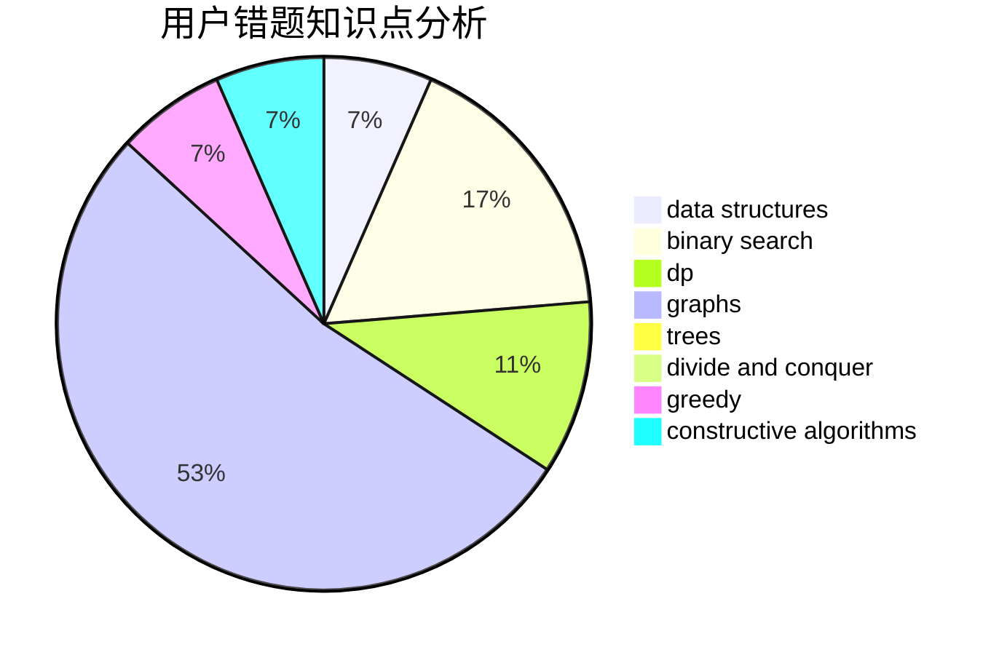

# ADOHAHA

<!-- tabs:start -->

#### **用户提交结果分析**

#### **用户做题类型偏好分析**

#### **用户错题知识点分析**

<!-- tabs:end -->
# 推荐题目
[1340A](https://codeforces.com/contest/1340/problem/A)		brute force,
                        data structures,
                        greedy,
                        implementation		  
[1494F](https://codeforces.com/contest/1494/problem/F)		brute force,
                        constructive algorithms,
                        dfs and similar,
                        graphs,
                        implementation		  
[13561](https://codeforces.com/contest/1356/problem/1)		dsu,graphs,sortings,trees		  
[1358F](https://codeforces.com/contest/1358/problem/F)		binary search,
                        constructive algorithms,
                        greedy,
                        implementation		  
[1360H](https://codeforces.com/contest/1360/problem/H)		binary search,
                        bitmasks,
                        brute force,
                        constructive algorithms		  
[1495E](https://codeforces.com/contest/1495/problem/E)		brute force,
                        data structures,
                        greedy,
                        implementation		  
[1385F](https://codeforces.com/contest/1385/problem/F)		data structures,
                        greedy,
                        implementation,
                        trees		  
[1016E](https://codeforces.com/contest/1016/problem/E)		binary search,
                        geometry		  
[1010F](https://codeforces.com/contest/1010/problem/F)		fft,
                        graphs,
                        trees		  
[1012B](https://codeforces.com/contest/1012/problem/B)		constructive algorithms,
                        dfs and similar,
                        dsu,
                        graphs,
                        matrices		  
