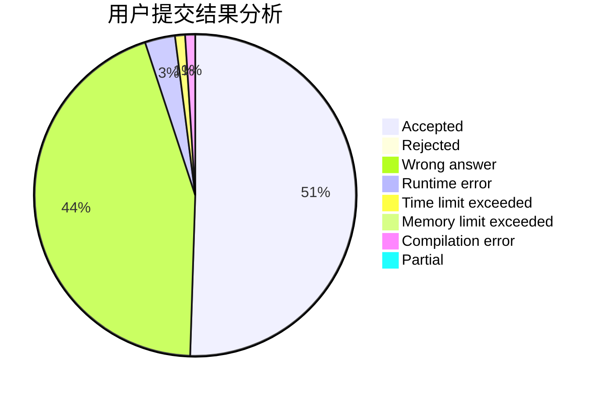
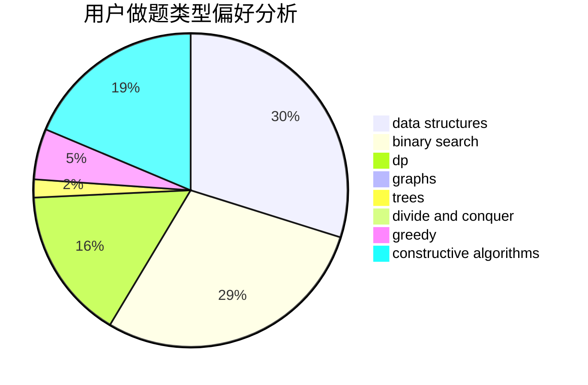
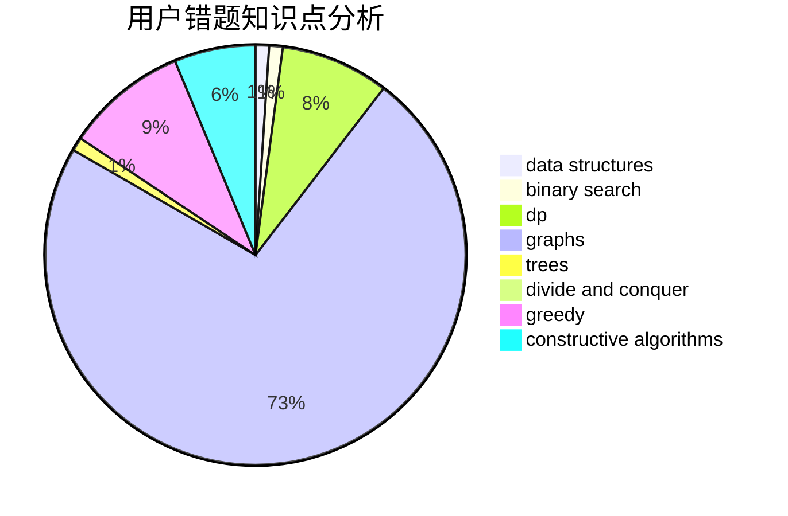

# Random_Rating

<!-- tabs:start -->

#### **用户提交结果分析**

#### **用户做题类型偏好分析**

#### **用户错题知识点分析**

<!-- tabs:end -->
# 推荐题目
[1213C](https://codeforces.com/contest/1213/problem/C)		math		  
[1464D](https://codeforces.com/contest/1464/problem/D)		dsu,graphs,sortings,trees		  
[1070C](https://codeforces.com/contest/1070/problem/C)		data structures,
                        greedy		  
[176D](https://codeforces.com/contest/176/problem/D)		dp		  
[623B](https://codeforces.com/contest/623/problem/B)		dp,
                        greedy,
                        number theory		  
[486A](https://codeforces.com/contest/486/problem/A)		implementation,
                        math		  
[1042B](https://codeforces.com/contest/1042/problem/B)		bitmasks,
                        brute force,
                        dp,
                        implementation		  
[226B](https://codeforces.com/contest/226/problem/B)		greedy		  
[1111C](https://codeforces.com/contest/1111/problem/C)		binary search,
                        brute force,
                        divide and conquer,
                        math		  
[416C](https://codeforces.com/contest/416/problem/C)		binary search,
                        dp,
                        greedy,
                        implementation		  
