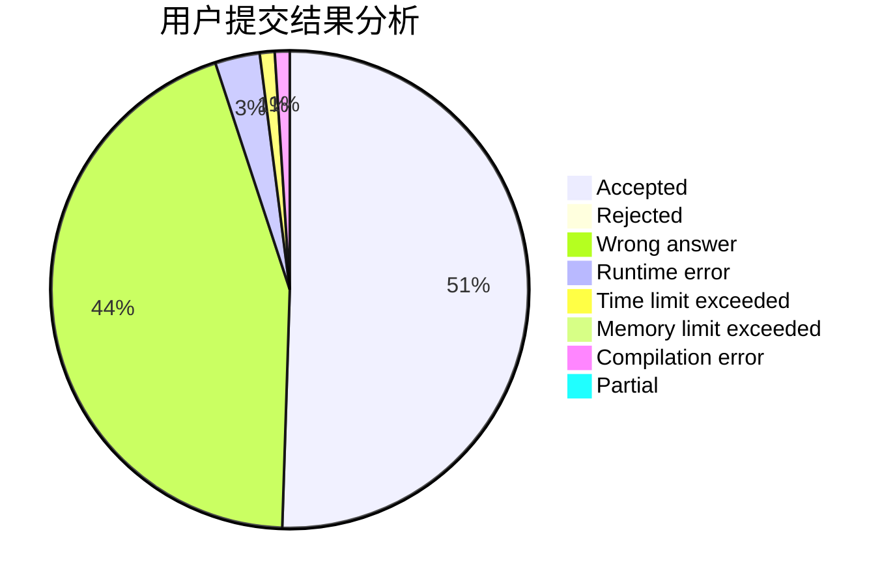
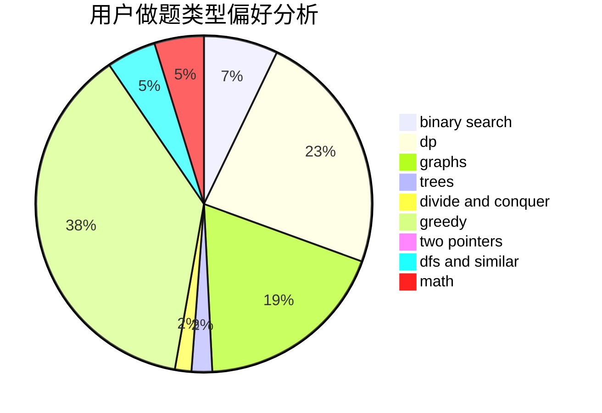

# Random_Rating

<!-- tabs:start -->

#### **用户提交结果分析**

#### **用户做题类型偏好分析**

<!-- tabs:end -->
# 推荐题目
[1217E](https://codeforces.com/contest/1217/problem/E)
[1471E](https://codeforces.com/contest/1471/problem/E)
[1070F](https://codeforces.com/contest/1070/problem/F)
[201C](https://codeforces.com/contest/201/problem/C)
[651B](https://codeforces.com/contest/651/problem/B)
[506D](https://codeforces.com/contest/506/problem/D)
[1042E](https://codeforces.com/contest/1042/problem/E)
[245A](https://codeforces.com/contest/245/problem/A)
[1113B](https://codeforces.com/contest/1113/problem/B)
[441C](https://codeforces.com/contest/441/problem/C)
